# 044131 - אותות ומערכות

## חורף 2018-2019

| איש סגל | תפקיד |
| ---- | ---- |
| ששון יגאל | מרצה - אחראי מקצוע |
| בן-דוד גל | מרצה |
| יאיר אור | מתרגל - עם הרשאות מרצה אחראי |
| כהן רגב | מתרגל - עם הרשאות מרצה אחראי |

### מבחן מועד א'

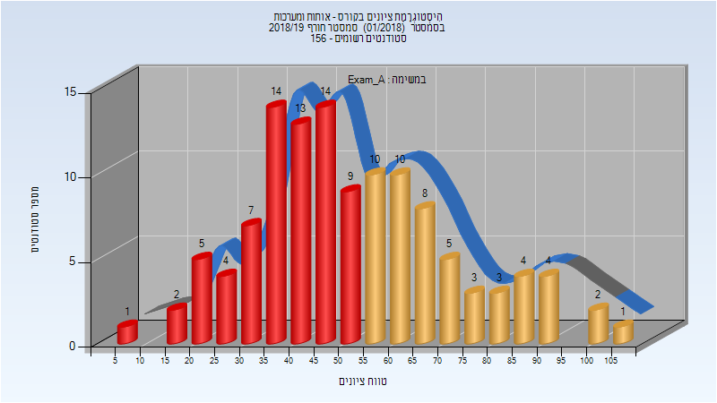

| סטודנטים | עברו/נכשלו | אחוז עוברים | ציון מינימלי | ציון מקסימלי | ממוצע | חציון |
| ---- | ---- | ---- | ---- | ---- | ---- | ---- |
| 119 | 50/69 | 42 | 8 | 105 | 52.487 | 49 |

### סופי מועד א'

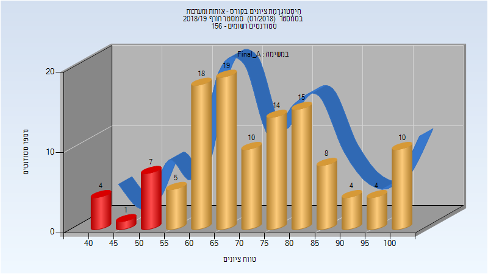

| סטודנטים | עברו/נכשלו | אחוז עוברים | ציון מינימלי | ציון מקסימלי | ממוצע | חציון |
| ---- | ---- | ---- | ---- | ---- | ---- | ---- |
| 119 | 107/12 | 90 | 40 | 100 | 73.303 | 72 |

### מבחן מועד ב'

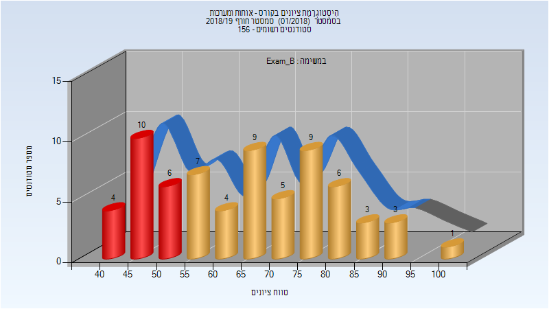

| סטודנטים | עברו/נכשלו | אחוז עוברים | ציון מינימלי | ציון מקסימלי | ממוצע | חציון |
| ---- | ---- | ---- | ---- | ---- | ---- | ---- |
| 67 | 47/20 | 70 | 40 | 100 | 65.284 | 65 |

### סופי מועד ב'

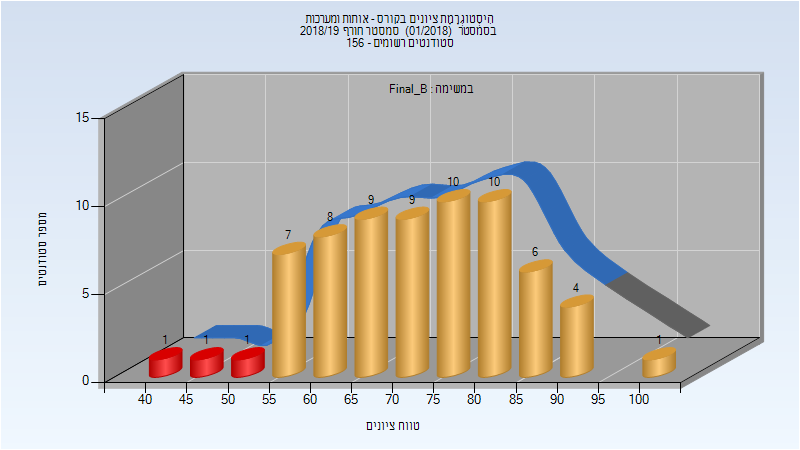

| סטודנטים | עברו/נכשלו | אחוז עוברים | ציון מינימלי | ציון מקסימלי | ממוצע | חציון |
| ---- | ---- | ---- | ---- | ---- | ---- | ---- |
| 67 | 64/3 | 96 | 44 | 100 | 72.537 | 73 |

### סופי

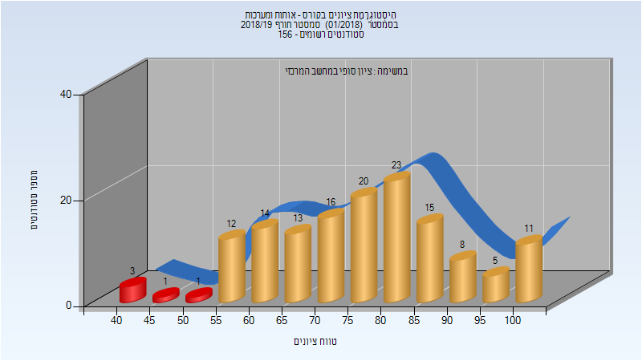

| סטודנטים | עברו/נכשלו | אחוז עוברים | ציון מינימלי | ציון מקסימלי | ממוצע | חציון |
| ---- | ---- | ---- | ---- | ---- | ---- | ---- |
| 142 | 137/5 | 96 | 40 | 100 | 76.373 | 78 |

## אביב 2019

| איש סגל | תפקיד |
| ---- | ---- |
| גלבוע גיא | מרצה - אחראי מקצוע |
| כהן רגב | מתרגל - עם הרשאות מרצה אחראי |
| אלעזרא אור | מתרגל - עם הרשאות מרצה אחראי |
| כהן אהרון | מתרגל - עם הרשאות מרצה אחראי |

### מבחן מועד א'

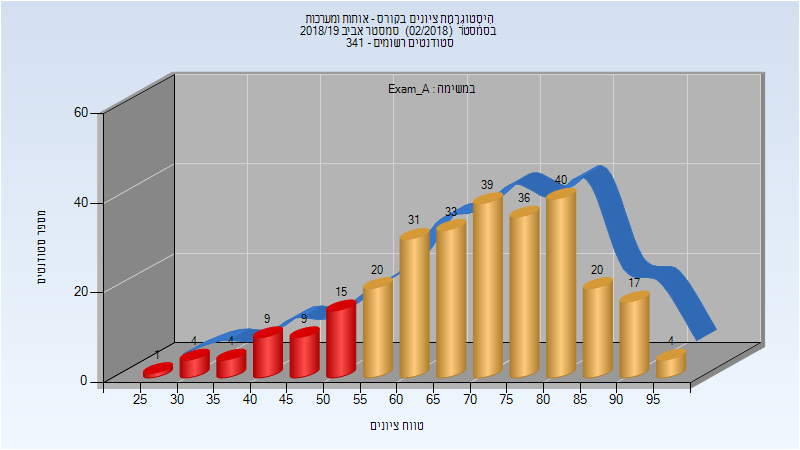

| סטודנטים | עברו/נכשלו | אחוז עוברים | ציון מינימלי | ציון מקסימלי | ממוצע | חציון |
| ---- | ---- | ---- | ---- | ---- | ---- | ---- |
| 282 | 240/42 | 85 | 29 | 99 | 69.823 | 71 |

### סופי מועד א'

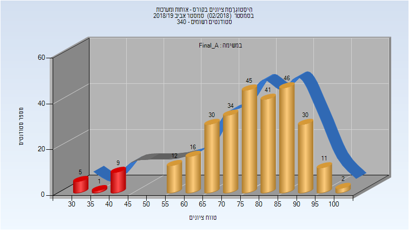

| סטודנטים | עברו/נכשלו | אחוז עוברים | ציון מינימלי | ציון מקסימלי | ממוצע | חציון |
| ---- | ---- | ---- | ---- | ---- | ---- | ---- |
| 282 | 267/15 | 95 | 31 | 100 | 76.511 | 78 |

### מבחן מועד ב'

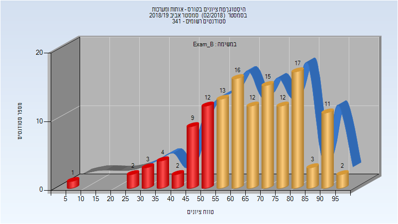

| סטודנטים | עברו/נכשלו | אחוז עוברים | ציון מינימלי | ציון מקסימלי | ממוצע | חציון |
| ---- | ---- | ---- | ---- | ---- | ---- | ---- |
| 134 | 101/33 | 75 | 7 | 98 | 65.828 | 66 |

### סופי מועד ב'

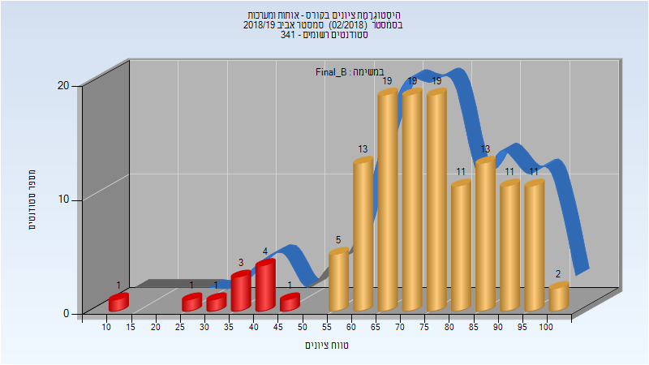

| סטודנטים | עברו/נכשלו | אחוז עוברים | ציון מינימלי | ציון מקסימלי | ממוצע | חציון |
| ---- | ---- | ---- | ---- | ---- | ---- | ---- |
| 134 | 123/11 | 92 | 11 | 100 | 73.799 | 74.5 |

### סופי

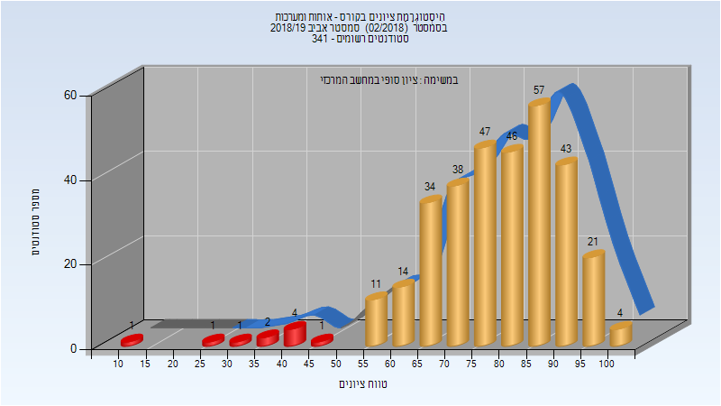

| סטודנטים | עברו/נכשלו | אחוז עוברים | ציון מינימלי | ציון מקסימלי | ממוצע | חציון |
| ---- | ---- | ---- | ---- | ---- | ---- | ---- |
| 325 | 315/10 | 97 | 11 | 100 | 78.772 | 80 |

## קיץ 2019

| איש סגל | תפקיד |
| ---- | ---- |
| בן-דוד גל | מרצה - אחראי מקצוע |
| שלו ארז | מתרגל - עם הרשאות מרצה אחראי |

### סופי מועד א'

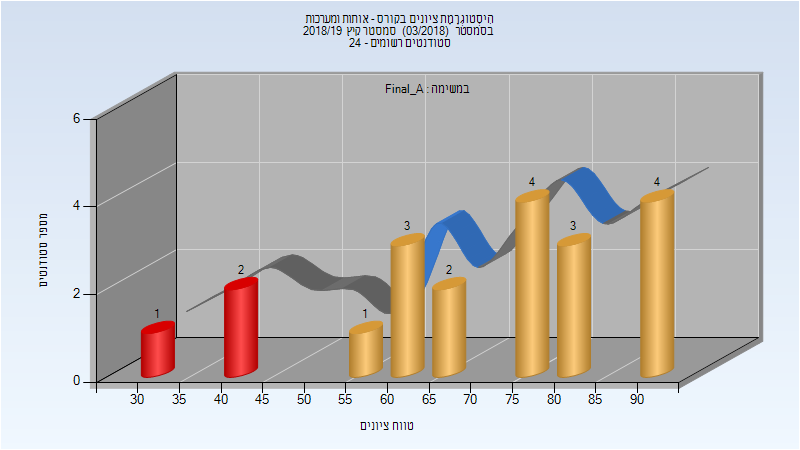

| סטודנטים | עברו/נכשלו | אחוז עוברים | ציון מינימלי | ציון מקסימלי | ממוצע | חציון |
| ---- | ---- | ---- | ---- | ---- | ---- | ---- |
| 20 | 17/3 | 85 | 31 | 94 | 71 | 76 |

### מבחן מועד ב'

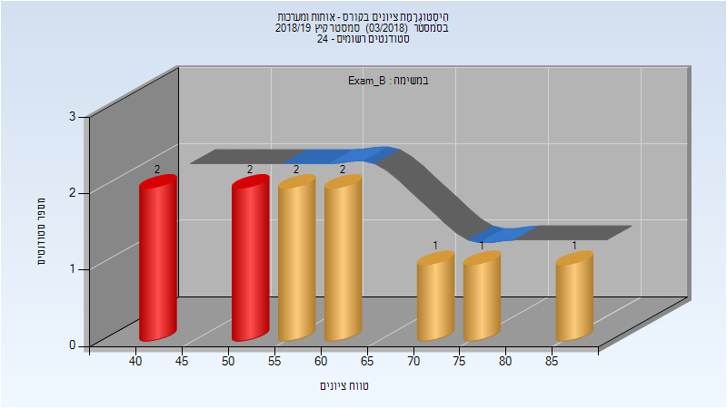

| סטודנטים | עברו/נכשלו | אחוז עוברים | ציון מינימלי | ציון מקסימלי | ממוצע | חציון |
| ---- | ---- | ---- | ---- | ---- | ---- | ---- |
| 11 | 7/4 | 64 | 40 | 88 | 60.091 | 56 |

### סופי מועד ב'

| סטודנטים | עברו/נכשלו | אחוז עוברים | ציון מינימלי | ציון מקסימלי | ממוצע | חציון |
| ---- | ---- | ---- | ---- | ---- | ---- | ---- |
| 20 | 17/3 | 85 | 31 | 94 | 71 | 76 |

## חורף 2019-2020

| איש סגל | תפקיד |
| ---- | ---- |
| בן-דוד גל | מרצה - אחראי מקצוע |
| שלו ארז | מתרגל - עם הרשאות מרצה אחראי |
| כהן אהרון | מתרגל - עם הרשאות מרצה אחראי |
| אלעזרא אור | מתרגל - עם הרשאות מרצה אחראי |

### מבחן מועד א'

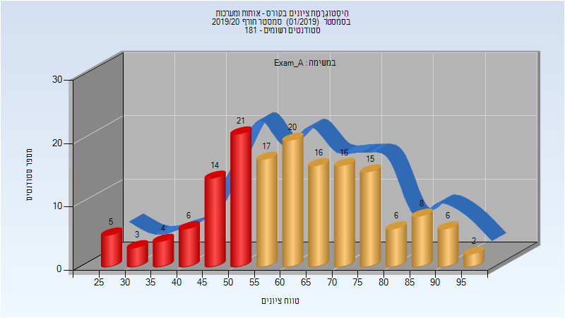

| סטודנטים | עברו/נכשלו | אחוז עוברים | ציון מינימלי | ציון מקסימלי | ממוצע | חציון |
| ---- | ---- | ---- | ---- | ---- | ---- | ---- |
| 159 | 106/53 | 67 | 25 | 99 | 62.321 | 61 |

### סופי מועד א'

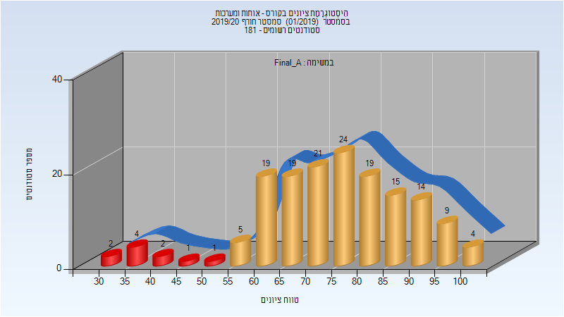

| סטודנטים | עברו/נכשלו | אחוז עוברים | ציון מינימלי | ציון מקסימלי | ממוצע | חציון |
| ---- | ---- | ---- | ---- | ---- | ---- | ---- |
| 159 | 149/10 | 94 | 33 | 100 | 75.075 | 76 |

### מבחן מועד ב'

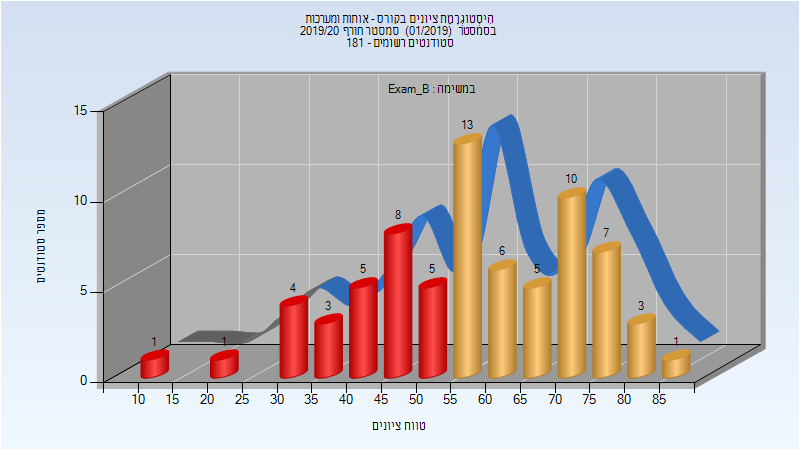

| סטודנטים | עברו/נכשלו | אחוז עוברים | ציון מינימלי | ציון מקסימלי | ממוצע | חציון |
| ---- | ---- | ---- | ---- | ---- | ---- | ---- |
| 72 | 45/27 | 62 | 14 | 89 | 57.653 | 57.5 |

### סופי מועד ב'

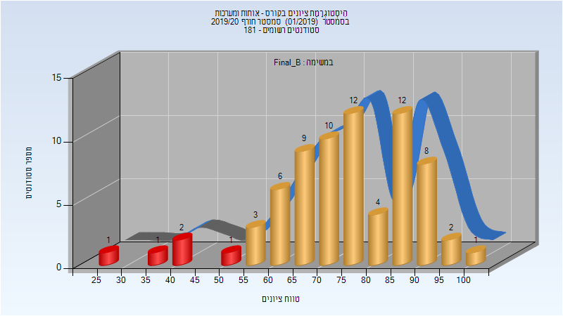

| סטודנטים | עברו/נכשלו | אחוז עוברים | ציון מינימלי | ציון מקסימלי | ממוצע | חציון |
| ---- | ---- | ---- | ---- | ---- | ---- | ---- |
| 72 | 67/5 | 93 | 27 | 100 | 74.986 | 76 |

### סופי

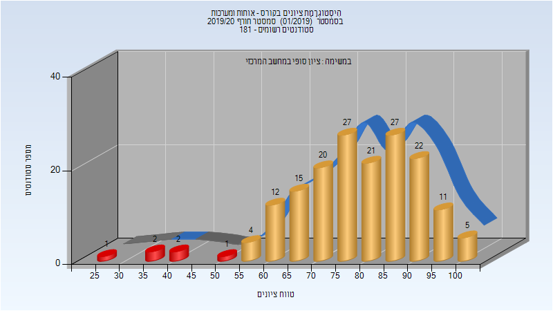

| סטודנטים | עברו/נכשלו | אחוז עוברים | ציון מינימלי | ציון מקסימלי | ממוצע | חציון |
| ---- | ---- | ---- | ---- | ---- | ---- | ---- |
| 171 | 165/6 | 96 | 27 | 100 | 78.929 | 80 |

## אביב 2020

| איש סגל | תפקיד |
| ---- | ---- |
| שורץ אדם | מרצה - אחראי מקצוע |
| בן-דוד גל | מרצה |
| שלו ארז | מתרגל - עם הרשאות מרצה אחראי |

### מבחן מועד א'

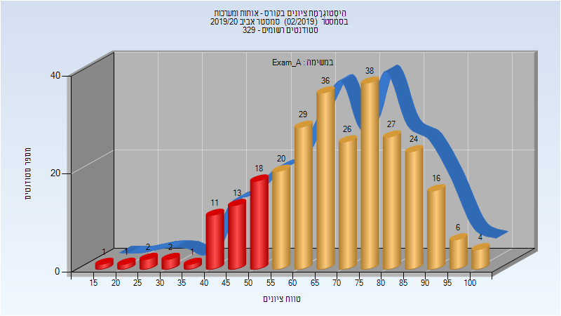

| סטודנטים | עברו/נכשלו | אחוז עוברים | ציון מינימלי | ציון מקסימלי | ממוצע | חציון |
| ---- | ---- | ---- | ---- | ---- | ---- | ---- |
| 278 | 229/49 | 82 | 19 | 100 | 69.563 | 70.5 |

### סופי מועד א'

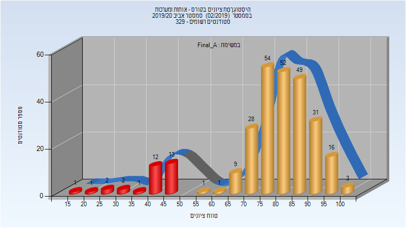

| סטודנטים | עברו/נכשלו | אחוז עוברים | ציון מינימלי | ציון מקסימלי | ממוצע | חציון |
| ---- | ---- | ---- | ---- | ---- | ---- | ---- |
| 278 | 247/31 | 89 | 19 | 100 | 78.26 | 81.0045 |

