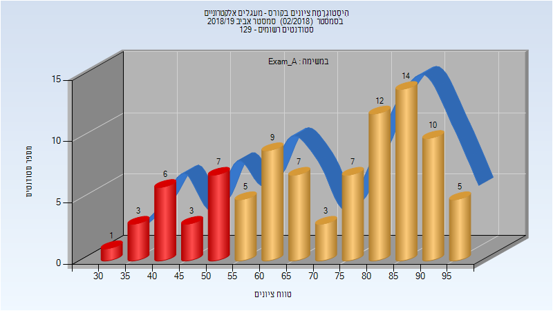
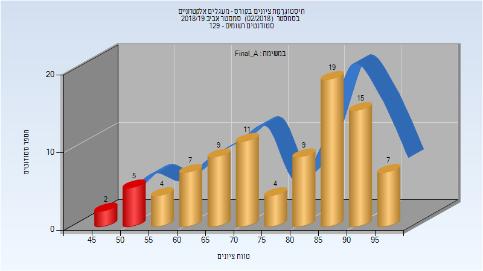
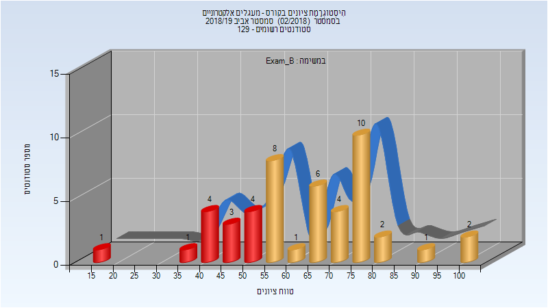
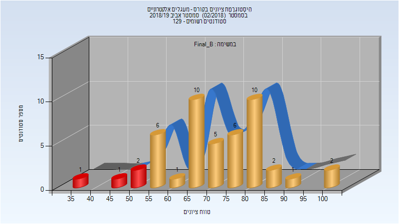
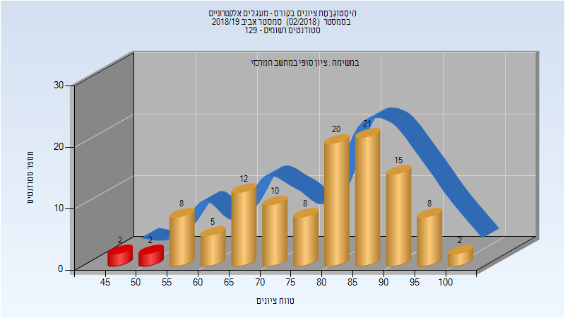
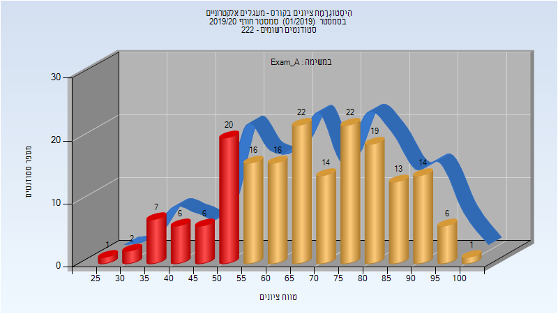
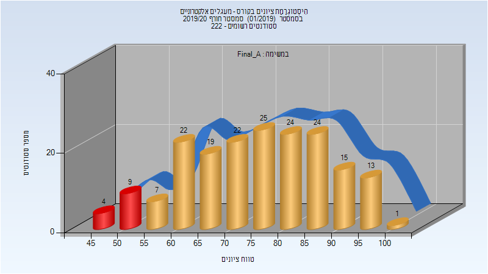
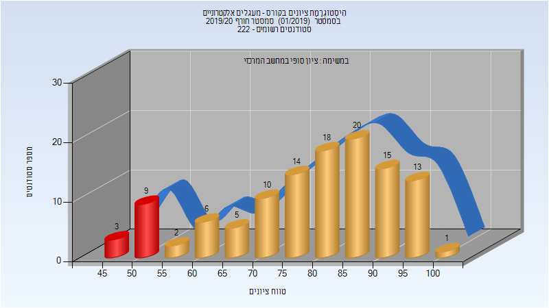
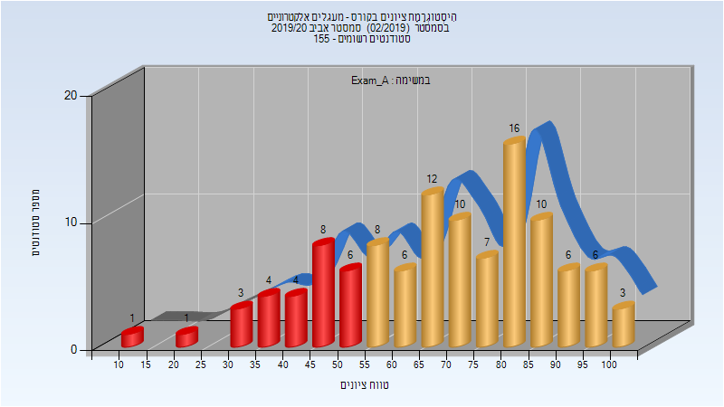
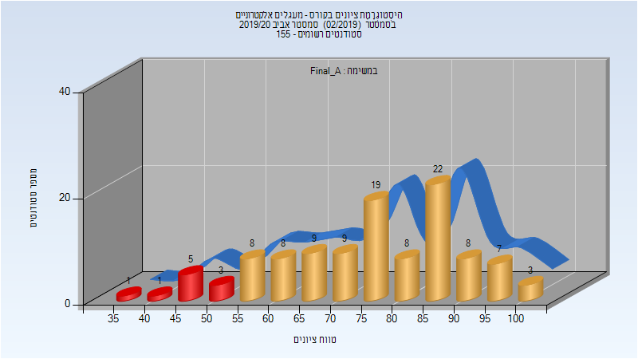

# 044137 - מעגלים אלקטרוניים

## אביב 2019

| איש סגל | תפקיד |
| ---- | ---- |
| קולודני אבינועם | מרצה - אחראי מקצוע |
| רכניץ שרון | מתרגל - עם הרשאות מרצה אחראי |

### מבחן מועד א'

| סטודנטים | עברו/נכשלו | אחוז עוברים | ציון מינימלי | ציון מקסימלי | ממוצע | חציון |
| ---- | ---- | ---- | ---- | ---- | ---- | ---- |
| 92 | 72/20 | 78 | 32 | 98 | 71.435 | 75.5 |

### סופי מועד א'

| סטודנטים | עברו/נכשלו | אחוז עוברים | ציון מינימלי | ציון מקסימלי | ממוצע | חציון |
| ---- | ---- | ---- | ---- | ---- | ---- | ---- |
| 92 | 85/7 | 92 | 46 | 98 | 77.88 | 81.5 |

### מבחן מועד ב'

| סטודנטים | עברו/נכשלו | אחוז עוברים | ציון מינימלי | ציון מקסימלי | ממוצע | חציון |
| ---- | ---- | ---- | ---- | ---- | ---- | ---- |
| 47 | 34/13 | 72 | 18 | 100 | 64.053 | 65 |

### סופי מועד ב'

| סטודנטים | עברו/נכשלו | אחוז עוברים | ציון מינימלי | ציון מקסימלי | ממוצע | חציון |
| ---- | ---- | ---- | ---- | ---- | ---- | ---- |
| 47 | 43/4 | 91 | 37 | 100 | 71.617 | 73 |

### סופי

| סטודנטים | עברו/נכשלו | אחוז עוברים | ציון מינימלי | ציון מקסימלי | ממוצע | חציון |
| ---- | ---- | ---- | ---- | ---- | ---- | ---- |
| 113 | 109/4 | 96 | 45 | 100 | 78.894 | 82 |

## חורף 2019-2020

| איש סגל | תפקיד |
| ---- | ---- |
| צברי ליאור | מרצה - אחראי מקצוע |
| קולודני אבינועם | מרצה |
| זולקוב ארז | מתרגל - עם הרשאות מרצה אחראי |
| נגוסי יהודה | מתרגל - עם הרשאות מרצה אחראי |
| רכניץ שרון | מתרגל - עם הרשאות מרצה אחראי |

### מבחן מועד א'

| סטודנטים | עברו/נכשלו | אחוז עוברים | ציון מינימלי | ציון מקסימלי | ממוצע | חציון |
| ---- | ---- | ---- | ---- | ---- | ---- | ---- |
| 185 | 143/42 | 77 | 28 | 100 | 68.565 | 69 |

### סופי מועד א'

| סטודנטים | עברו/נכשלו | אחוז עוברים | ציון מינימלי | ציון מקסימלי | ממוצע | חציון |
| ---- | ---- | ---- | ---- | ---- | ---- | ---- |
| 185 | 172/13 | 93 | 45 | 100 | 75.638 | 76 |

### סופי

| סטודנטים | עברו/נכשלו | אחוז עוברים | ציון מינימלי | ציון מקסימלי | ממוצע | חציון |
| ---- | ---- | ---- | ---- | ---- | ---- | ---- |
| 185 | 173/12 | 94 | 45 | 100 | 80.1 | 84 |

## אביב 2020

| איש סגל | תפקיד |
| ---- | ---- |
| כהן עמנואל | מרצה - אחראי מקצוע |
| צברי ליאור | מרצה |
| נגוסי יהודה | מתרגל - עם הרשאות מרצה אחראי |
| גרסטמן ליעד | מתרגל - עם הרשאות מרצה אחראי |

### מבחן מועד א'

| סטודנטים | עברו/נכשלו | אחוז עוברים | ציון מינימלי | ציון מקסימלי | ממוצע | חציון |
| ---- | ---- | ---- | ---- | ---- | ---- | ---- |
| 111 | 84/27 | 76 | 5 | 104 | 68.667 | 71 |

### סופי מועד א'

| סטודנטים | עברו/נכשלו | אחוז עוברים | ציון מינימלי | ציון מקסימלי | ממוצע | חציון |
| ---- | ---- | ---- | ---- | ---- | ---- | ---- |
| 111 | 100/11 | 90 | 24 | 100 | 75.495 | 78 |

