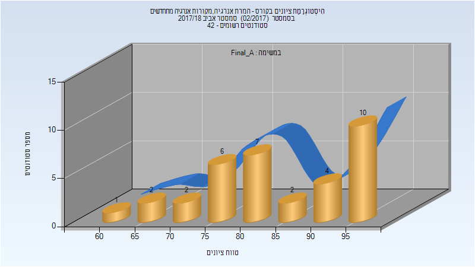
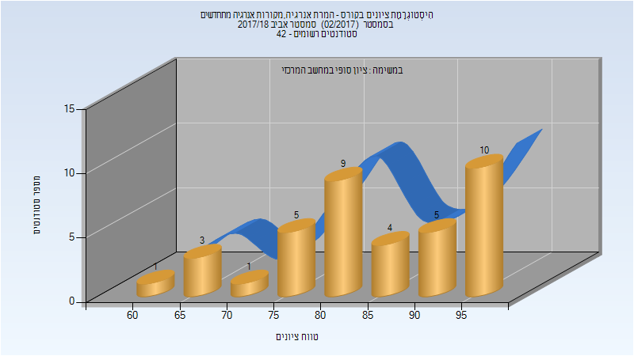
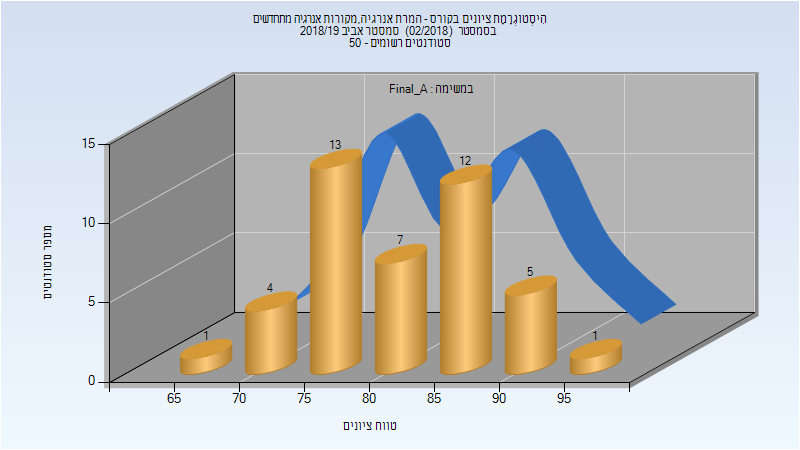
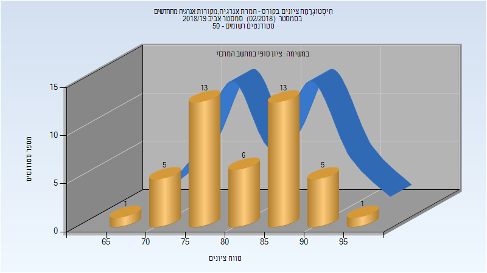
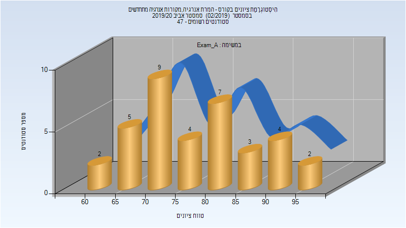
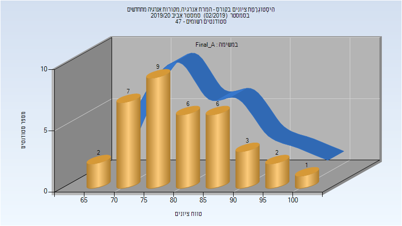

# 044196 - המרת אנרגיה,מקורות אנרגיה מתחדשים

## אביב 2018

| איש סגל | תפקיד |
| ---- | ---- |
| וינשטוק דן | מרצה |
| דיסקין אלכסיי | מרצה |
| קלנר דב | מתרגל - עם הרשאות מרצה אחראי |

### סופי מועד א'

| סטודנטים | עברו/נכשלו | אחוז עוברים | ציון מינימלי | ציון מקסימלי | ממוצע | חציון |
| ---- | ---- | ---- | ---- | ---- | ---- | ---- |
| 34 | 34/0 | 100 | 60 | 98 | 84.588 | 83 |

### סופי

| סטודנטים | עברו/נכשלו | אחוז עוברים | ציון מינימלי | ציון מקסימלי | ממוצע | חציון |
| ---- | ---- | ---- | ---- | ---- | ---- | ---- |
| 38 | 38/0 | 100 | 60 | 98 | 84.842 | 85 |

## אביב 2019

| איש סגל | תפקיד |
| ---- | ---- |
| וינשטוק דן | מרצה - אחראי מקצוע |
| קלנר דב | מתרגל - עם הרשאות מרצה אחראי |

### סופי מועד א'

| סטודנטים | עברו/נכשלו | אחוז עוברים | ציון מינימלי | ציון מקסימלי | ממוצע | חציון |
| ---- | ---- | ---- | ---- | ---- | ---- | ---- |
| 43 | 43/0 | 100 | 65 | 95 | 81.814 | 80 |

### סופי

| סטודנטים | עברו/נכשלו | אחוז עוברים | ציון מינימלי | ציון מקסימלי | ממוצע | חציון |
| ---- | ---- | ---- | ---- | ---- | ---- | ---- |
| 44 | 44/0 | 100 | 65 | 95 | 81.727 | 81.5 |

## אביב 2020

| איש סגל | תפקיד |
| ---- | ---- |
| בק יובל | מרצה - אחראי מקצוע |
| זרגרי נועה | מתרגל - עם הרשאות מרצה אחראי |

### מבחן מועד א'

| סטודנטים | עברו/נכשלו | אחוז עוברים | ציון מינימלי | ציון מקסימלי | ממוצע | חציון |
| ---- | ---- | ---- | ---- | ---- | ---- | ---- |
| 36 | 36/0 | 100 | 63 | 99 | 78.361 | 77 |

### סופי מועד א'

| סטודנטים | עברו/נכשלו | אחוז עוברים | ציון מינימלי | ציון מקסימלי | ממוצע | חציון |
| ---- | ---- | ---- | ---- | ---- | ---- | ---- |
| 36 | 36/0 | 100 | 67 | 100 | 80.694 | 79 |

