# 044202 - אותות אקראיים

## אביב 2012

| איש סגל | תפקיד |
| ---- | ---- |
| ששון יגאל | מרצה - אחראי מקצוע |
| סיגלוב דניאל | מתרגל |
| קרבצ'יק איליה | מתרגל |

### מבחן מועד א'

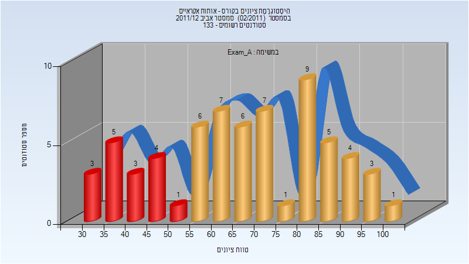

| סטודנטים | עברו/נכשלו | אחוז עוברים | ציון מינימלי | ציון מקסימלי | ממוצע | חציון |
| ---- | ---- | ---- | ---- | ---- | ---- | ---- |
| 65 | 49/16 | 75 | 30 | 100 | 66.785 | 67 |

### סופי מועד א'

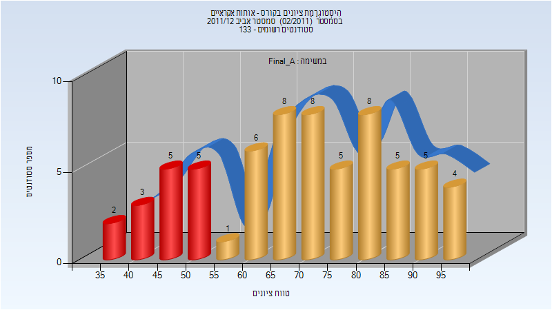

| סטודנטים | עברו/נכשלו | אחוז עוברים | ציון מינימלי | ציון מקסימלי | ממוצע | חציון |
| ---- | ---- | ---- | ---- | ---- | ---- | ---- |
| 65 | 50/15 | 77 | 39.175 | 99.775 | 70.687 | 71.25 |

### סופי מועד ב'

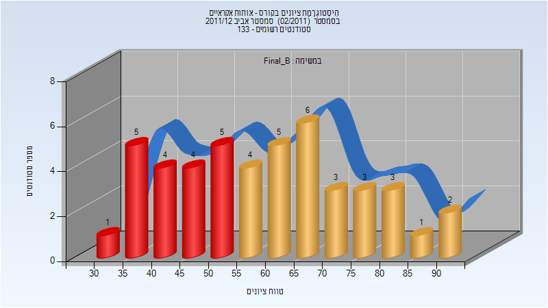

| סטודנטים | עברו/נכשלו | אחוז עוברים | ציון מינימלי | ציון מקסימלי | ממוצע | חציון |
| ---- | ---- | ---- | ---- | ---- | ---- | ---- |
| 46 | 27/19 | 59 | 34.55 | 93.85 | 59.987 | 59.7875 |

## חורף 2012-2013

| איש סגל | תפקיד |
| ---- | ---- |
| ששון יגאל | מרצה - אחראי מקצוע |
| סיגלוב דניאל | מתרגל |
| ישצ'נקו דמיטרי | מתרגל |

### מבחן מועד א'

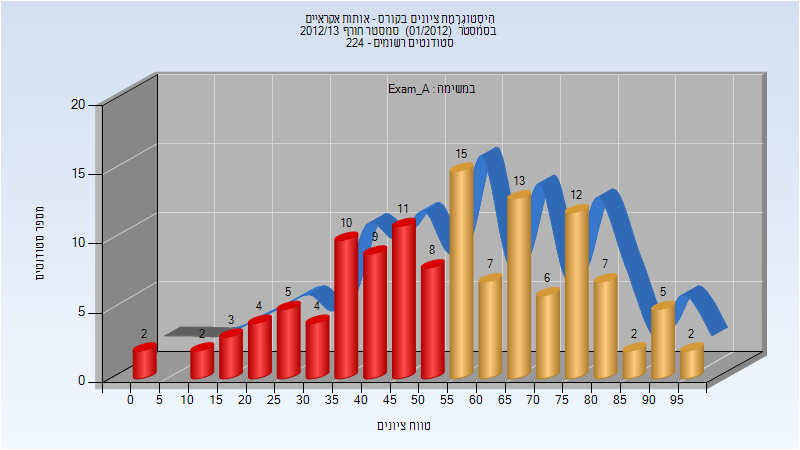

| סטודנטים | עברו/נכשלו | אחוז עוברים | ציון מינימלי | ציון מקסימלי | ממוצע | חציון |
| ---- | ---- | ---- | ---- | ---- | ---- | ---- |
| 127 | 69/58 | 54 | 4 | 99 | 55.614 | 58 |

### סופי מועד א'

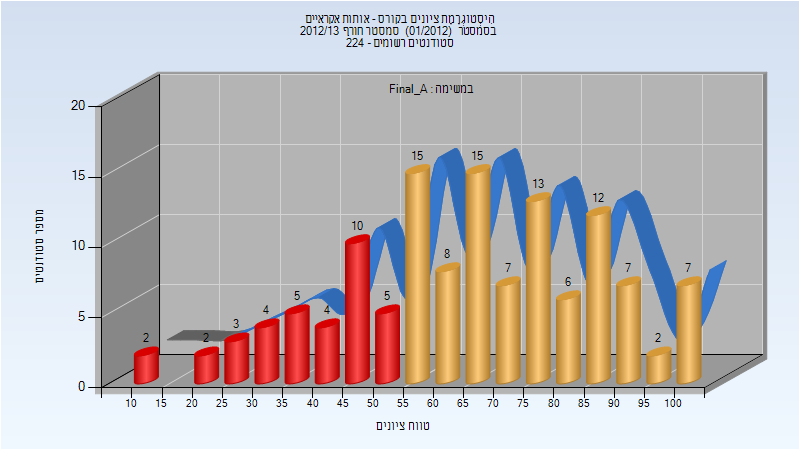

| סטודנטים | עברו/נכשלו | אחוז עוברים | ציון מינימלי | ציון מקסימלי | ממוצע | חציון |
| ---- | ---- | ---- | ---- | ---- | ---- | ---- |
| 127 | 92/35 | 72 | 14 | 100 | 65.488 | 68 |

### סופי מועד ב'

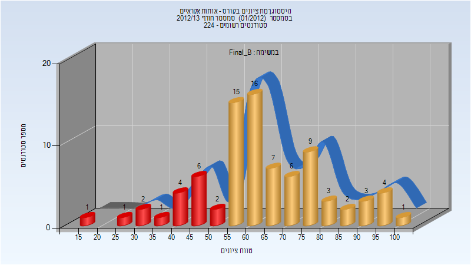

| סטודנטים | עברו/נכשלו | אחוז עוברים | ציון מינימלי | ציון מקסימלי | ממוצע | חציון |
| ---- | ---- | ---- | ---- | ---- | ---- | ---- |
| 83 | 66/17 | 80 | 17 | 100 | 64.145 | 61 |

## אביב 2013

| איש סגל | תפקיד |
| ---- | ---- |
| מנור שי | מרצה - אחראי מקצוע |
| סיגלוב דניאל | מתרגל |
| ישצ'נקו דמיטרי | מתרגל |

### מבחן מועד א'

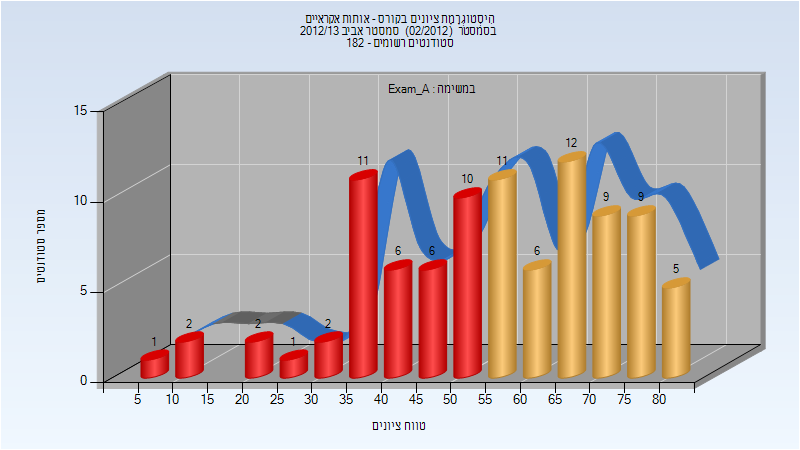

| סטודנטים | עברו/נכשלו | אחוז עוברים | ציון מינימלי | ציון מקסימלי | ממוצע | חציון |
| ---- | ---- | ---- | ---- | ---- | ---- | ---- |
| 93 | 52/41 | 56 | 8 | 84 | 55.796 | 57 |

### סופי מועד א'

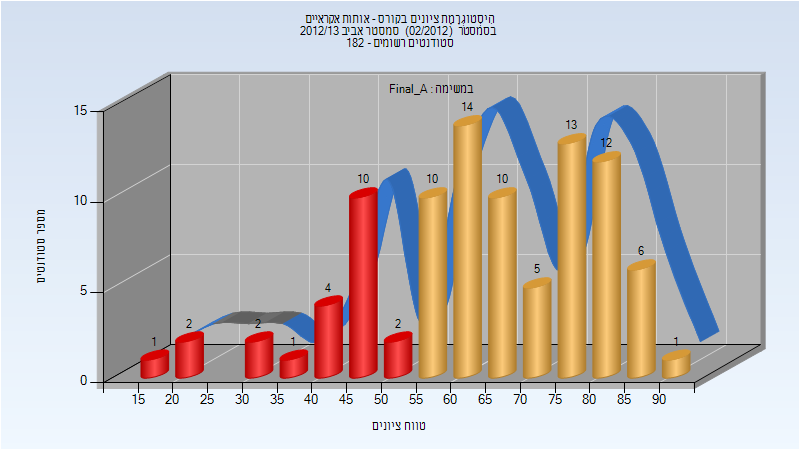

| סטודנטים | עברו/נכשלו | אחוז עוברים | ציון מינימלי | ציון מקסימלי | ממוצע | חציון |
| ---- | ---- | ---- | ---- | ---- | ---- | ---- |
| 93 | 71/22 | 76 | 19.25 | 91.45 | 64.629 | 65.8 |

### סופי מועד ב'

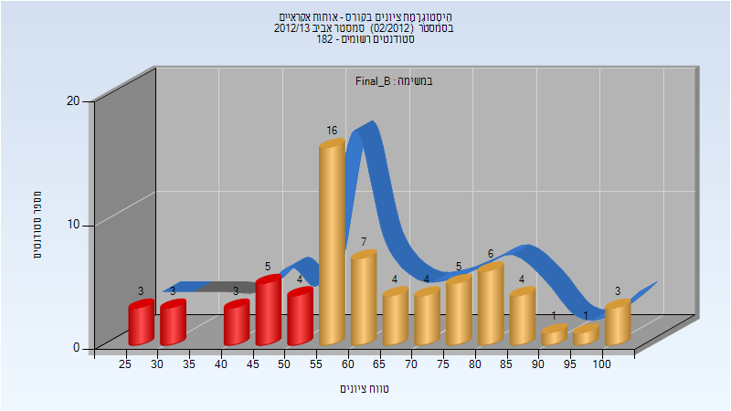

| סטודנטים | עברו/נכשלו | אחוז עוברים | ציון מינימלי | ציון מקסימלי | ממוצע | חציון |
| ---- | ---- | ---- | ---- | ---- | ---- | ---- |
| 69 | 51/18 | 74 | 26.6 | 100 | 63.438 | 60.1 |

## אביב 2014

| איש סגל | תפקיד |
| ---- | ---- |
| אתר רמי | מרצה - אחראי מקצוע |
| סיגלוב דניאל | מתרגל |
| פרג עוזיהו | מתרגל |

### סופי מועד א'

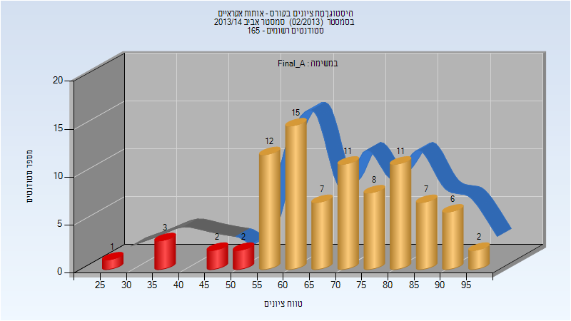

| סטודנטים | עברו/נכשלו | אחוז עוברים | ציון מינימלי | ציון מקסימלי | ממוצע | חציון |
| ---- | ---- | ---- | ---- | ---- | ---- | ---- |
| 87 | 79/8 | 91 | 26.66 | 99.96 | 70.346 | 70.1 |

### סופי מועד ב'

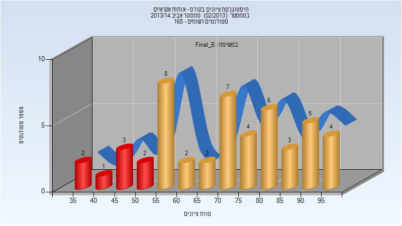

| סטודנטים | עברו/נכשלו | אחוז עוברים | ציון מינימלי | ציון מקסימלי | ממוצע | חציון |
| ---- | ---- | ---- | ---- | ---- | ---- | ---- |
| 49 | 41/8 | 84 | 35.96 | 99.8 | 71.285 | 71.88 |

## חורף 2014-2015

| איש סגל | תפקיד |
| ---- | ---- |
| שטינברג יוסף | מרצה - אחראי מקצוע |
| פרג עוזיהו | מתרגל |

### סופי מועד א'

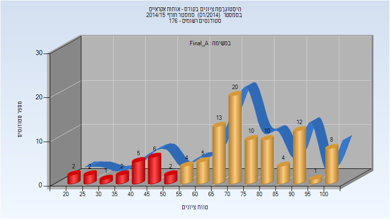

| סטודנטים | עברו/נכשלו | אחוז עוברים | ציון מינימלי | ציון מקסימלי | ממוצע | חציון |
| ---- | ---- | ---- | ---- | ---- | ---- | ---- |
| 107 | 87/20 | 81 | 22.88 | 100 | 71.184 | 72.1 |

### סופי מועד ב'

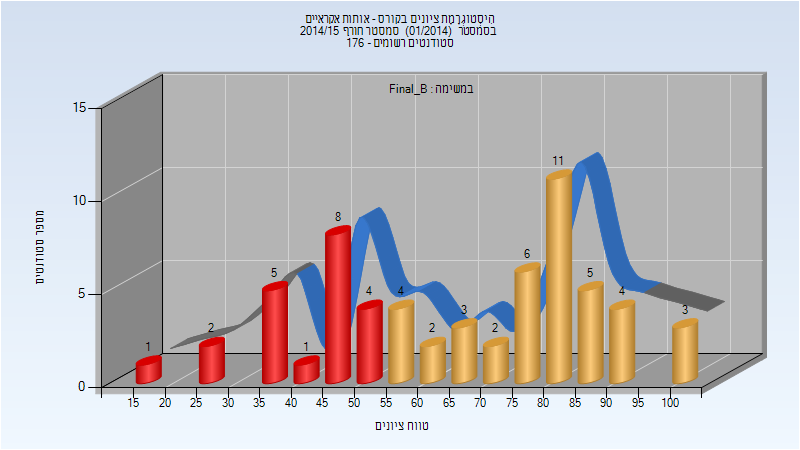

| סטודנטים | עברו/נכשלו | אחוז עוברים | ציון מינימלי | ציון מקסימלי | ממוצע | חציון |
| ---- | ---- | ---- | ---- | ---- | ---- | ---- |
| 61 | 40/21 | 66 | 15 | 100 | 66.475 | 70 |

### סופי

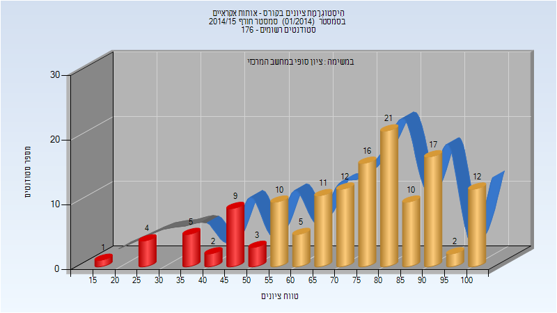

| סטודנטים | עברו/נכשלו | אחוז עוברים | ציון מינימלי | ציון מקסימלי | ממוצע | חציון |
| ---- | ---- | ---- | ---- | ---- | ---- | ---- |
| 140 | 116/24 | 83 | 15 | 100 | 73.114 | 77 |

## אביב 2015

| איש סגל | תפקיד |
| ---- | ---- |
| אתר רמי | מרצה - אחראי מקצוע |
| פרג עוזיהו | מתרגל |

### מבחן מועד א'

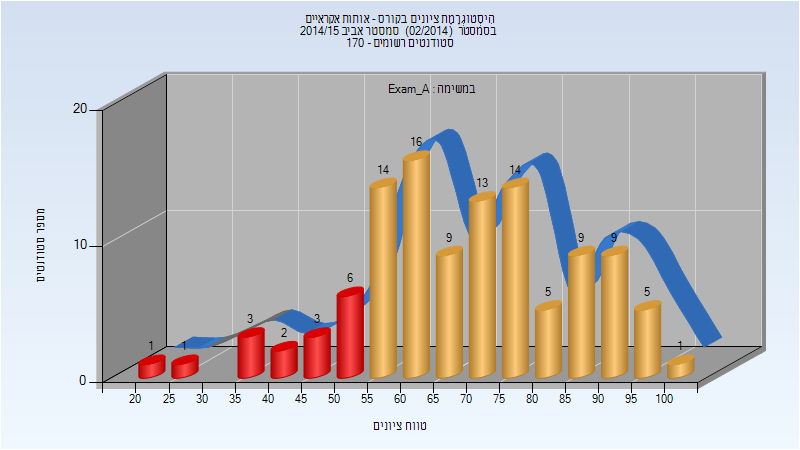

| סטודנטים | עברו/נכשלו | אחוז עוברים | ציון מינימלי | ציון מקסימלי | ממוצע | חציון |
| ---- | ---- | ---- | ---- | ---- | ---- | ---- |
| 111 | 95/16 | 86 | 24 | 100 | 69.405 | 69 |

### סופי מועד א'

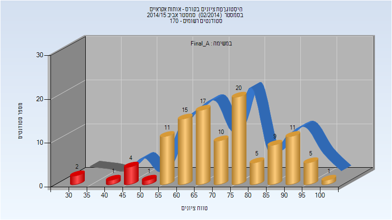

| סטודנטים | עברו/נכשלו | אחוז עוברים | ציון מינימלי | ציון מקסימלי | ממוצע | חציון |
| ---- | ---- | ---- | ---- | ---- | ---- | ---- |
| 112 | 104/8 | 93 | 32 | 100 | 72.25 | 72.5 |

### סופי מועד ב'

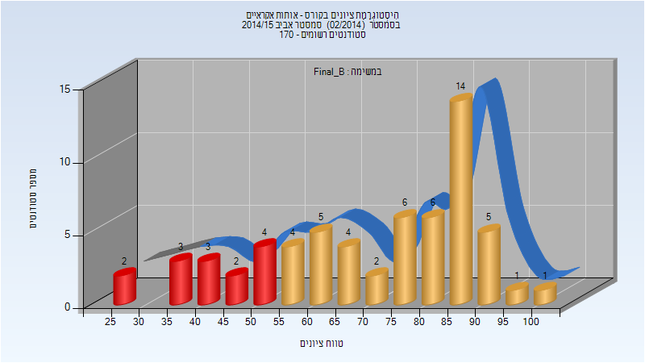

| סטודנטים | עברו/נכשלו | אחוז עוברים | ציון מינימלי | ציון מקסימלי | ממוצע | חציון |
| ---- | ---- | ---- | ---- | ---- | ---- | ---- |
| 62 | 48/14 | 77 | 27 | 100 | 70.484 | 75.5 |

### סופי

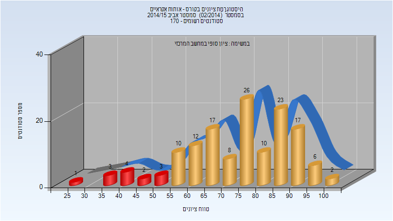

| סטודנטים | עברו/נכשלו | אחוז עוברים | ציון מינימלי | ציון מקסימלי | ממוצע | חציון |
| ---- | ---- | ---- | ---- | ---- | ---- | ---- |
| 144 | 131/13 | 91 | 28 | 100 | 74.764 | 77 |

## חורף 2015-2016

| איש סגל | תפקיד |
| ---- | ---- |
| מרחב נרי | מרצה - אחראי מקצוע |
| זצ'בסקי עדו | מתרגל - עם הרשאות מרצה אחראי |
| פרג עוזיהו | מתרגל - עם הרשאות מרצה אחראי |
| חלק אסף | מתרגל - עם הרשאות מרצה אחראי |

### מבחן מועד א'

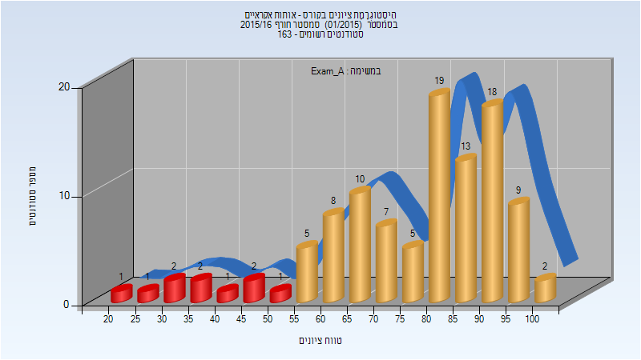

| סטודנטים | עברו/נכשלו | אחוז עוברים | ציון מינימלי | ציון מקסימלי | ממוצע | חציון |
| ---- | ---- | ---- | ---- | ---- | ---- | ---- |
| 106 | 96/10 | 91 | 24 | 100 | 76.934 | 82 |

### סופי מועד א'

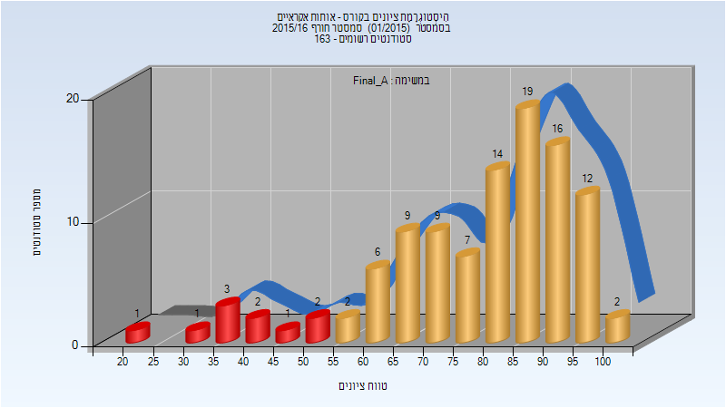

| סטודנטים | עברו/נכשלו | אחוז עוברים | ציון מינימלי | ציון מקסימלי | ממוצע | חציון |
| ---- | ---- | ---- | ---- | ---- | ---- | ---- |
| 106 | 96/10 | 91 | 24 | 100 | 78.425 | 84 |

### מבחן מועד ב'

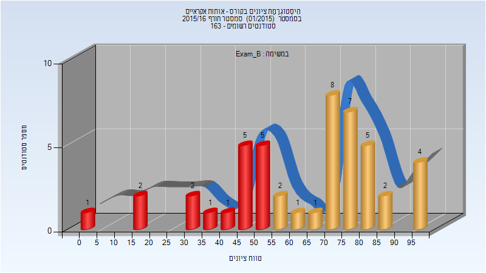

| סטודנטים | עברו/נכשלו | אחוז עוברים | ציון מינימלי | ציון מקסימלי | ממוצע | חציון |
| ---- | ---- | ---- | ---- | ---- | ---- | ---- |
| 47 | 30/17 | 64 | 0 | 98 | 63.936 | 70 |

### סופי מועד ב'

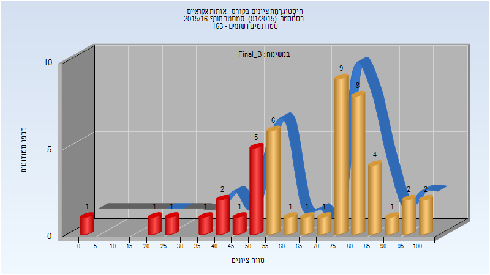

| סטודנטים | עברו/נכשלו | אחוז עוברים | ציון מינימלי | ציון מקסימלי | ממוצע | חציון |
| ---- | ---- | ---- | ---- | ---- | ---- | ---- |
| 47 | 35/12 | 74 | 3 | 100 | 68.553 | 75 |

### סופי

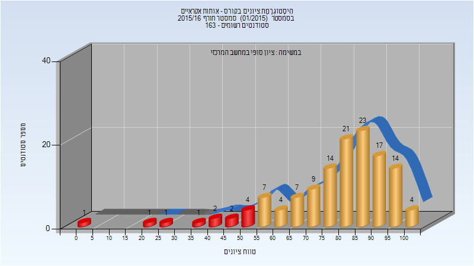

| סטודנטים | עברו/נכשלו | אחוז עוברים | ציון מינימלי | ציון מקסימלי | ממוצע | חציון |
| ---- | ---- | ---- | ---- | ---- | ---- | ---- |
| 132 | 120/12 | 91 | 3 | 100 | 78.621 | 83 |

## אביב 2016

| איש סגל | תפקיד |
| ---- | ---- |
| אתר רמי | מרצה - אחראי מקצוע |
| זצ'בסקי עדו | מתרגל - עם הרשאות מרצה אחראי |

### סופי מועד א'

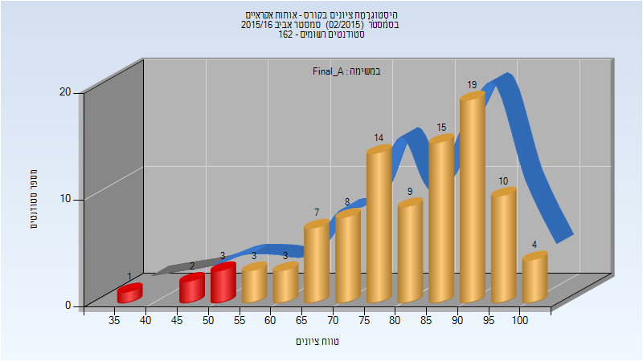

| סטודנטים | עברו/נכשלו | אחוז עוברים | ציון מינימלי | ציון מקסימלי | ממוצע | חציון |
| ---- | ---- | ---- | ---- | ---- | ---- | ---- |
| 98 | 92/6 | 94 | 39.62 | 100 | 81.402 | 84.61 |

### סופי מועד ב'

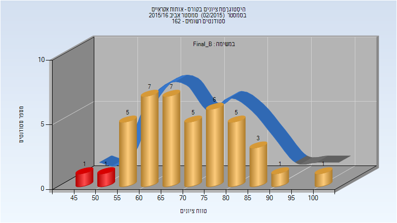

| סטודנטים | עברו/נכשלו | אחוז עוברים | ציון מינימלי | ציון מקסימלי | ממוצע | חציון |
| ---- | ---- | ---- | ---- | ---- | ---- | ---- |
| 42 | 40/2 | 95 | 47 | 100 | 70.952 | 70 |

### סופי

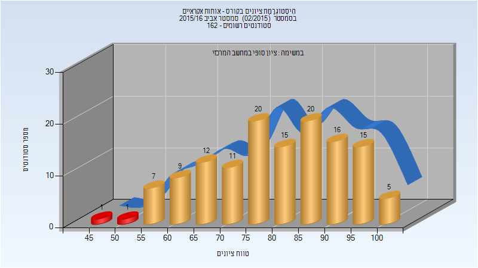

| סטודנטים | עברו/נכשלו | אחוז עוברים | ציון מינימלי | ציון מקסימלי | ממוצע | חציון |
| ---- | ---- | ---- | ---- | ---- | ---- | ---- |
| 132 | 130/2 | 98 | 47 | 100 | 80.129 | 81 |

## חורף 2016-2017

| איש סגל | תפקיד |
| ---- | ---- |
| מיכאלי תומר | מרצה - אחראי מקצוע |
| טננהולץ גיא | מתרגל - עם הרשאות מרצה אחראי |

### מבחן מועד א'

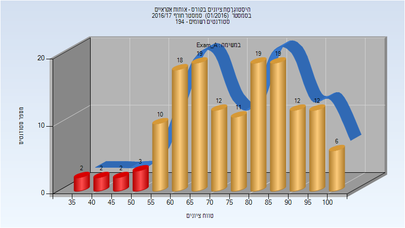

| סטודנטים | עברו/נכשלו | אחוז עוברים | ציון מינימלי | ציון מקסימלי | ממוצע | חציון |
| ---- | ---- | ---- | ---- | ---- | ---- | ---- |
| 147 | 138/9 | 94 | 37 | 100 | 75.891 | 77 |

### סופי מועד א'

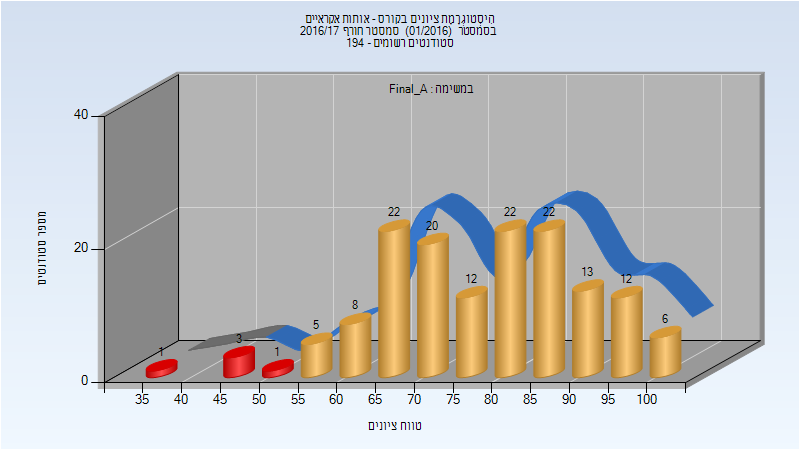

| סטודנטים | עברו/נכשלו | אחוז עוברים | ציון מינימלי | ציון מקסימלי | ממוצע | חציון |
| ---- | ---- | ---- | ---- | ---- | ---- | ---- |
| 147 | 142/5 | 97 | 37 | 100 | 79.075 | 80.45 |

### מבחן מועד ב'

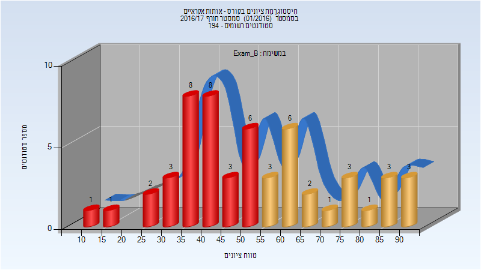

| סטודנטים | עברו/נכשלו | אחוז עוברים | ציון מינימלי | ציון מקסימלי | ממוצע | חציון |
| ---- | ---- | ---- | ---- | ---- | ---- | ---- |
| 54 | 22/32 | 41 | 14 | 93 | 53.074 | 50.5 |

### סופי מועד ב'

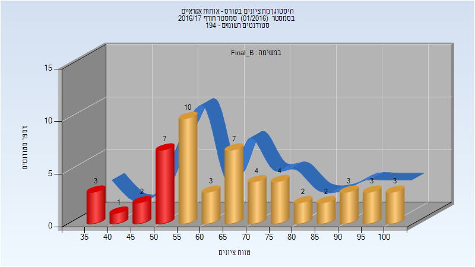

| סטודנטים | עברו/נכשלו | אחוז עוברים | ציון מינימלי | ציון מקסימלי | ממוצע | חציון |
| ---- | ---- | ---- | ---- | ---- | ---- | ---- |
| 54 | 41/13 | 76 | 35.4 | 100 | 67.327 | 65.6 |

### סופי

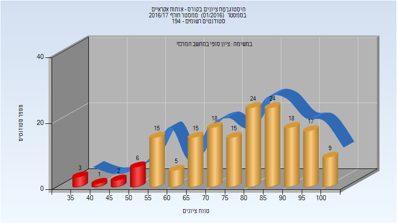

| סטודנטים | עברו/נכשלו | אחוז עוברים | ציון מינימלי | ציון מקסימלי | ממוצע | חציון |
| ---- | ---- | ---- | ---- | ---- | ---- | ---- |
| 172 | 160/12 | 93 | 35 | 100 | 78.157 | 81 |

## אביב 2017

| איש סגל | תפקיד |
| ---- | ---- |
| בוברובסקי עומר | מרצה - אחראי מקצוע |
| פרג עוזיהו | מתרגל - עם הרשאות מרצה אחראי |

### מבחן מועד א'

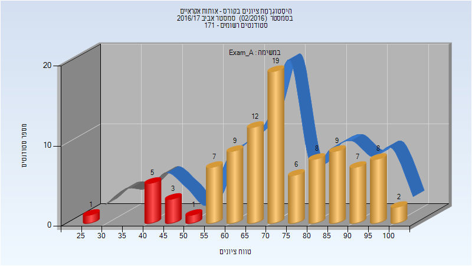

| סטודנטים | עברו/נכשלו | אחוז עוברים | ציון מינימלי | ציון מקסימלי | ממוצע | חציון |
| ---- | ---- | ---- | ---- | ---- | ---- | ---- |
| 97 | 87/10 | 90 | 28 | 100 | 72.969 | 72 |

### סופי מועד א'

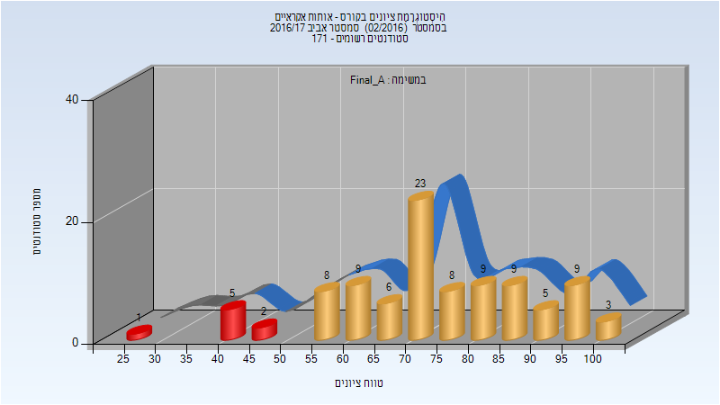

| סטודנטים | עברו/נכשלו | אחוז עוברים | ציון מינימלי | ציון מקסימלי | ממוצע | חציון |
| ---- | ---- | ---- | ---- | ---- | ---- | ---- |
| 97 | 89/8 | 92 | 28 | 100 | 73.866 | 73 |

### סופי מועד ב'

| סטודנטים | עברו/נכשלו | אחוז עוברים | ציון מינימלי | ציון מקסימלי | ממוצע | חציון |
| ---- | ---- | ---- | ---- | ---- | ---- | ---- |
| 55 | 42/13 | 76 | 7 | 103 | 70.6 | 71 |

### סופי

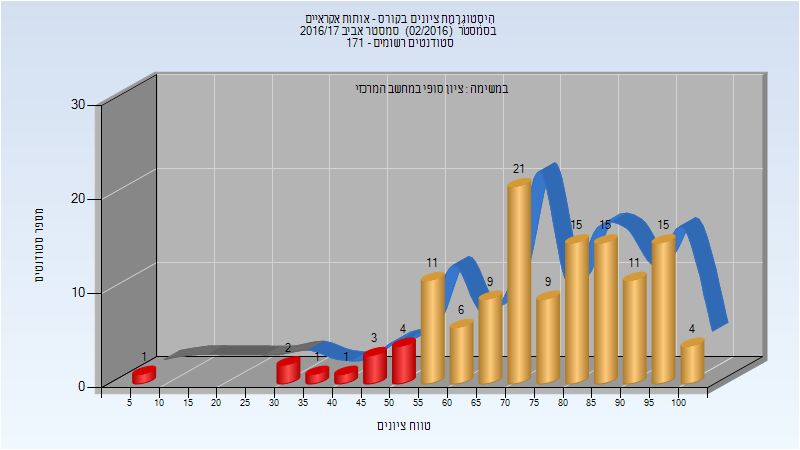

| סטודנטים | עברו/נכשלו | אחוז עוברים | ציון מינימלי | ציון מקסימלי | ממוצע | חציון |
| ---- | ---- | ---- | ---- | ---- | ---- | ---- |
| 128 | 116/12 | 91 | 7 | 100 | 75.93 | 76 |

## חורף 2017-2018

| איש סגל | תפקיד |
| ---- | ---- |
| מיכאלי תומר | מרצה - אחראי מקצוע |
| פרג עוזיהו | מתרגל - עם הרשאות מרצה אחראי |

### מבחן מועד א'

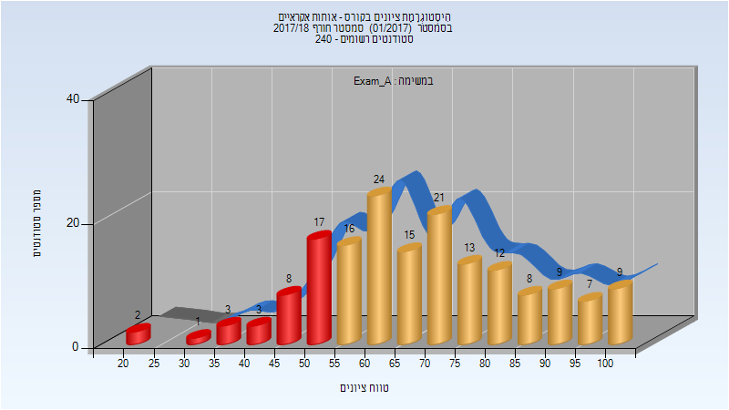

| סטודנטים | עברו/נכשלו | אחוז עוברים | ציון מינימלי | ציון מקסימלי | ממוצע | חציון |
| ---- | ---- | ---- | ---- | ---- | ---- | ---- |
| 168 | 134/34 | 80 | 21 | 100 | 68.875 | 68 |

### סופי מועד א'

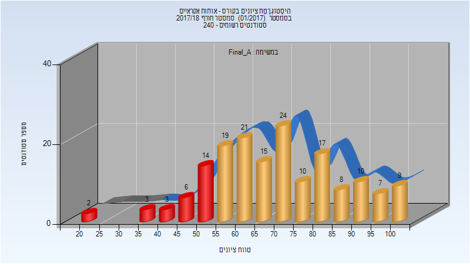

| סטודנטים | עברו/נכשלו | אחוז עוברים | ציון מינימלי | ציון מקסימלי | ממוצע | חציון |
| ---- | ---- | ---- | ---- | ---- | ---- | ---- |
| 168 | 140/28 | 83 | 21 | 100 | 70.054 | 70.5 |

### מבחן מועד ב'

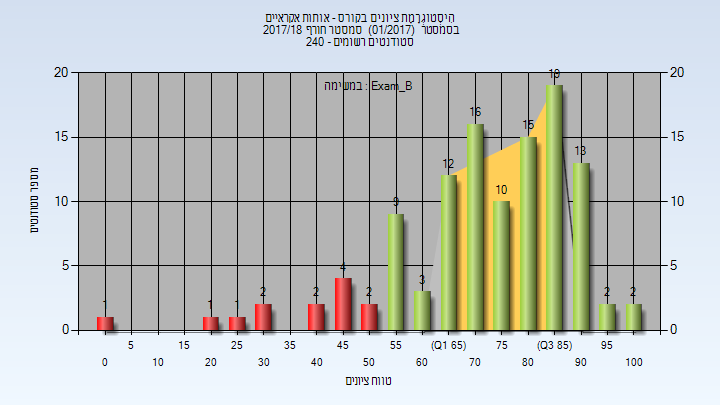

| סטודנטים | עברו/נכשלו | אחוז עוברים | ציון מינימלי | ציון מקסימלי | ממוצע | חציון |
| ---- | ---- | ---- | ---- | ---- | ---- | ---- |
| 114 | 101/13 | 89 | 0 | 100 | 73.754 | 76.5 |

### סופי מועד ב'

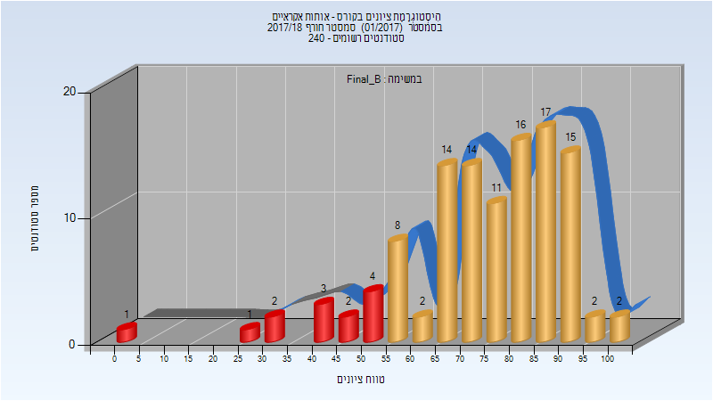

| סטודנטים | עברו/נכשלו | אחוז עוברים | ציון מינימלי | ציון מקסימלי | ממוצע | חציון |
| ---- | ---- | ---- | ---- | ---- | ---- | ---- |
| 114 | 101/13 | 89 | 0 | 100 | 74.211 | 78 |

### סופי

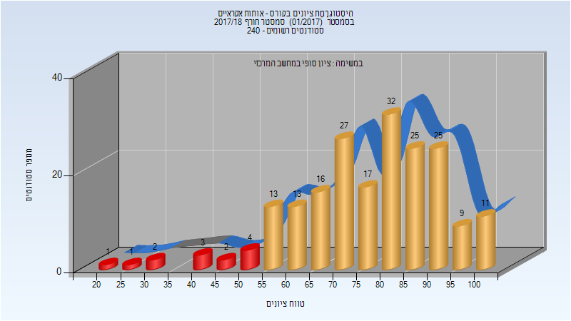

| סטודנטים | עברו/נכשלו | אחוז עוברים | ציון מינימלי | ציון מקסימלי | ממוצע | חציון |
| ---- | ---- | ---- | ---- | ---- | ---- | ---- |
| 201 | 188/13 | 94 | 21 | 100 | 77.06 | 80 |

## אביב 2018

| איש סגל | תפקיד |
| ---- | ---- |
| אתר רמי | מרצה - אחראי מקצוע |
| מיכאלי תומר | מרצה |
| פרג עוזיהו | מתרגל - עם הרשאות מרצה אחראי |
| זיסלמן אב | מתרגל - עם הרשאות מרצה אחראי |

### מבחן מועד א'

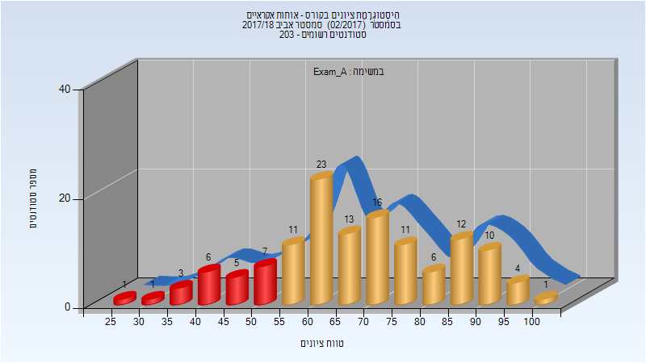

| סטודנטים | עברו/נכשלו | אחוז עוברים | ציון מינימלי | ציון מקסימלי | ממוצע | חציון |
| ---- | ---- | ---- | ---- | ---- | ---- | ---- |
| 130 | 107/23 | 82 | 29 | 100 | 68.469 | 68 |

### סופי מועד א'

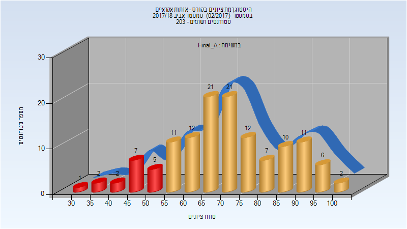

| סטודנטים | עברו/נכשלו | אחוז עוברים | ציון מינימלי | ציון מקסימלי | ממוצע | חציון |
| ---- | ---- | ---- | ---- | ---- | ---- | ---- |
| 130 | 113/17 | 87 | 33 | 100 | 70.969 | 71 |

### מבחן מועד ב'

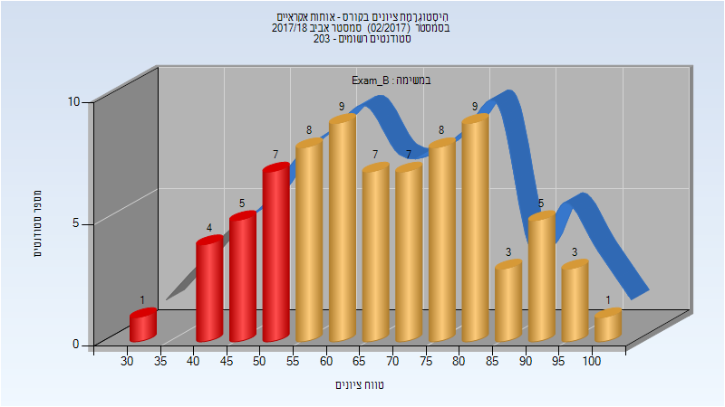

| סטודנטים | עברו/נכשלו | אחוז עוברים | ציון מינימלי | ציון מקסימלי | ממוצע | חציון |
| ---- | ---- | ---- | ---- | ---- | ---- | ---- |
| 77 | 60/17 | 78 | 33 | 100 | 68.13 | 68 |

### סופי מועד ב'

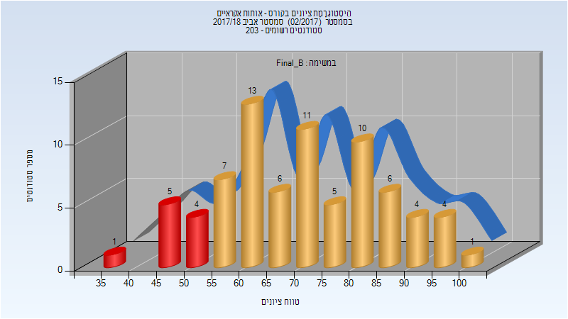

| סטודנטים | עברו/נכשלו | אחוז עוברים | ציון מינימלי | ציון מקסימלי | ממוצע | חציון |
| ---- | ---- | ---- | ---- | ---- | ---- | ---- |
| 77 | 67/10 | 87 | 37 | 100 | 70.675 | 71 |

### סופי

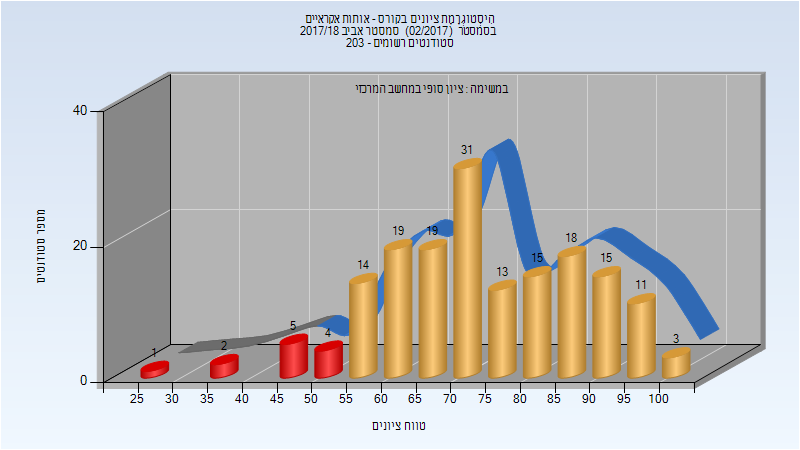

| סטודנטים | עברו/נכשלו | אחוז עוברים | ציון מינימלי | ציון מקסימלי | ממוצע | חציון |
| ---- | ---- | ---- | ---- | ---- | ---- | ---- |
| 170 | 158/12 | 93 | 29 | 100 | 73.835 | 74 |

## חורף 2018-2019

| איש סגל | תפקיד |
| ---- | ---- |
| מיכאלי תומר | מרצה - אחראי מקצוע |
| בוברובסקי עומר | מרצה |
| פרג עוזיהו | מתרגל - עם הרשאות מרצה אחראי |
| מולאיוף רותם | מתרגל - עם הרשאות מרצה אחראי |

### מבחן מועד א'

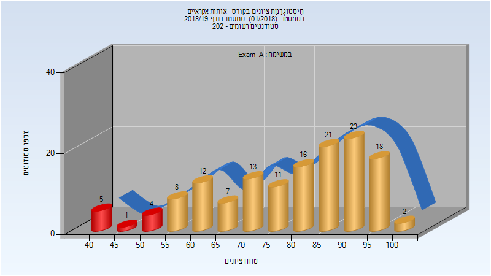

| סטודנטים | עברו/נכשלו | אחוז עוברים | ציון מינימלי | ציון מקסימלי | ממוצע | חציון |
| ---- | ---- | ---- | ---- | ---- | ---- | ---- |
| 141 | 131/10 | 93 | 40 | 100 | 78.957 | 82 |

### סופי מועד א'

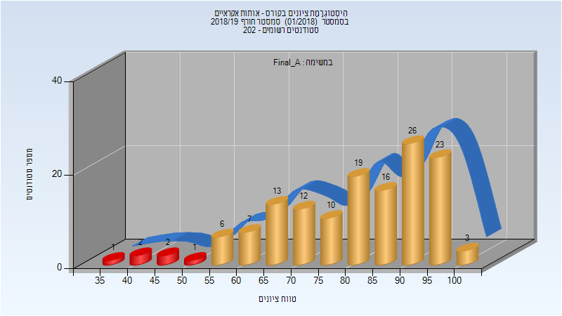

| סטודנטים | עברו/נכשלו | אחוז עוברים | ציון מינימלי | ציון מקסימלי | ממוצע | חציון |
| ---- | ---- | ---- | ---- | ---- | ---- | ---- |
| 141 | 135/6 | 96 | 39 | 100 | 81.255 | 84 |

### מבחן מועד ב'

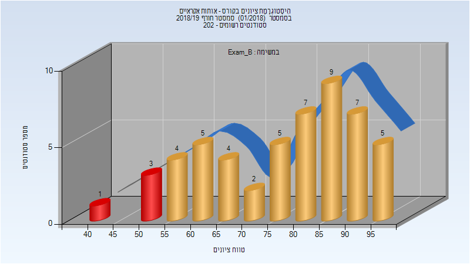

| סטודנטים | עברו/נכשלו | אחוז עוברים | ציון מינימלי | ציון מקסימלי | ממוצע | חציון |
| ---- | ---- | ---- | ---- | ---- | ---- | ---- |
| 52 | 48/4 | 92 | 44 | 99 | 77.288 | 81 |

### סופי מועד ב'

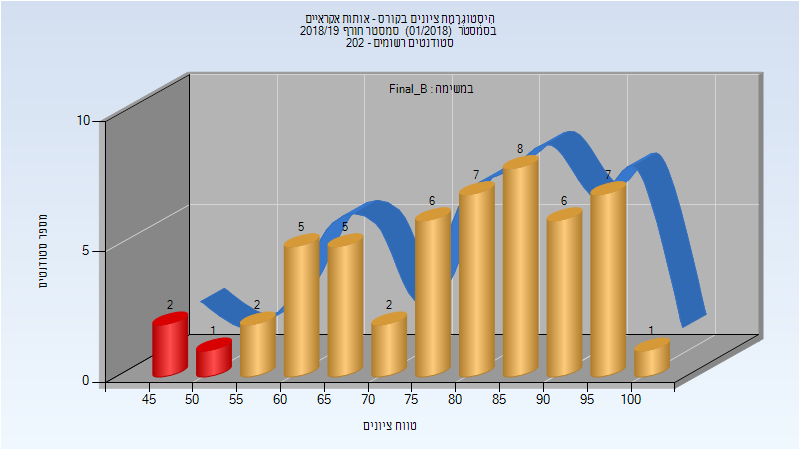

| סטודנטים | עברו/נכשלו | אחוז עוברים | ציון מינימלי | ציון מקסימלי | ממוצע | חציון |
| ---- | ---- | ---- | ---- | ---- | ---- | ---- |
| 52 | 49/3 | 94 | 46 | 100 | 79 | 82 |

### סופי

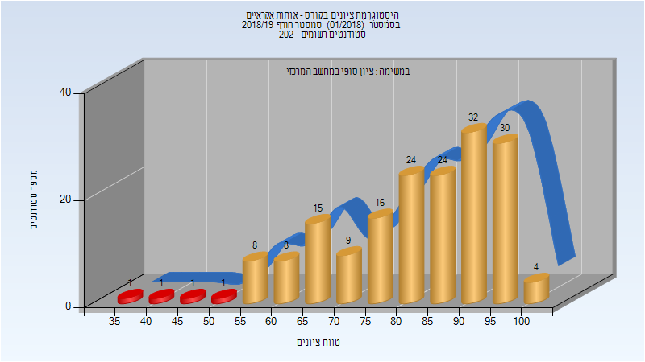

| סטודנטים | עברו/נכשלו | אחוז עוברים | ציון מינימלי | ציון מקסימלי | ממוצע | חציון |
| ---- | ---- | ---- | ---- | ---- | ---- | ---- |
| 174 | 170/4 | 98 | 36 | 100 | 82.443 | 86 |

## אביב 2019

| איש סגל | תפקיד |
| ---- | ---- |
| מרחב נרי | מרצה - אחראי מקצוע |
| מולאיוף רותם | מתרגל - עם הרשאות מרצה אחראי |
| זיסלמן אב | מתרגל - עם הרשאות מרצה אחראי |
| כהן עדו | מתרגל - עם הרשאות מרצה אחראי |
| מנדלסון גל | מתרגל - עם הרשאות מרצה אחראי |

### סופי מועד א'

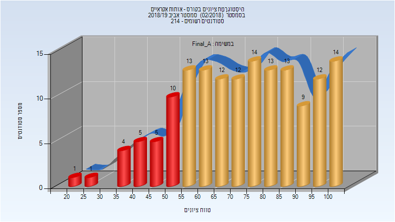

| סטודנטים | עברו/נכשלו | אחוז עוברים | ציון מינימלי | ציון מקסימלי | ממוצע | חציון |
| ---- | ---- | ---- | ---- | ---- | ---- | ---- |
| 151 | 125/26 | 83 | 21 | 100 | 73.159 | 74 |

### סופי מועד ב'

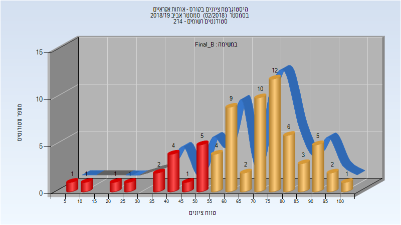

| סטודנטים | עברו/נכשלו | אחוז עוברים | ציון מינימלי | ציון מקסימלי | ממוצע | חציון |
| ---- | ---- | ---- | ---- | ---- | ---- | ---- |
| 70 | 54/16 | 77 | 9 | 100 | 66.843 | 72 |

### סופי

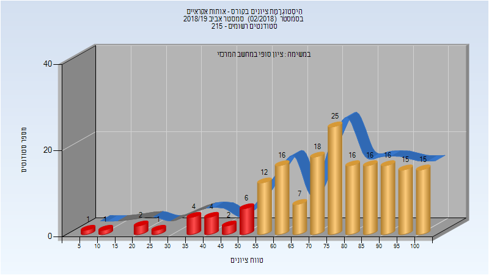

| סטודנטים | עברו/נכשלו | אחוז עוברים | ציון מינימלי | ציון מקסימלי | ממוצע | חציון |
| ---- | ---- | ---- | ---- | ---- | ---- | ---- |
| 177 | 156/21 | 88 | 9 | 100 | 75.203 | 78 |

## חורף 2019-2020

| איש סגל | תפקיד |
| ---- | ---- |
| אתר רמי | מרצה - אחראי מקצוע |
| בוברובסקי עומר | מרצה |
| מנדלסון גל | מתרגל - עם הרשאות מרצה אחראי |
| מולאיוף רותם | מתרגל - עם הרשאות מרצה אחראי |
| זיסלמן אב | מתרגל - עם הרשאות מרצה אחראי |

### מבחן מועד א'

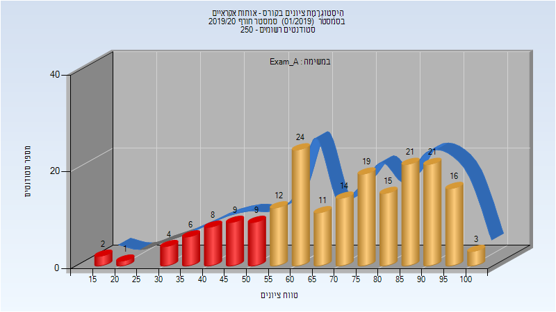

| סטודנטים | עברו/נכשלו | אחוז עוברים | ציון מינימלי | ציון מקסימלי | ממוצע | חציון |
| ---- | ---- | ---- | ---- | ---- | ---- | ---- |
| 195 | 156/39 | 80 | 17 | 100 | 71.015 | 74 |

### סופי מועד א'

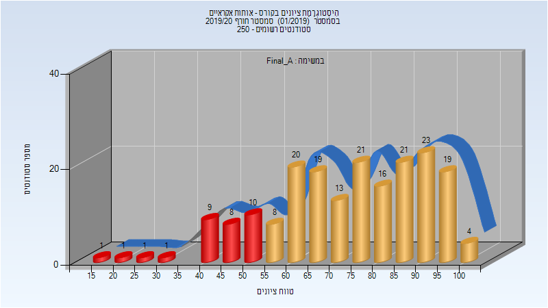

| סטודנטים | עברו/נכשלו | אחוז עוברים | ציון מינימלי | ציון מקסימלי | ממוצע | חציון |
| ---- | ---- | ---- | ---- | ---- | ---- | ---- |
| 195 | 164/31 | 84 | 18 | 100 | 73.877 | 77 |

### מבחן מועד ב'

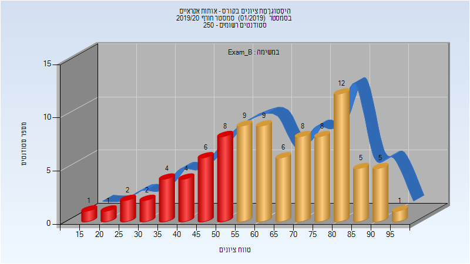

| סטודנטים | עברו/נכשלו | אחוז עוברים | ציון מינימלי | ציון מקסימלי | ממוצע | חציון |
| ---- | ---- | ---- | ---- | ---- | ---- | ---- |
| 91 | 63/28 | 69 | 18.5 | 95.5 | 64.154 | 64 |

### סופי מועד ב'

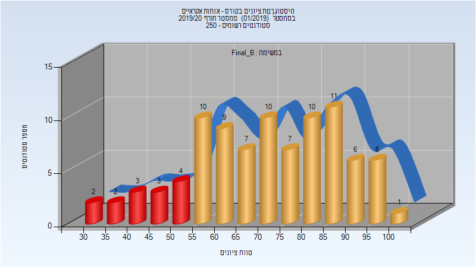

| סטודנטים | עברו/נכשלו | אחוז עוברים | ציון מינימלי | ציון מקסימלי | ממוצע | חציון |
| ---- | ---- | ---- | ---- | ---- | ---- | ---- |
| 91 | 77/14 | 85 | 31 | 100 | 71.429 | 72 |

### סופי

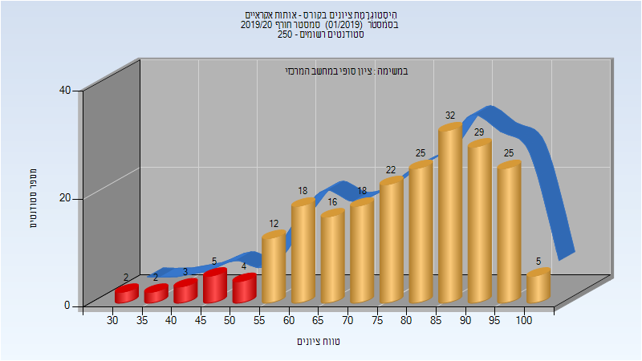

| סטודנטים | עברו/נכשלו | אחוז עוברים | ציון מינימלי | ציון מקסימלי | ממוצע | חציון |
| ---- | ---- | ---- | ---- | ---- | ---- | ---- |
| 225 | 209/16 | 93 | 31 | 100 | 78.064 | 81 |

## אביב 2020

| איש סגל | תפקיד |
| ---- | ---- |
| מיכאלי תומר | מרצה - אחראי מקצוע |
| אתר רמי | מרצה |
| זיסלמן אב | מתרגל - עם הרשאות מרצה אחראי |
| מולאיוף רותם | מתרגל - עם הרשאות מרצה אחראי |

### מבחן מועד א'

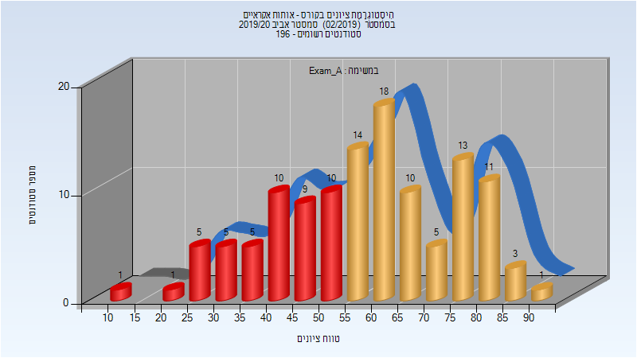

| סטודנטים | עברו/נכשלו | אחוז עוברים | ציון מינימלי | ציון מקסימלי | ממוצע | חציון |
| ---- | ---- | ---- | ---- | ---- | ---- | ---- |
| 121 | 75/46 | 62 | 11 | 93.5 | 58.747 | 60 |

### סופי מועד א'

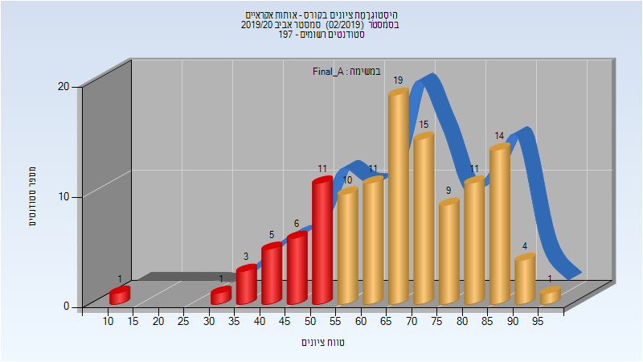

| סטודנטים | עברו/נכשלו | אחוז עוברים | ציון מינימלי | ציון מקסימלי | ממוצע | חציון |
| ---- | ---- | ---- | ---- | ---- | ---- | ---- |
| 121 | 94/27 | 78 | 14 | 99 | 67.074 | 68 |

### סופי מועד ב'

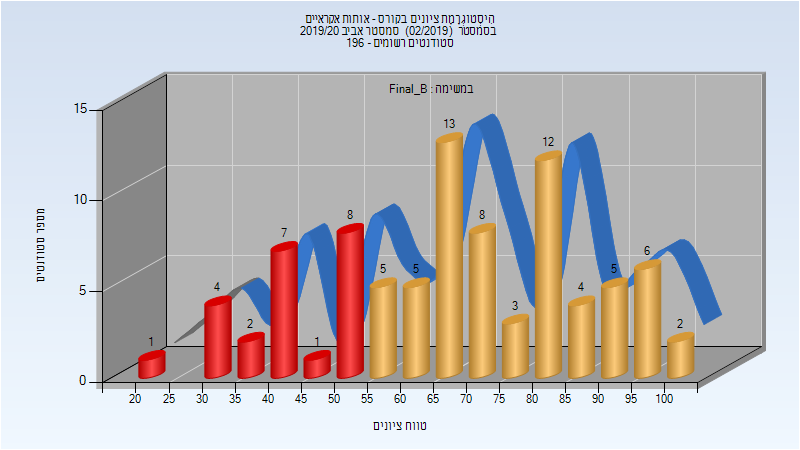

| סטודנטים | עברו/נכשלו | אחוז עוברים | ציון מינימלי | ציון מקסימלי | ממוצע | חציון |
| ---- | ---- | ---- | ---- | ---- | ---- | ---- |
| 86 | 63/23 | 73 | 23 | 100 | 67.826 | 68.5 |

### סופי

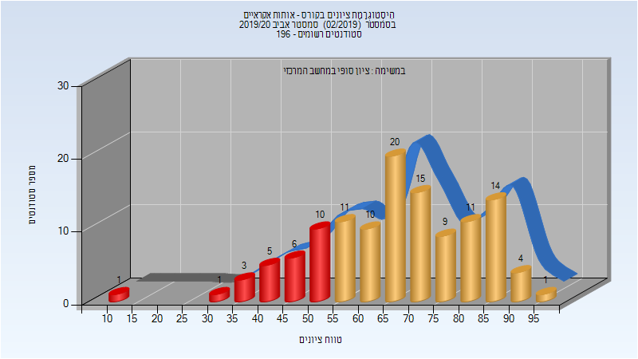

| סטודנטים | עברו/נכשלו | אחוז עוברים | ציון מינימלי | ציון מקסימלי | ממוצע | חציון |
| ---- | ---- | ---- | ---- | ---- | ---- | ---- |
| 152 | 129/23 | 85 | 23 | 100 | 70.947 | 72 |

## חורף 2020-2021

| איש סגל | תפקיד |
| ---- | ---- |
| בוברובסקי עומר | מרצה - אחראי מקצוע |
| שטינברג יוסף | מרצה |
| זיסלמן אב | מתרגל - עם הרשאות מרצה אחראי |
| מולאיוף רותם | מתרגל - עם הרשאות מרצה אחראי |

### מבחן מועד א'

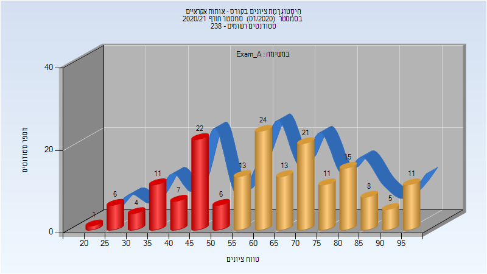

| סטודנטים | עברו/נכשלו | אחוז עוברים | ציון מינימלי | ציון מקסימלי | ממוצע | חציון |
| ---- | ---- | ---- | ---- | ---- | ---- | ---- |
| 178 | 121/57 | 68 | 22 | 99 | 63.382 | 64 |

### סופי מועד א'

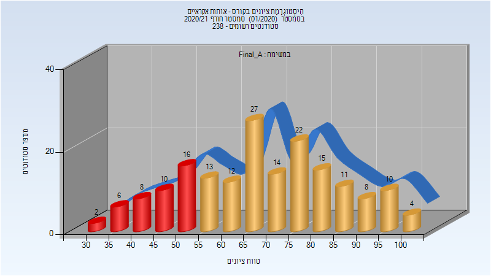

| סטודנטים | עברו/נכשלו | אחוז עוברים | ציון מינימלי | ציון מקסימלי | ממוצע | חציון |
| ---- | ---- | ---- | ---- | ---- | ---- | ---- |
| 178 | 136/42 | 76 | 32 | 100 | 68.624 | 69 |

### מבחן מועד ב'

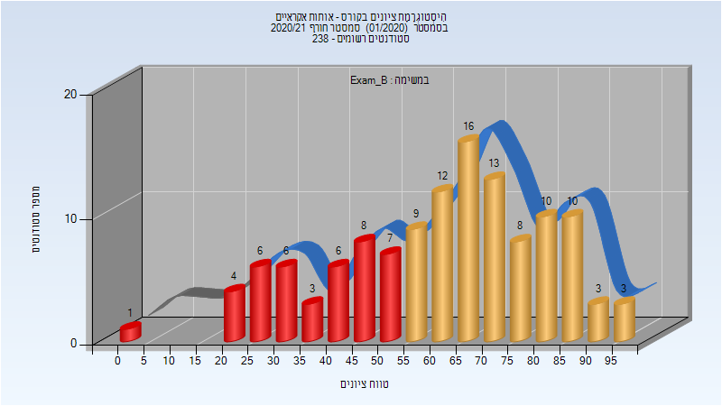

| סטודנטים | עברו/נכשלו | אחוז עוברים | ציון מינימלי | ציון מקסימלי | ממוצע | חציון |
| ---- | ---- | ---- | ---- | ---- | ---- | ---- |
| 125 | 84/41 | 67 | 1 | 97 | 61.328 | 65 |

### סופי מועד ב'

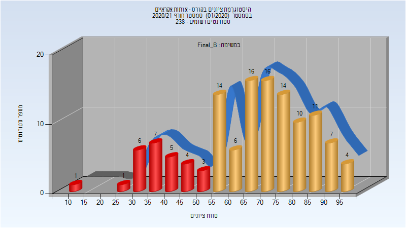

| סטודנטים | עברו/נכשלו | אחוז עוברים | ציון מינימלי | ציון מקסימלי | ממוצע | חציון |
| ---- | ---- | ---- | ---- | ---- | ---- | ---- |
| 125 | 98/27 | 78 | 12 | 99 | 66.72 | 69 |

### סופי

| סטודנטים | עברו/נכשלו | אחוז עוברים | ציון מינימלי | ציון מקסימלי | ממוצע | חציון |
| ---- | ---- | ---- | ---- | ---- | ---- | ---- |
| 207 | 177/30 | 86 | 12 | 100 | 71.957 | 74 |

## אביב 2021

| איש סגל | תפקיד |
| ---- | ---- |
| אתר רמי | מרצה - אחראי מקצוע |
| מיכאלי תומר | מרצה |
| זיסלמן אב | מתרגל - עם הרשאות מרצה אחראי |

