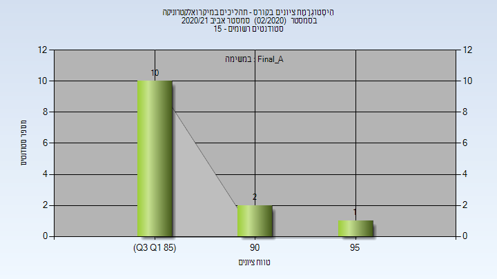
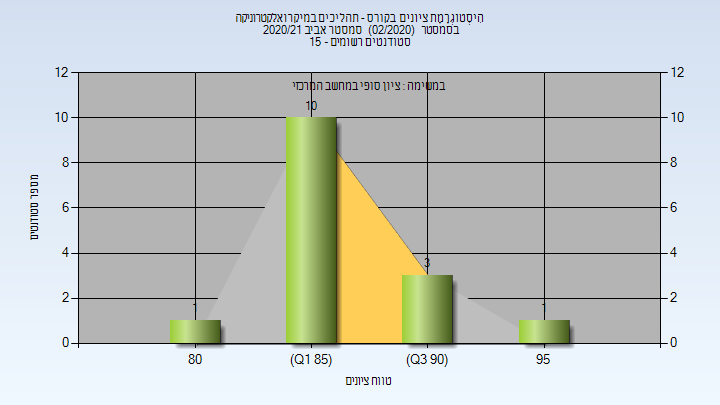
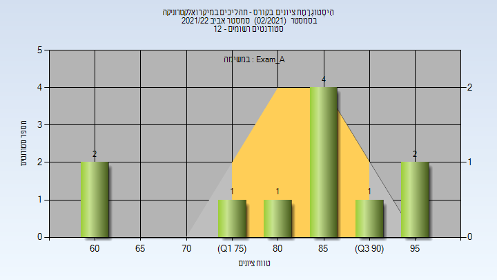
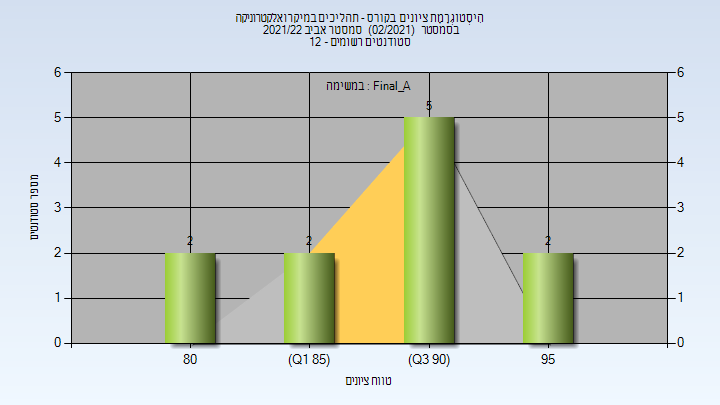

# 044239 - תהליכים במיקרואלקטרוניקה

## אביב 2018

| איש סגל | תפקיד |
| ---- | ---- |
| קורנבלום ליאור | מרצה - אחראי מקצוע |
| אשל יוני |  |
| פז יובל |  |
| בושר שלמה |  |

### מבחן מועד א'

| סטודנטים | עברו/נכשלו | אחוז עוברים | ציון מינימלי | ציון מקסימלי | ממוצע | חציון |
| ---- | ---- | ---- | ---- | ---- | ---- | ---- |
| 12 | 12/0 | 100 | 64 | 98 | 85.375 | 85.75 |

### סופי מועד א'

| סטודנטים | עברו/נכשלו | אחוז עוברים | ציון מינימלי | ציון מקסימלי | ממוצע | חציון |
| ---- | ---- | ---- | ---- | ---- | ---- | ---- |
| 12 | 12/0 | 100 | 83 | 97 | 91.583 | 91.5 |

### סופי

| סטודנטים | עברו/נכשלו | אחוז עוברים | ציון מינימלי | ציון מקסימלי | ממוצע | חציון |
| ---- | ---- | ---- | ---- | ---- | ---- | ---- |
| 12 | 12/0 | 100 | 83 | 97 | 91.583 | 91.5 |

## אביב 2020

| איש סגל | תפקיד |
| ---- | ---- |
| קורנבלום ליאור | מרצה - אחראי מקצוע |

## חורף 2020-2021

| איש סגל | תפקיד |
| ---- | ---- |
| ריטר דן | מרצה - אחראי מקצוע |

## אביב 2021

| איש סגל | תפקיד |
| ---- | ---- |
| בושר שלמה | מתרגל |
| כהן אזרזר דנה | מתרגל |
| קורנבלום ליאור | מרצה - אחראי מקצוע |

### סופי מועד א'

| סטודנטים | עברו/נכשלו | אחוז עוברים | ציון מינימלי | ציון מקסימלי | ממוצע | חציון |
| ---- | ---- | ---- | ---- | ---- | ---- | ---- |
| 13 | 13/0 | 100 | 86 | 97 | 88.923 | 88 |

### סופי

| סטודנטים | עברו/נכשלו | אחוז עוברים | ציון מינימלי | ציון מקסימלי | ממוצע | חציון |
| ---- | ---- | ---- | ---- | ---- | ---- | ---- |
| 15 | 15/0 | 100 | 80 | 97 | 88.6 | 88 |

## אביב 2022

| איש סגל | תפקיד |
| ---- | ---- |
| קורנבלום ליאור | מרצה - אחראי מקצוע |
| לויט אור |  |
| ניר הארווד רבקה גליה |  |
| כהן אזרזר דנה |  |
| שמאליה דועאא |  |

### מבחן מועד א'

| סטודנטים | עברו/נכשלו | אחוז עוברים | ציון מינימלי | ציון מקסימלי | ממוצע | חציון |
| ---- | ---- | ---- | ---- | ---- | ---- | ---- |
| 11 | 11/0 | 100 | 64 | 96 | 83.364 | 87 |

### סופי מועד א'

| סטודנטים | עברו/נכשלו | אחוז עוברים | ציון מינימלי | ציון מקסימלי | ממוצע | חציון |
| ---- | ---- | ---- | ---- | ---- | ---- | ---- |
| 11 | 11/0 | 100 | 80 | 97 | 90.455 | 92 |

