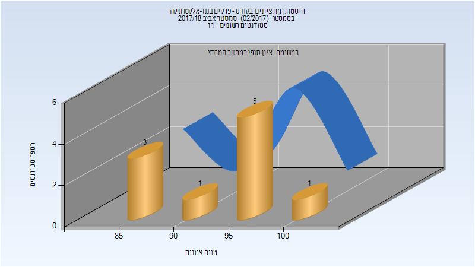

# 046232 - פרקים בננו-אלקטרוניקה

## אביב 2018

| איש סגל | תפקיד |
| ---- | ---- |
| בוקס איל | מרצה - אחראי מקצוע |
| אלפסי ניר | מתרגל - עם הרשאות מרצה אחראי |

### סופי

| סטודנטים | עברו/נכשלו | אחוז עוברים | ציון מינימלי | ציון מקסימלי | ממוצע | חציון |
| ---- | ---- | ---- | ---- | ---- | ---- | ---- |
| 10 | 10/0 | 100 | 87 | 100 | 94.8 | 96.5 |

## אביב 2020

| איש סגל | תפקיד |
| ---- | ---- |
| בוקס איל | מרצה - אחראי מקצוע |
| רוימי רון | מתרגל - עם הרשאות מרצה אחראי |

