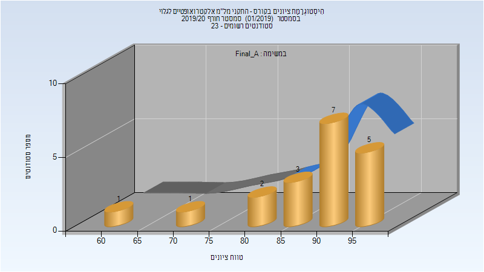
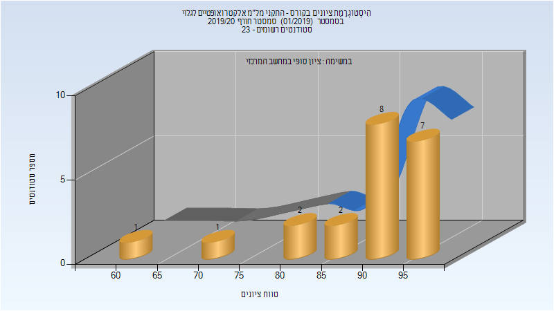

# 046773 - התקני מל"מ אלקטרואופטיים לגלוי

## חורף 2019-2020

| איש סגל | תפקיד |
| ---- | ---- |
| נמירובסקי יעל | מרצה - אחראי מקצוע |
| בושר שלמה | מתרגל - עם הרשאות מרצה אחראי |

### סופי מועד א'

| סטודנטים | עברו/נכשלו | אחוז עוברים | ציון מינימלי | ציון מקסימלי | ממוצע | חציון |
| ---- | ---- | ---- | ---- | ---- | ---- | ---- |
| 19 | 19/0 | 100 | 61 | 97 | 88.632 | 91 |

### סופי

| סטודנטים | עברו/נכשלו | אחוז עוברים | ציון מינימלי | ציון מקסימלי | ממוצע | חציון |
| ---- | ---- | ---- | ---- | ---- | ---- | ---- |
| 22 | 22/0 | 100 | 60 | 98 | 89.619 | 92 |

