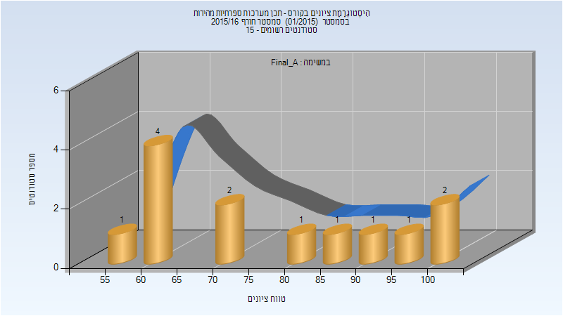
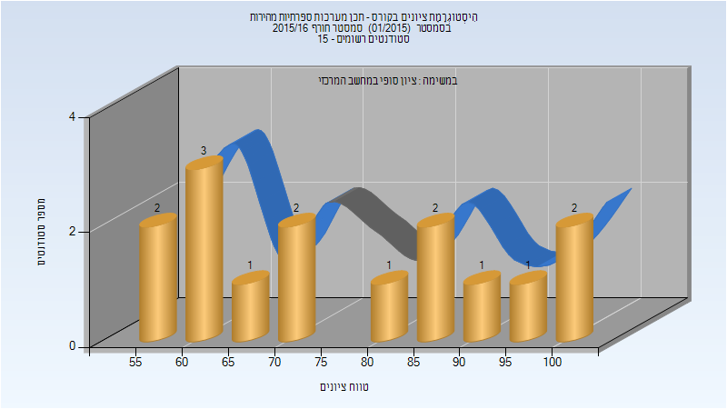
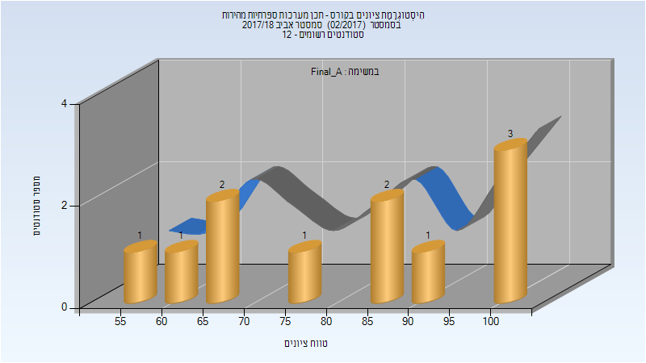
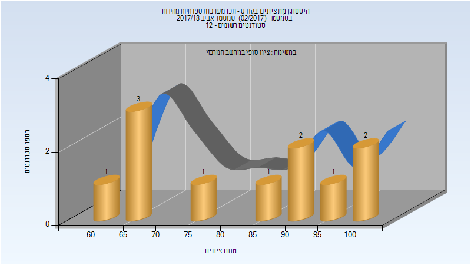

# 046864 - תכן מערכות ספרתיות מהירות

## חורף 2015-2016

| איש סגל | תפקיד |
| ---- | ---- |
| ורנר מיכאל | מרצה - אחראי מקצוע |
| טולמץ' אלכסנדר | מתרגל - עם הרשאות מרצה אחראי |

### סופי מועד א'

| סטודנטים | עברו/נכשלו | אחוז עוברים | ציון מינימלי | ציון מקסימלי | ממוצע | חציון |
| ---- | ---- | ---- | ---- | ---- | ---- | ---- |
| 13 | 13/0 | 100 | 58 | 100 | 77.538 | 72 |

### סופי

| סטודנטים | עברו/נכשלו | אחוז עוברים | ציון מינימלי | ציון מקסימלי | ממוצע | חציון |
| ---- | ---- | ---- | ---- | ---- | ---- | ---- |
| 15 | 15/0 | 100 | 56 | 100 | 76.867 | 71 |

## אביב 2018

| איש סגל | תפקיד |
| ---- | ---- |
| ורנר מיכאל | מרצה - אחראי מקצוע |
| טולמץ' אלכסנדר | מתרגל - עם הרשאות מרצה אחראי |

### סופי מועד א'

| סטודנטים | עברו/נכשלו | אחוז עוברים | ציון מינימלי | ציון מקסימלי | ממוצע | חציון |
| ---- | ---- | ---- | ---- | ---- | ---- | ---- |
| 11 | 11/0 | 100 | 56 | 100 | 81.455 | 77 |

### סופי

| סטודנטים | עברו/נכשלו | אחוז עוברים | ציון מינימלי | ציון מקסימלי | ממוצע | חציון |
| ---- | ---- | ---- | ---- | ---- | ---- | ---- |
| 11 | 11/0 | 100 | 61 | 100 | 82.545 | 77 |

