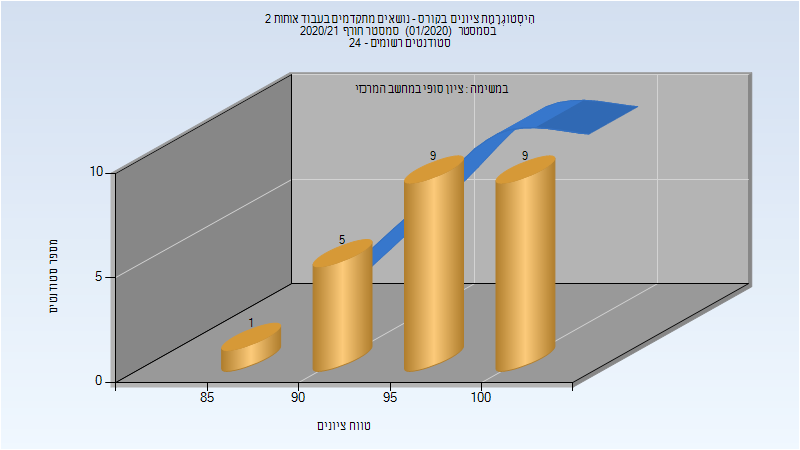

# 048865 - נושאים בעבוד אותות 2

## חורף 2020-2021

| איש סגל | תפקיד |
| ---- | ---- |
| טלמון רונן | מרצה - אחראי מקצוע |
| קימל רון | מרצה |

### סופי מועד א'

| סטודנטים | עברו/נכשלו | אחוז עוברים | ציון מינימלי | ציון מקסימלי | ממוצע | חציון |
| ---- | ---- | ---- | ---- | ---- | ---- | ---- |
| 24 | 24/0 | 100 | 86 | 100 | 97.042 | 98 |

### סופי

| סטודנטים | עברו/נכשלו | אחוז עוברים | ציון מינימלי | ציון מקסימלי | ממוצע | חציון |
| ---- | ---- | ---- | ---- | ---- | ---- | ---- |
| 24 | 24/0 | 100 | 86 | 100 | 97.042 | 98 |

