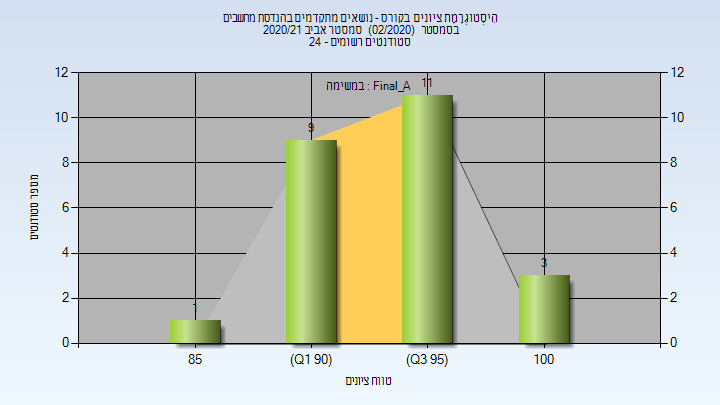
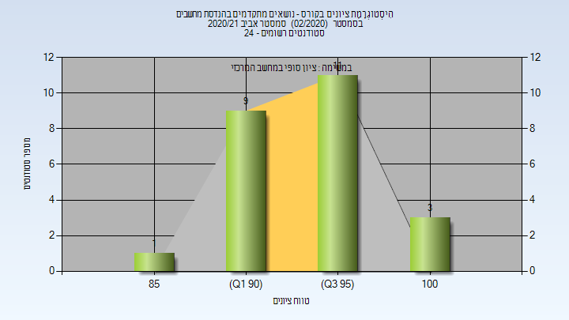

# 048885 - נושאים מתקדמים בהנדסת מחשבים

## אביב 2020

| איש סגל | תפקיד |
| ---- | ---- |
| דרקסלר כהן דנה | מרצה - אחראי מקצוע |

## אביב 2021

| איש סגל | תפקיד |
| ---- | ---- |
| דרקסלר כהן דנה | מרצה - אחראי מקצוע |

### סופי מועד א'

| סטודנטים | עברו/נכשלו | אחוז עוברים | ציון מינימלי | ציון מקסימלי | ממוצע | חציון |
| ---- | ---- | ---- | ---- | ---- | ---- | ---- |
| 24 | 24/0 | 100 | 85 | 100 | 95.708 | 95.5 |

### סופי

| סטודנטים | עברו/נכשלו | אחוז עוברים | ציון מינימלי | ציון מקסימלי | ממוצע | חציון |
| ---- | ---- | ---- | ---- | ---- | ---- | ---- |
| 24 | 24/0 | 100 | 85 | 100 | 95.708 | 95.5 |

