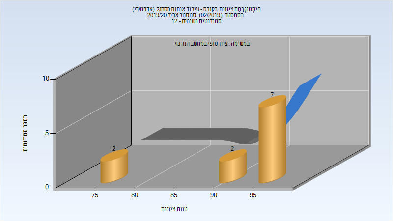

# 048929 - עיבוד אותות מסתגל

## אביב 2020

| איש סגל | תפקיד |
| ---- | ---- |
| פויאר אנדריאס אר | מרצה - אחראי מקצוע |
| אופיר הדס | מתרגל |

### סופי מועד א'

| סטודנטים | עברו/נכשלו | אחוז עוברים | ציון מינימלי | ציון מקסימלי | ממוצע | חציון |
| ---- | ---- | ---- | ---- | ---- | ---- | ---- |
| 11 | 11/0 | 100 | 78 | 97 | 92.455 | 96 |

### סופי

| סטודנטים | עברו/נכשלו | אחוז עוברים | ציון מינימלי | ציון מקסימלי | ממוצע | חציון |
| ---- | ---- | ---- | ---- | ---- | ---- | ---- |
| 11 | 11/0 | 100 | 78 | 97 | 92.455 | 96 |

