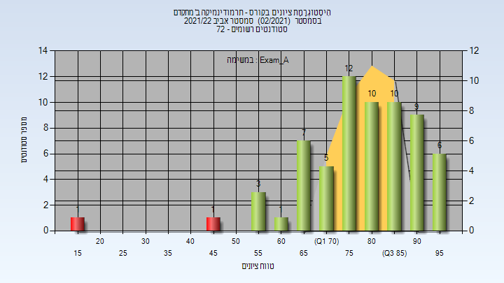

# 054319 - תרמודינמיקה ב' מתקדם

## אביב 2022

| איש סגל | תפקיד |
| ---- | ---- |
| גרינברג-דנה אלון | מרצה - אחראי מקצוע |
| רפפורט ספיר | מתרגל |
| מנסור אליאס | מרצה |

### מבחן מועד א'

| סטודנטים | עברו/נכשלו | אחוז עוברים | ציון מינימלי | ציון מקסימלי | ממוצע | חציון |
| ---- | ---- | ---- | ---- | ---- | ---- | ---- |
| 65 | 63/2 | 97 | 15 | 97 | 79.223 | 81 |

