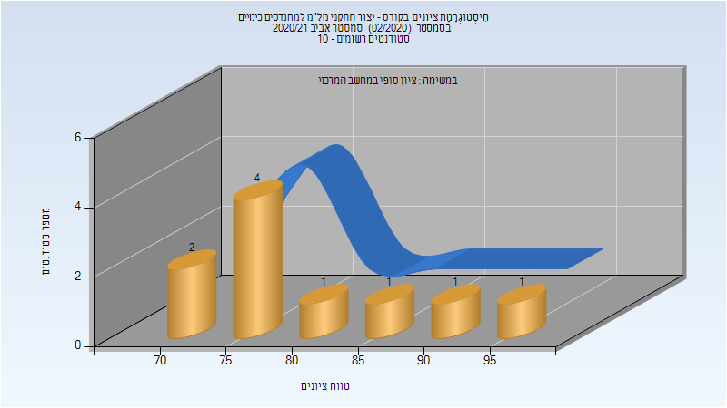

# 054375 - יצור התקני מל"מ למהנדסים כימיים

## אביב 2020

| איש סגל | תפקיד |
| ---- | ---- |
| פז ירון | מרצה - אחראי מקצוע |

## אביב 2021

| איש סגל | תפקיד |
| ---- | ---- |
| פז ירון | מרצה - אחראי מקצוע |

### סופי

| סטודנטים | עברו/נכשלו | אחוז עוברים | ציון מינימלי | ציון מקסימלי | ממוצע | חציון |
| ---- | ---- | ---- | ---- | ---- | ---- | ---- |
| 10 | 10/0 | 100 | 71 | 96 | 81.1 | 77.5 |

