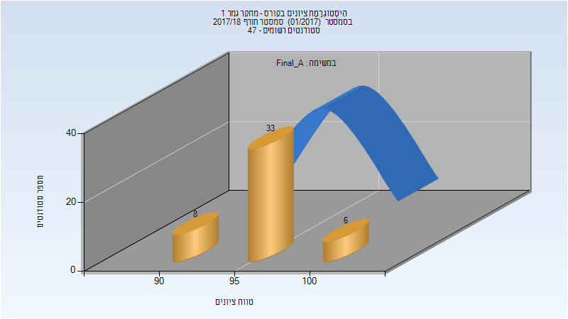
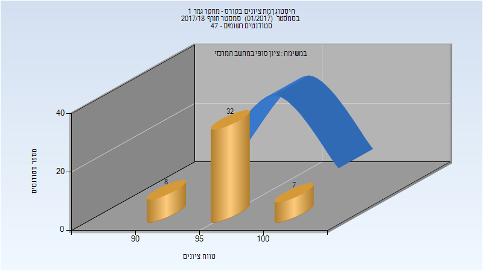
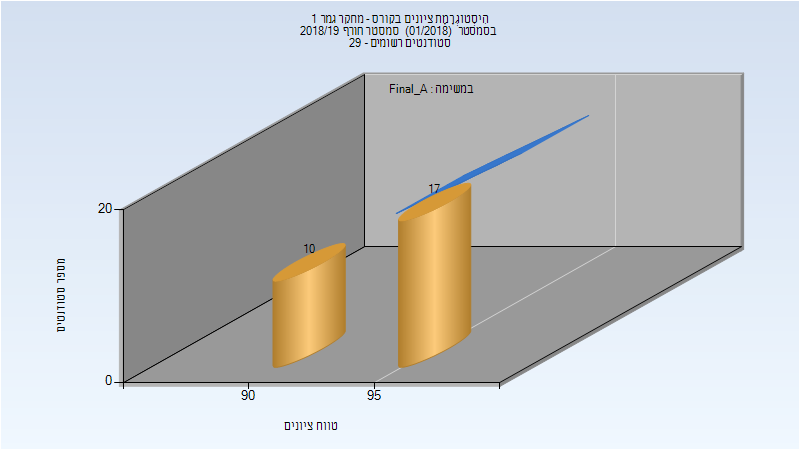
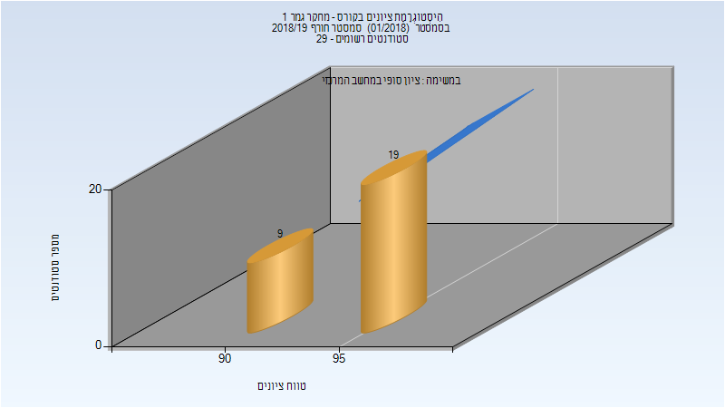
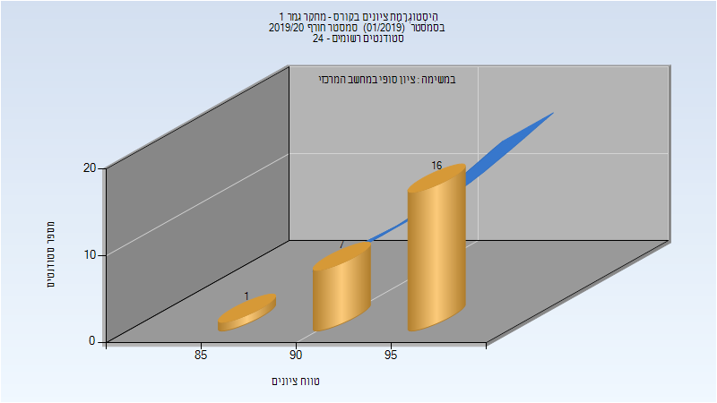

# 054406 - מחקר גמר 1

## חורף 2017-2018

| איש סגל | תפקיד |
| ---- | ---- |
| דקל דריו | מדריך מעבדה - עם הרשאות מרצה אחראי |
| וילדורף-כהן ספיר |  |

### סופי מועד א'

| סטודנטים | עברו/נכשלו | אחוז עוברים | ציון מינימלי | ציון מקסימלי | ממוצע | חציון |
| ---- | ---- | ---- | ---- | ---- | ---- | ---- |
| 47 | 47/0 | 100 | 91 | 100 | 96.149 | 96 |

### סופי

| סטודנטים | עברו/נכשלו | אחוז עוברים | ציון מינימלי | ציון מקסימלי | ממוצע | חציון |
| ---- | ---- | ---- | ---- | ---- | ---- | ---- |
| 47 | 47/0 | 100 | 91 | 100 | 96.191 | 96 |

## חורף 2018-2019

| איש סגל | תפקיד |
| ---- | ---- |
| ברנר נעמה | מרצה - אחראי מקצוע |

### סופי מועד א'

| סטודנטים | עברו/נכשלו | אחוז עוברים | ציון מינימלי | ציון מקסימלי | ממוצע | חציון |
| ---- | ---- | ---- | ---- | ---- | ---- | ---- |
| 27 | 27/0 | 100 | 90 | 99 | 94.889 | 95 |

### סופי

| סטודנטים | עברו/נכשלו | אחוז עוברים | ציון מינימלי | ציון מקסימלי | ממוצע | חציון |
| ---- | ---- | ---- | ---- | ---- | ---- | ---- |
| 28 | 28/0 | 100 | 92 | 99 | 95.143 | 95 |

## חורף 2019-2020

| איש סגל | תפקיד |
| ---- | ---- |
| ברנר נעמה | מדריך מעבדה - עם הרשאות מרצה אחראי |
| אליהו שקד | מדריך מעבדה |

### סופי מועד א'

| סטודנטים | עברו/נכשלו | אחוז עוברים | ציון מינימלי | ציון מקסימלי | ממוצע | חציון |
| ---- | ---- | ---- | ---- | ---- | ---- | ---- |
| 24 | 24/0 | 100 | 88 | 99 | 95.167 | 96 |

### סופי

| סטודנטים | עברו/נכשלו | אחוז עוברים | ציון מינימלי | ציון מקסימלי | ממוצע | חציון |
| ---- | ---- | ---- | ---- | ---- | ---- | ---- |
| 24 | 24/0 | 100 | 88 | 99 | 95.167 | 96 |

