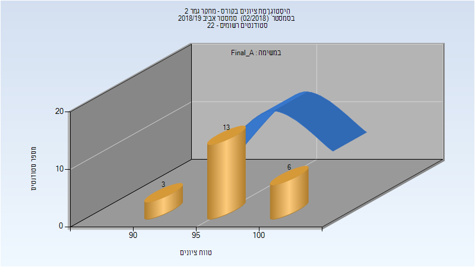

# 054407 - מחקר גמר 2

## אביב 2019

| איש סגל | תפקיד |
| ---- | ---- |
| חאיק חוסאם | מדריך מעבדה - עם הרשאות מרצה אחראי |
| האשול דינא |  |

### סופי מועד א'

| סטודנטים | עברו/נכשלו | אחוז עוברים | ציון מינימלי | ציון מקסימלי | ממוצע | חציון |
| ---- | ---- | ---- | ---- | ---- | ---- | ---- |
| 22 | 22/0 | 100 | 92 | 100 | 97.364 | 97.5 |

### סופי

| סטודנטים | עברו/נכשלו | אחוז עוברים | ציון מינימלי | ציון מקסימלי | ממוצע | חציון |
| ---- | ---- | ---- | ---- | ---- | ---- | ---- |
| 22 | 22/0 | 100 | 92 | 100 | 97.364 | 97.5 |

