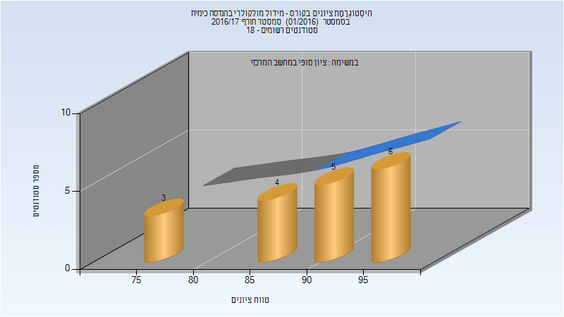

# 054476 - מידול מולקולרי בהנדסה כימית

## חורף 2016-2017

| איש סגל | תפקיד |
| ---- | ---- |
| סטקלוב שמחה רבקה | מרצה - אחראי מקצוע |
| צדוק ישראל | מרצה |

### סופי

| סטודנטים | עברו/נכשלו | אחוז עוברים | ציון מינימלי | ציון מקסימלי | ממוצע | חציון |
| ---- | ---- | ---- | ---- | ---- | ---- | ---- |
| 18 | 18/0 | 100 | 76 | 95 | 88.778 | 90.5 |

