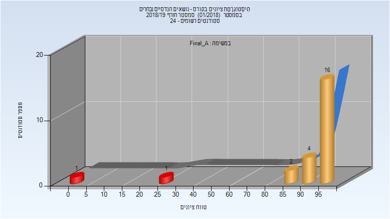
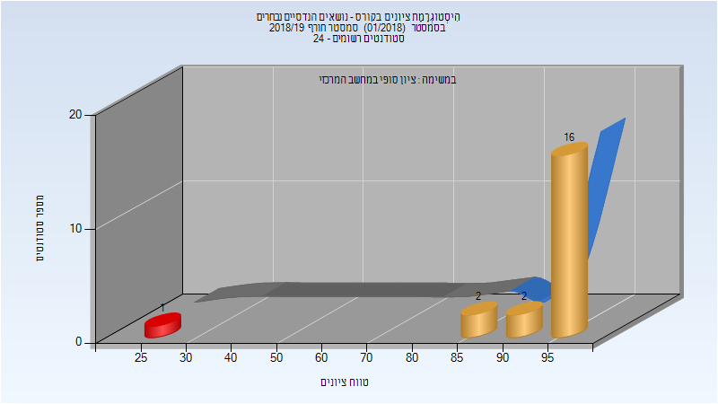

# 056146 - נושאים הנדסיים נבחרים

## חורף 2018-2019

| איש סגל | תפקיד |
| ---- | ---- |
| סמבורסקי גיא | מרצה - אחראי מקצוע |
| רגוניס דניאל | מרצה |

### סופי מועד א'

| סטודנטים | עברו/נכשלו | אחוז עוברים | ציון מינימלי | ציון מקסימלי | ממוצע | חציון |
| ---- | ---- | ---- | ---- | ---- | ---- | ---- |
| 24 | 22/2 | 92 | 0 | 99 | 88.792 | 97 |

### סופי

| סטודנטים | עברו/נכשלו | אחוז עוברים | ציון מינימלי | ציון מקסימלי | ממוצע | חציון |
| ---- | ---- | ---- | ---- | ---- | ---- | ---- |
| 21 | 20/1 | 95 | 26 | 99 | 92.524 | 97 |

