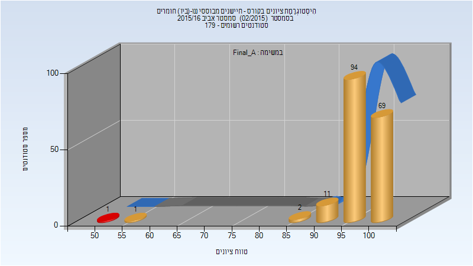
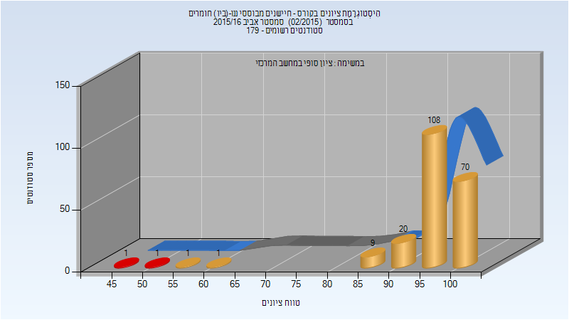
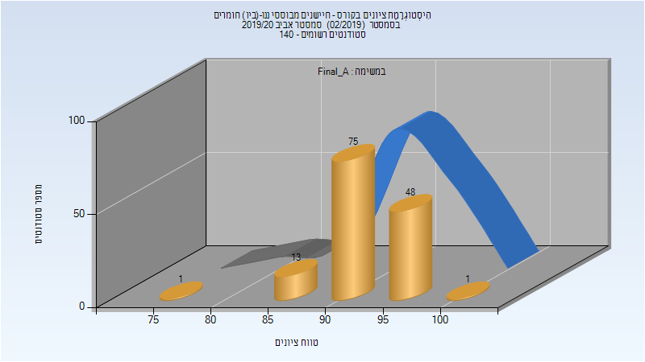
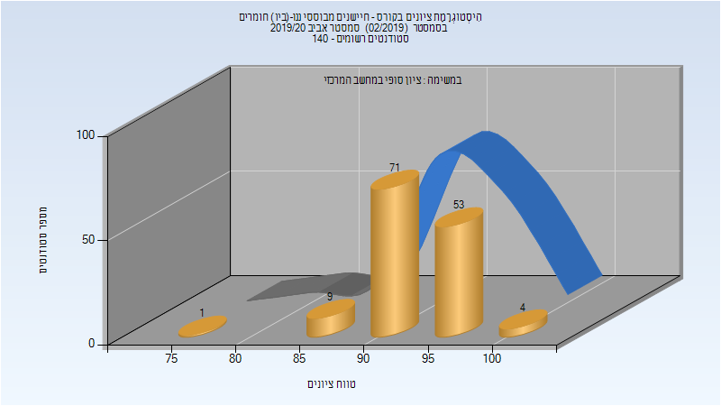
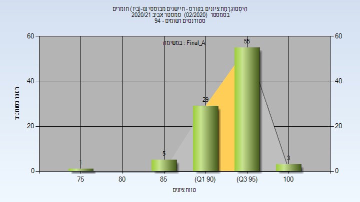
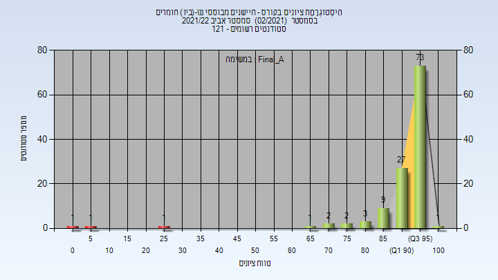
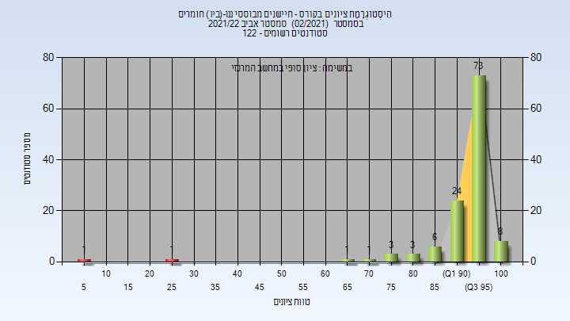

# 056391 - חיישנים מבוססי ננו-(ביו) חומרים

## אביב 2016

| איש סגל | תפקיד |
| ---- | ---- |
| חאיק חוסאם | מרצה - אחראי מקצוע |

### סופי מועד א'

| סטודנטים | עברו/נכשלו | אחוז עוברים | ציון מינימלי | ציון מקסימלי | ממוצע | חציון |
| ---- | ---- | ---- | ---- | ---- | ---- | ---- |
| 178 | 177/1 | 99 | 51 | 100 | 97.528 | 99 |

### סופי

| סטודנטים | עברו/נכשלו | אחוז עוברים | ציון מינימלי | ציון מקסימלי | ממוצע | חציון |
| ---- | ---- | ---- | ---- | ---- | ---- | ---- |
| 211 | 209/2 | 99 | 49 | 100 | 96.536 | 98 |

## אביב 2018

| איש סגל | תפקיד |
| ---- | ---- |
| חאיק חוסאם | מרצה - אחראי מקצוע |
| חורב יהוא דוד | מתרגל - עם הרשאות מרצה אחראי |

### סופי מועד א'

| סטודנטים | עברו/נכשלו | אחוז עוברים | ציון מינימלי | ציון מקסימלי | ממוצע | חציון |
| ---- | ---- | ---- | ---- | ---- | ---- | ---- |
| 250 | 249/1 | 100 | 45 | 99 | 93.876 | 94 |

### סופי

| סטודנטים | עברו/נכשלו | אחוז עוברים | ציון מינימלי | ציון מקסימלי | ממוצע | חציון |
| ---- | ---- | ---- | ---- | ---- | ---- | ---- |
| 249 | 248/1 | 100 | 45 | 99 | 93.952 | 94 |

## אביב 2019

| איש סגל | תפקיד |
| ---- | ---- |
| חאיק חוסאם | מרצה - אחראי מקצוע |
| חורב יהוא דוד | מרצה |

### סופי מועד א'

| סטודנטים | עברו/נכשלו | אחוז עוברים | ציון מינימלי | ציון מקסימלי | ממוצע | חציון |
| ---- | ---- | ---- | ---- | ---- | ---- | ---- |
| 137 | 137/0 | 100 | 70 | 100 | 93.796 | 94 |

### סופי

| סטודנטים | עברו/נכשלו | אחוז עוברים | ציון מינימלי | ציון מקסימלי | ממוצע | חציון |
| ---- | ---- | ---- | ---- | ---- | ---- | ---- |
| 137 | 137/0 | 100 | 70 | 100 | 93.796 | 94 |

## אביב 2020

| איש סגל | תפקיד |
| ---- | ---- |
| חאיק חוסאם | מרצה - אחראי מקצוע |
| חורב יהוא דוד | מרצה |

### סופי מועד א'

| סטודנטים | עברו/נכשלו | אחוז עוברים | ציון מינימלי | ציון מקסימלי | ממוצע | חציון |
| ---- | ---- | ---- | ---- | ---- | ---- | ---- |
| 138 | 138/0 | 100 | 77.07 | 100 | 93.766 | 93.8 |

### סופי

| סטודנטים | עברו/נכשלו | אחוז עוברים | ציון מינימלי | ציון מקסימלי | ממוצע | חציון |
| ---- | ---- | ---- | ---- | ---- | ---- | ---- |
| 138 | 138/0 | 100 | 77 | 100 | 93.783 | 94 |

## אביב 2021

| איש סגל | תפקיד |
| ---- | ---- |
| חאיק חוסאם | מרצה - אחראי מקצוע |
| ויויאן דרסה מאידנ | מרצה |

### סופי מועד א'

| סטודנטים | עברו/נכשלו | אחוז עוברים | ציון מינימלי | ציון מקסימלי | ממוצע | חציון |
| ---- | ---- | ---- | ---- | ---- | ---- | ---- |
| 93 | 93/0 | 100 | 78 | 100 | 94.656 | 95 |

### סופי

| סטודנטים | עברו/נכשלו | אחוז עוברים | ציון מינימלי | ציון מקסימלי | ממוצע | חציון |
| ---- | ---- | ---- | ---- | ---- | ---- | ---- |
| 93 | 93/0 | 100 | 78 | 100 | 94.656 | 95 |

## אביב 2022

| איש סגל | תפקיד |
| ---- | ---- |
| חאיק חוסאם | מרצה - אחראי מקצוע |
| דוגלין ג'ון | מרצה |
| דוגלין ג'ון | מתרגל |

### סופי מועד א'

| סטודנטים | עברו/נכשלו | אחוז עוברים | ציון מינימלי | ציון מקסימלי | ממוצע | חציון |
| ---- | ---- | ---- | ---- | ---- | ---- | ---- |
| 121 | 118/3 | 98 | 0 | 100 | 92.338 | 96.1 |

### סופי

| סטודנטים | עברו/נכשלו | אחוז עוברים | ציון מינימלי | ציון מקסימלי | ממוצע | חציון |
| ---- | ---- | ---- | ---- | ---- | ---- | ---- |
| 120 | 118/2 | 98 | 9 | 100 | 93.125 | 96 |

