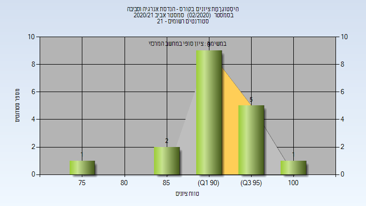

# 056399 - הנדסת אנרגיה וסביבה

## אביב 2019

| איש סגל | תפקיד |
| ---- | ---- |
| קפוסטה סרגיו דניא | מרצה - אחראי מקצוע |
| חאיכ נסים | מרצה |

### סופי מועד א'

| סטודנטים | עברו/נכשלו | אחוז עוברים | ציון מינימלי | ציון מקסימלי | ממוצע | חציון |
| ---- | ---- | ---- | ---- | ---- | ---- | ---- |
| 35 | 34/1 | 97 | 32 | 100 | 88.257 | 90 |

### סופי

| סטודנטים | עברו/נכשלו | אחוז עוברים | ציון מינימלי | ציון מקסימלי | ממוצע | חציון |
| ---- | ---- | ---- | ---- | ---- | ---- | ---- |
| 35 | 34/1 | 97 | 32 | 100 | 88.257 | 90 |

## אביב 2020

| איש סגל | תפקיד |
| ---- | ---- |
| קפוסטה סרגיו דניא | מרצה - אחראי מקצוע |
| רביץ תמר | מרצה |
| לוין גלית | מרצה |

## אביב 2021

| איש סגל | תפקיד |
| ---- | ---- |
| קפוסטה סרגיו דניא | מרצה - אחראי מקצוע |
| רביץ תמר | מרצה |

### סופי מועד א'

| סטודנטים | עברו/נכשלו | אחוז עוברים | ציון מינימלי | ציון מקסימלי | ממוצע | חציון |
| ---- | ---- | ---- | ---- | ---- | ---- | ---- |
| 18 | 18/0 | 100 | 76 | 100 | 92.778 | 93.5 |

### סופי

| סטודנטים | עברו/נכשלו | אחוז עוברים | ציון מינימלי | ציון מקסימלי | ממוצע | חציון |
| ---- | ---- | ---- | ---- | ---- | ---- | ---- |
| 18 | 18/0 | 100 | 76 | 100 | 92.833 | 93.5 |

