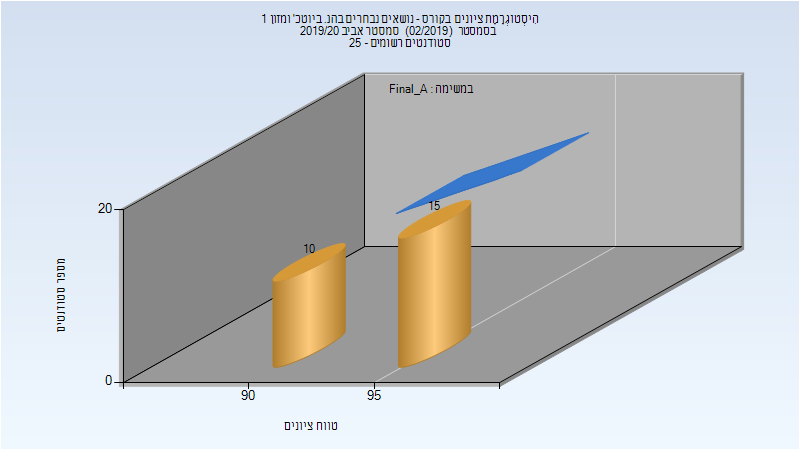
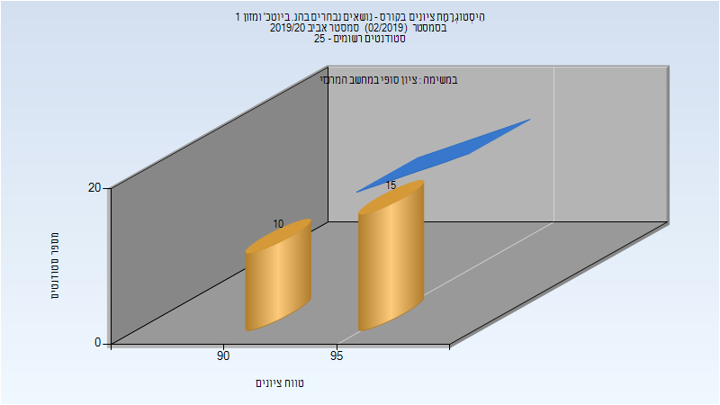

# 064014 - נושאים נבחרים בהנ. ביוטכ' ומזון 1

## אביב 2020

| איש סגל | תפקיד |
| ---- | ---- |
| גור אריה יניב | מרצה - אחראי מקצוע |
| מירון-הולץ אסתר | מרצה |

### סופי מועד א'

| סטודנטים | עברו/נכשלו | אחוז עוברים | ציון מינימלי | ציון מקסימלי | ממוצע | חציון |
| ---- | ---- | ---- | ---- | ---- | ---- | ---- |
| 25 | 25/0 | 100 | 90 | 99 | 94.6 | 95 |

### סופי

| סטודנטים | עברו/נכשלו | אחוז עוברים | ציון מינימלי | ציון מקסימלי | ממוצע | חציון |
| ---- | ---- | ---- | ---- | ---- | ---- | ---- |
| 25 | 25/0 | 100 | 90 | 99 | 94.6 | 95 |

