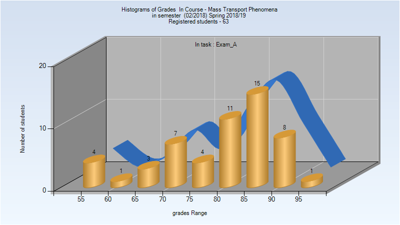
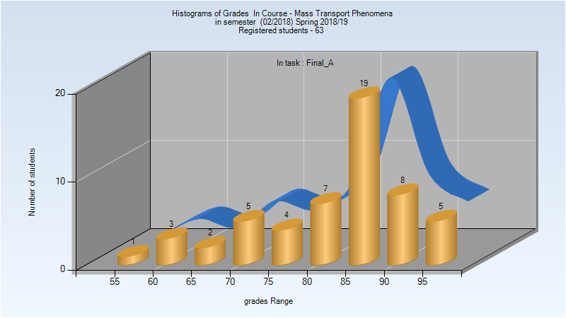
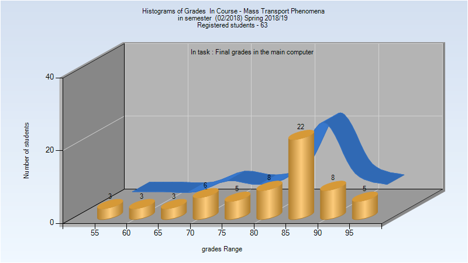
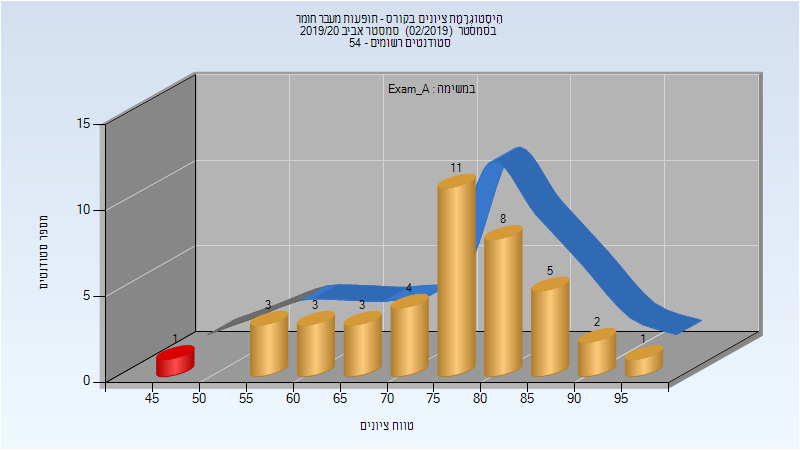
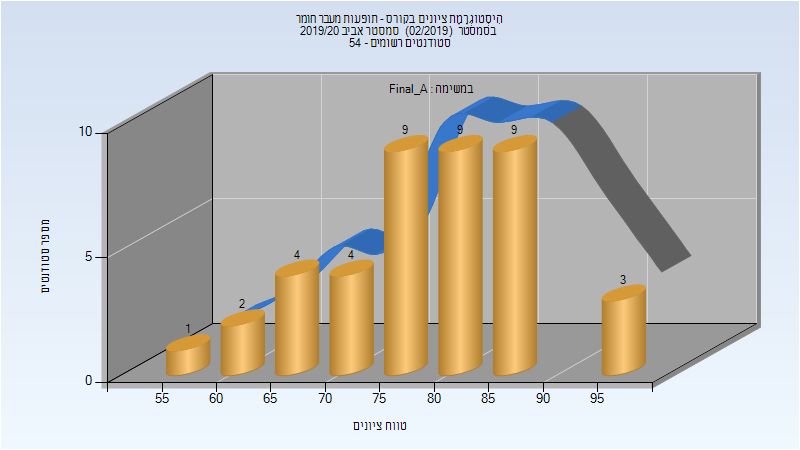
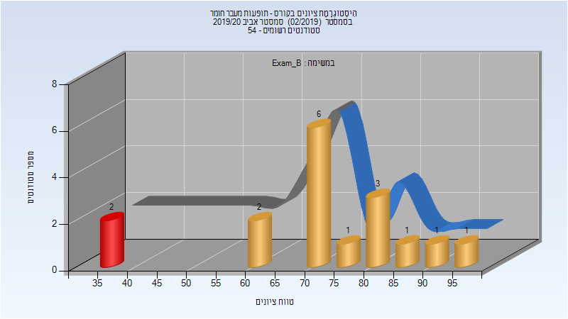
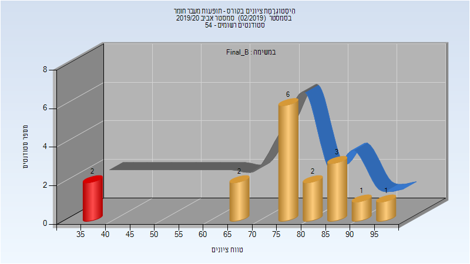
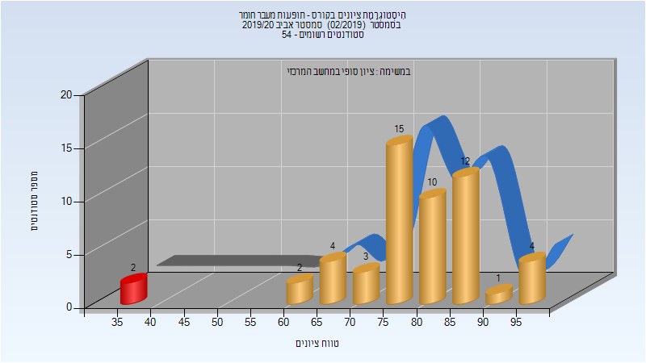
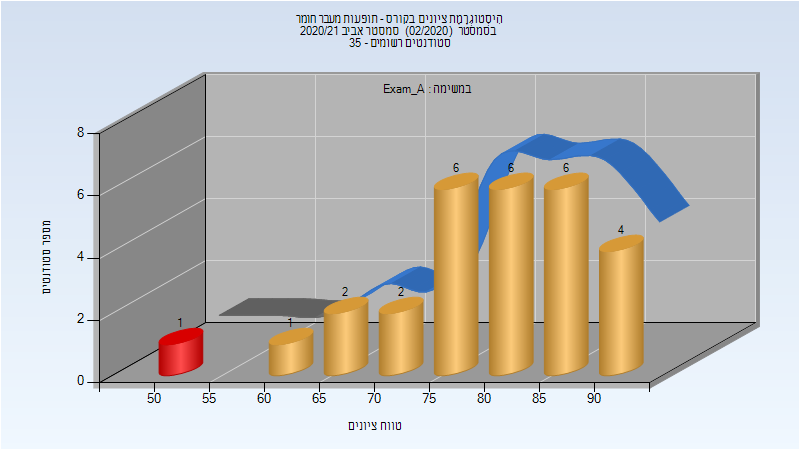

# 064118 - תופעות מעבר חומר

## אביב 2019

| איש סגל | תפקיד |
| ---- | ---- |
| סגל אסתר | מרצה - אחראי מקצוע |
| דוידוביץ-פנח מאיה | מרצה |
| פרינץ סתר עופר | מתרגל |
| שגן אלונה | מתרגל |
| לוי רחל | מתרגל |

### מבחן מועד א'

| סטודנטים | עברו/נכשלו | אחוז עוברים | ציון מינימלי | ציון מקסימלי | ממוצע | חציון |
| ---- | ---- | ---- | ---- | ---- | ---- | ---- |
| 54 | 54/0 | 100 | 55 | 97 | 80.296 | 83 |

### סופי מועד א'

| סטודנטים | עברו/נכשלו | אחוז עוברים | ציון מינימלי | ציון מקסימלי | ממוצע | חציון |
| ---- | ---- | ---- | ---- | ---- | ---- | ---- |
| 54 | 54/0 | 100 | 55 | 97 | 82.963 | 85 |

### סופי

| סטודנטים | עברו/נכשלו | אחוז עוברים | ציון מינימלי | ציון מקסימלי | ממוצע | חציון |
| ---- | ---- | ---- | ---- | ---- | ---- | ---- |
| 63 | 63/0 | 100 | 55 | 97 | 81.762 | 85 |

## אביב 2020

| איש סגל | תפקיד |
| ---- | ---- |
| סגל אסתר | מרצה - אחראי מקצוע |
| דוידוביץ-פנח מאיה | מרצה |
| שגן אלונה | מתרגל |
| פרינץ סתר עופר | מתרגל |

### מבחן מועד א'

| סטודנטים | עברו/נכשלו | אחוז עוברים | ציון מינימלי | ציון מקסימלי | ממוצע | חציון |
| ---- | ---- | ---- | ---- | ---- | ---- | ---- |
| 41 | 40/1 | 98 | 49 | 97 | 76.122 | 77 |

### סופי מועד א'

| סטודנטים | עברו/נכשלו | אחוז עוברים | ציון מינימלי | ציון מקסימלי | ממוצע | חציון |
| ---- | ---- | ---- | ---- | ---- | ---- | ---- |
| 41 | 41/0 | 100 | 56 | 97 | 79.293 | 80 |

### מבחן מועד ב'

| סטודנטים | עברו/נכשלו | אחוז עוברים | ציון מינימלי | ציון מקסימלי | ממוצע | חציון |
| ---- | ---- | ---- | ---- | ---- | ---- | ---- |
| 17 | 15/2 | 88 | 36 | 96 | 72.353 | 74 |

### סופי מועד ב'

| סטודנטים | עברו/נכשלו | אחוז עוברים | ציון מינימלי | ציון מקסימלי | ממוצע | חציון |
| ---- | ---- | ---- | ---- | ---- | ---- | ---- |
| 17 | 15/2 | 88 | 36 | 96 | 74.941 | 77 |

### סופי

| סטודנטים | עברו/נכשלו | אחוז עוברים | ציון מינימלי | ציון מקסימלי | ממוצע | חציון |
| ---- | ---- | ---- | ---- | ---- | ---- | ---- |
| 53 | 51/2 | 96 | 36 | 97 | 78.868 | 80 |

## אביב 2021

| איש סגל | תפקיד |
| ---- | ---- |
| סגל אסתר | מרצה - אחראי מקצוע |
| דוידוביץ-פנח מאיה | מרצה |
| פרינץ סתר עופר | מתרגל |
| שמעוני נטע | מתרגל |

### מבחן מועד א'

| סטודנטים | עברו/נכשלו | אחוז עוברים | ציון מינימלי | ציון מקסימלי | ממוצע | חציון |
| ---- | ---- | ---- | ---- | ---- | ---- | ---- |
| 28 | 27/1 | 96 | 50 | 94 | 80.286 | 82 |

