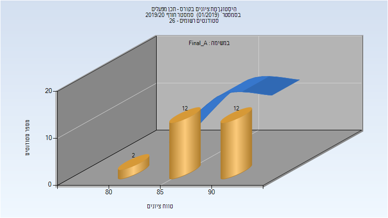
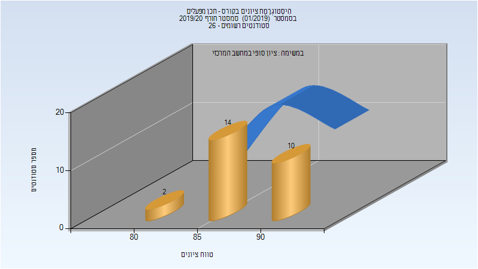
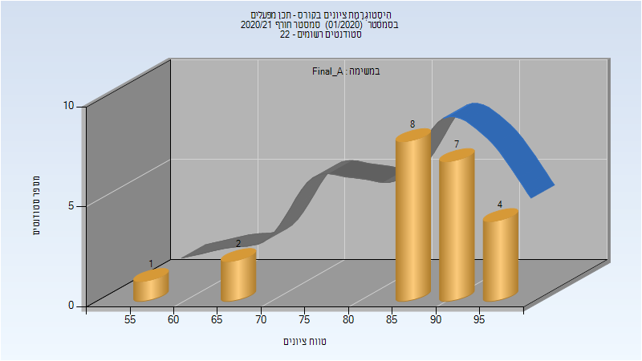
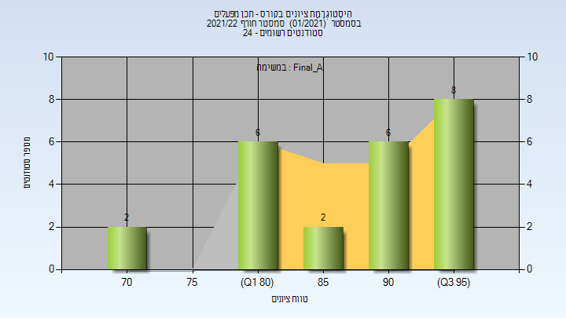

# 064119 - תכן מפעלים

## חורף 2019-2020

| איש סגל | תפקיד |
| ---- | ---- |
| שלומאי פנחס | מרצה - אחראי מקצוע |
| כהן ליטל | מתרגל |

### סופי מועד א'

| סטודנטים | עברו/נכשלו | אחוז עוברים | ציון מינימלי | ציון מקסימלי | ממוצע | חציון |
| ---- | ---- | ---- | ---- | ---- | ---- | ---- |
| 26 | 26/0 | 100 | 83 | 92 | 88.769 | 89 |

### סופי

| סטודנטים | עברו/נכשלו | אחוז עוברים | ציון מינימלי | ציון מקסימלי | ממוצע | חציון |
| ---- | ---- | ---- | ---- | ---- | ---- | ---- |
| 26 | 26/0 | 100 | 83 | 92 | 88.615 | 89 |

## חורף 2020-2021

| איש סגל | תפקיד |
| ---- | ---- |
| שלומאי פנחס | מרצה - אחראי מקצוע |
| כהן ליטל | מתרגל - עם הרשאות מרצה אחראי |

### סופי מועד א'

| סטודנטים | עברו/נכשלו | אחוז עוברים | ציון מינימלי | ציון מקסימלי | ממוצע | חציון |
| ---- | ---- | ---- | ---- | ---- | ---- | ---- |
| 22 | 22/0 | 100 | 55 | 98 | 87.045 | 89.5 |

## חורף 2021-2022

| איש סגל | תפקיד |
| ---- | ---- |
| שלומאי פנחס | מרצה - אחראי מקצוע |
| לייטרר קרולינה | מתרגל - עם הרשאות מרצה אחראי |

### סופי מועד א'

| סטודנטים | עברו/נכשלו | אחוז עוברים | ציון מינימלי | ציון מקסימלי | ממוצע | חציון |
| ---- | ---- | ---- | ---- | ---- | ---- | ---- |
| 24 | 24/0 | 100 | 73 | 98 | 88.583 | 90.5 |

### סופי

| סטודנטים | עברו/נכשלו | אחוז עוברים | ציון מינימלי | ציון מקסימלי | ממוצע | חציון |
| ---- | ---- | ---- | ---- | ---- | ---- | ---- |
| 24 | 24/0 | 100 | 73 | 98 | 88.583 | 90.5 |

