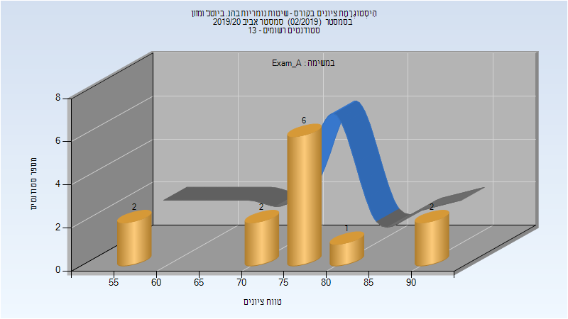
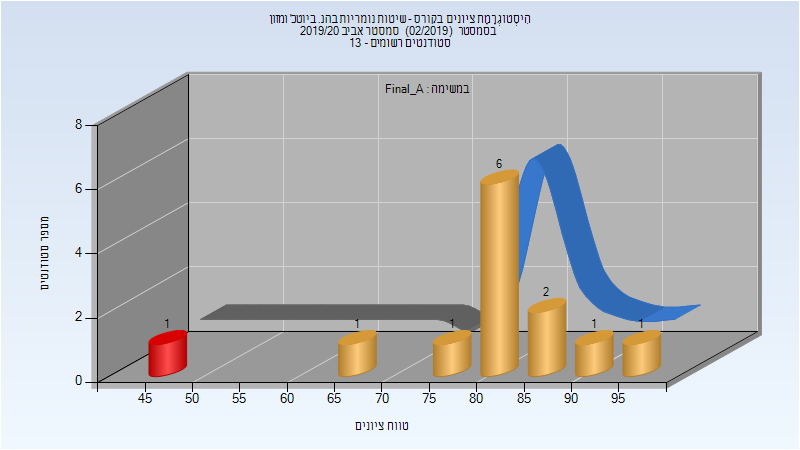

# 064120 - שיטות נומריות בהנ. ביוטכ' ומזון

## אביב 2020

| איש סגל | תפקיד |
| ---- | ---- |
| צייזל עמית | מרצה - אחראי מקצוע |
| חמיאס שני | מתרגל |

### מבחן מועד א'

| סטודנטים | עברו/נכשלו | אחוז עוברים | ציון מינימלי | ציון מקסימלי | ממוצע | חציון |
| ---- | ---- | ---- | ---- | ---- | ---- | ---- |
| 13 | 13/0 | 100 | 55 | 94 | 75.769 | 76 |

### סופי מועד א'

| סטודנטים | עברו/נכשלו | אחוז עוברים | ציון מינימלי | ציון מקסימלי | ממוצע | חציון |
| ---- | ---- | ---- | ---- | ---- | ---- | ---- |
| 13 | 12/1 | 92 | 47 | 95 | 80.846 | 83 |

