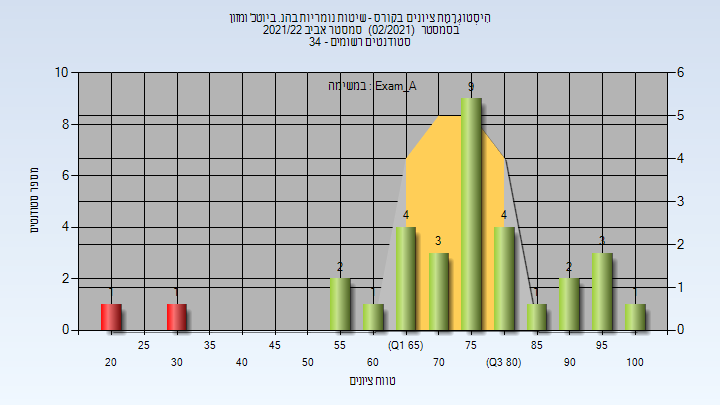
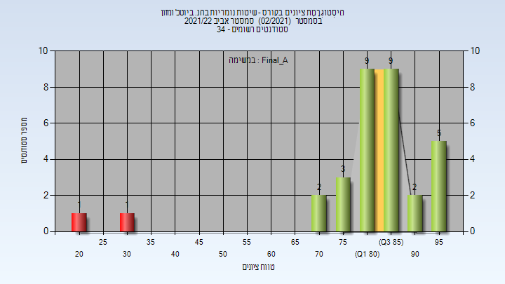

# 064120 - שיטות נומריות בהנ. ביוטכ' ומזון

## אביב 2020

| איש סגל | תפקיד |
| ---- | ---- |
| צייזל עמית | מרצה - אחראי מקצוע |
| חמיאס שני | מתרגל |

### מבחן מועד א'

| סטודנטים | עברו/נכשלו | אחוז עוברים | ציון מינימלי | ציון מקסימלי | ממוצע | חציון |
| ---- | ---- | ---- | ---- | ---- | ---- | ---- |
| 13 | 13/0 | 100 | 55 | 94 | 75.846 | 76 |

### סופי מועד א'

| סטודנטים | עברו/נכשלו | אחוז עוברים | ציון מינימלי | ציון מקסימלי | ממוצע | חציון |
| ---- | ---- | ---- | ---- | ---- | ---- | ---- |
| 13 | 12/1 | 92 | 47 | 95 | 81.231 | 83 |

### סופי

| סטודנטים | עברו/נכשלו | אחוז עוברים | ציון מינימלי | ציון מקסימלי | ממוצע | חציון |
| ---- | ---- | ---- | ---- | ---- | ---- | ---- |
| 13 | 12/1 | 92 | 47 | 95 | 81.083 | 83 |

## אביב 2021

| איש סגל | תפקיד |
| ---- | ---- |
| ציזל עמית | מרצה - אחראי מקצוע |
| חמיאס שני | מתרגל - עם הרשאות מרצה אחראי |

## אביב 2022

| איש סגל | תפקיד |
| ---- | ---- |
| ציזל עמית | מרצה - אחראי מקצוע |
| טיבי מוחמד | מתרגל |
| חמיאס שני | מתרגל |

### מבחן מועד א'

| סטודנטים | עברו/נכשלו | אחוז עוברים | ציון מינימלי | ציון מקסימלי | ממוצע | חציון |
| ---- | ---- | ---- | ---- | ---- | ---- | ---- |
| 32 | 30/2 | 94 | 24 | 100 | 74.812 | 76.5 |

### סופי מועד א'

| סטודנטים | עברו/נכשלו | אחוז עוברים | ציון מינימלי | ציון מקסימלי | ממוצע | חציון |
| ---- | ---- | ---- | ---- | ---- | ---- | ---- |
| 32 | 30/2 | 94 | 24 | 99 | 81.875 | 84.5 |

