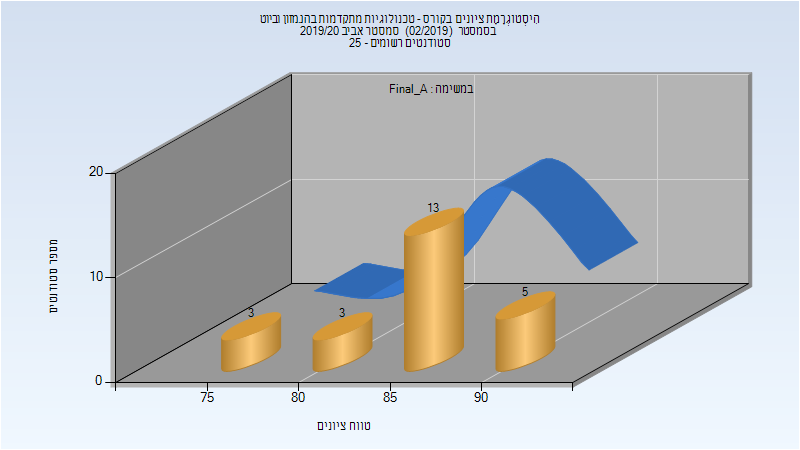

# 064209 - טכנולוגיות מתקדמות בהנ.מזון וביוט

## אביב 2020

| איש סגל | תפקיד |
| ---- | ---- |
| שפיגלמן אבי | מרצה - אחראי מקצוע |
| לזמס אורי | מרצה |
| טרזי הילה | מדריך מעבדה |
| רומנו אלון | מדריך מעבדה |
| רפאל גילי | מדריך מעבדה |
| לוי רחל | מדריך מעבדה |
| חנוכה ענבל | מדריך מעבדה |
| שקולניקוב חני | מדריך מעבדה |

### סופי מועד א'

| סטודנטים | עברו/נכשלו | אחוז עוברים | ציון מינימלי | ציון מקסימלי | ממוצע | חציון |
| ---- | ---- | ---- | ---- | ---- | ---- | ---- |
| 25 | 25/0 | 100 | 76 | 93.9 | 85.556 | 85.8 |

