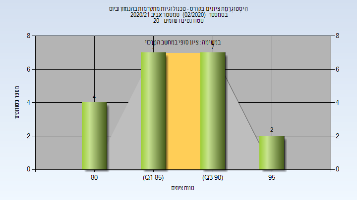

# 064209 - טכנולוגיות מתקדמות בהנ.מזון וביוט

**הערה**: מאגר ההיסטוגרמות הוקם עבור [CheeseFork](https://cheesefork.cf/), כלי בניית מערכת שעות עבור סטודנטים בטכניון. באתר בו אתם גולשים ניתן לעיין בהיסטוגרמות, אך הדרך היותר נוחה היא לעיין בהיסטוגרמות, ובמידע נוסף כגון חוות דעת של סטודנטים, באתר CheeseFork.

* [אביב 2020](#201902)
  * [סופי מועד א'](#201902-Final_A)
* [אביב 2021](#202002)
  * [סופי מועד א'](#202002-Final_A)
  * [סופי](#202002-Finals)

<h2 id="201902">אביב 2020</h2>

| איש סגל | תפקיד |
| ---- | ---- |
| שפיגלמן אבי | מרצה - אחראי מקצוע |
| לזמס אורי | מרצה |
| טרזי הילה | מדריך מעבדה |
| רומנו אלון | מדריך מעבדה |
| רפאל גילי | מדריך מעבדה |
| לוי רחל | מדריך מעבדה |
| חנוכה ענבל | מדריך מעבדה |
| שקולניקוב חני | מדריך מעבדה |

<h3 id="201902-Final_A">סופי מועד א'</h3>

| סטודנטים | עברו/נכשלו | אחוז עוברים | ציון מינימלי | ציון מקסימלי | ממוצע | חציון |
| ---- | ---- | ---- | ---- | ---- | ---- | ---- |
| 25 | 25/0 | 100 | 76 | 93.9 | 85.556 | 85.8 |

<h2 id="202002">אביב 2021</h2>

| איש סגל | תפקיד |
| ---- | ---- |
| שפיגלמן אבי | מרצה |
| לזמס אורי | מרצה |
| שקולניקוב חני | מתרגל |
| טרזי הילה | מתרגל |
| ערן עדן | מתרגל |
| רומנו אלון | מתרגל |
| לוי רחל | מתרגל |
| רפאל גילי | מתרגל |

<h3 id="202002-Final_A">סופי מועד א'</h3>

| סטודנטים | עברו/נכשלו | אחוז עוברים | ציון מינימלי | ציון מקסימלי | ממוצע | חציון |
| ---- | ---- | ---- | ---- | ---- | ---- | ---- |
| 20 | 20/0 | 100 | 83 | 96 | 89.15 | 89 |

<h3 id="202002-Finals">סופי</h3>

| סטודנטים | עברו/נכשלו | אחוז עוברים | ציון מינימלי | ציון מקסימלי | ממוצע | חציון |
| ---- | ---- | ---- | ---- | ---- | ---- | ---- |
| 20 | 20/0 | 100 | 83 | 96 | 89.15 | 89 |

