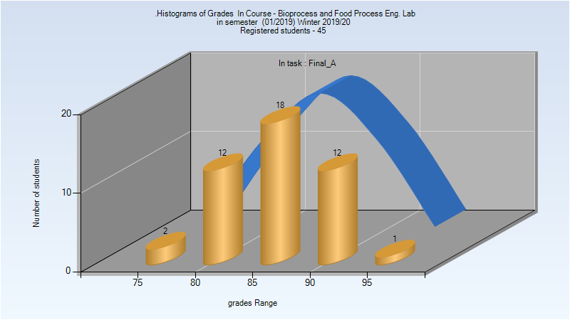
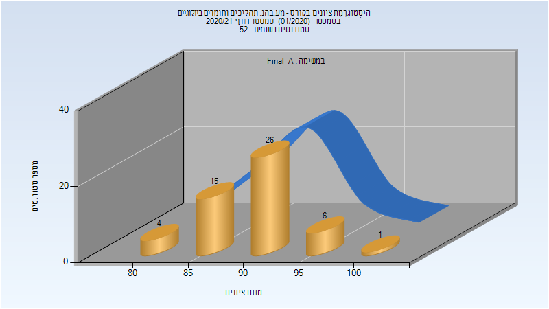

# 064239 - מע.בהנ. תהליכים וחומרים ביולוגיים

## חורף 2019-2020

| איש סגל | תפקיד |
| ---- | ---- |
| לזמס אורי | מרצה - אחראי מקצוע |
| חמלניק אולג | מדריך מעבדה |
| חנוכה ענבל | מדריך מעבדה |
| רומנו אלון | מדריך מעבדה |
| נסייר ראוף | מדריך מעבדה |
| כהן שרי | מדריך מעבדה |
| הים רתם | מדריך מעבדה |

### סופי מועד א'

| סטודנטים | עברו/נכשלו | אחוז עוברים | ציון מינימלי | ציון מקסימלי | ממוצע | חציון |
| ---- | ---- | ---- | ---- | ---- | ---- | ---- |
| 45 | 45/0 | 100 | 78 | 95 | 86.692 | 87 |

### סופי

| סטודנטים | עברו/נכשלו | אחוז עוברים | ציון מינימלי | ציון מקסימלי | ממוצע | חציון |
| ---- | ---- | ---- | ---- | ---- | ---- | ---- |
| 45 | 45/0 | 100 | 78 | 95 | 86.667 | 87 |

## חורף 2020-2021

| איש סגל | תפקיד |
| ---- | ---- |
| לזמס אורי | מרצה - אחראי מקצוע |
| חמלניק אולג |  |
| אנגלברג שירה |  |
| שקולניקוב חני |  |
| חנוכה ענבל |  |
| רומנו אלון |  |
| נסייר ראוף |  |
| הים רתם |  |

### סופי מועד א'

| סטודנטים | עברו/נכשלו | אחוז עוברים | ציון מינימלי | ציון מקסימלי | ממוצע | חציון |
| ---- | ---- | ---- | ---- | ---- | ---- | ---- |
| 52 | 52/0 | 100 | 82 | 100 | 90.154 | 90 |

