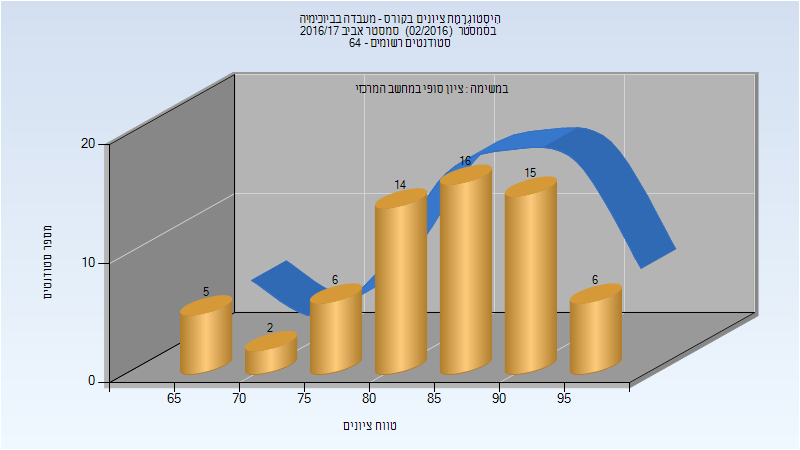
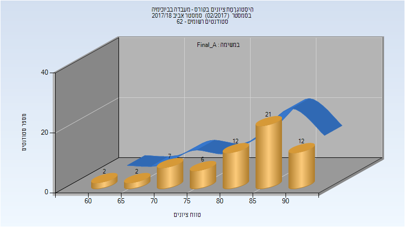
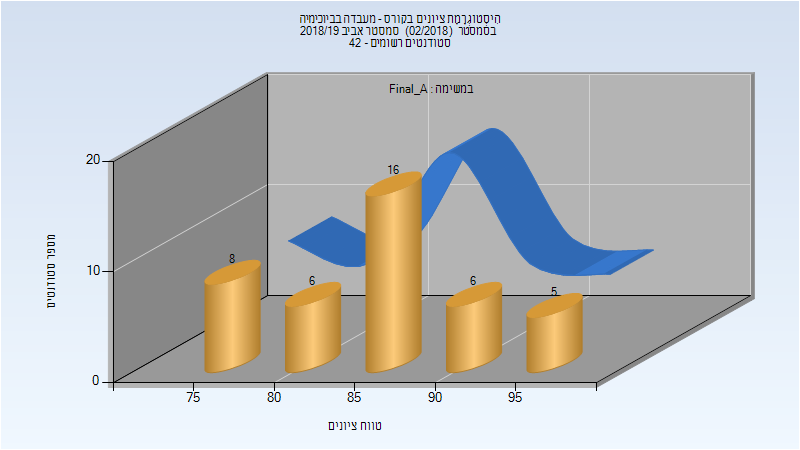
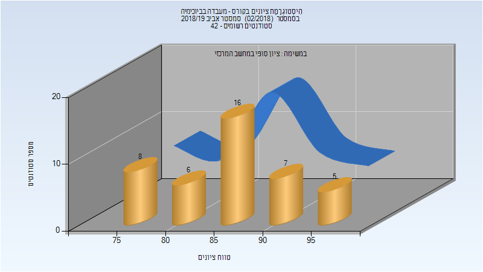
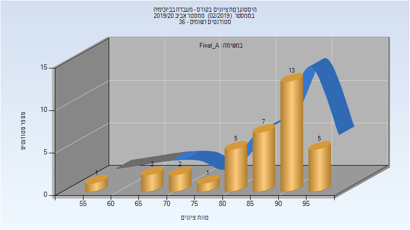

# 064325 - מעבדה בביוכימיה

## אביב 2017

| איש סגל | תפקיד |
| ---- | ---- |
| מזרחי בעז | מרצה - אחראי מקצוע |
| קצב הדס | מתרגל |
| חיימוב יורי | מתרגל |
| רוזנברג מיכל | מתרגל |
| כהן נועה | מתרגל |
| גרהם סופיה | מתרגל |
| טרזי הילה | מתרגל |
| גלי סיון |  |

### סופי מועד א'

| סטודנטים | עברו/נכשלו | אחוז עוברים | ציון מינימלי | ציון מקסימלי | ממוצע | חציון |
| ---- | ---- | ---- | ---- | ---- | ---- | ---- |
| 64 | 64/0 | 100 | 66 | 97 | 85.094 | 86 |

### סופי

| סטודנטים | עברו/נכשלו | אחוז עוברים | ציון מינימלי | ציון מקסימלי | ממוצע | חציון |
| ---- | ---- | ---- | ---- | ---- | ---- | ---- |
| 64 | 64/0 | 100 | 66 | 97 | 85.094 | 86 |

## אביב 2018

| איש סגל | תפקיד |
| ---- | ---- |
| מזרחי בעז | מדריך מעבדה - עם הרשאות מרצה אחראי |
| רוזנברג מיכל |  |
| קצב הדס |  |
| גלי סיון |  |
| טרזי הילה |  |
| גרהם סופיה |  |
| עליאן מוחמד |  |

### סופי מועד א'

| סטודנטים | עברו/נכשלו | אחוז עוברים | ציון מינימלי | ציון מקסימלי | ממוצע | חציון |
| ---- | ---- | ---- | ---- | ---- | ---- | ---- |
| 62 | 62/0 | 100 | 64 | 94 | 83.355 | 85.5 |

### סופי

| סטודנטים | עברו/נכשלו | אחוז עוברים | ציון מינימלי | ציון מקסימלי | ממוצע | חציון |
| ---- | ---- | ---- | ---- | ---- | ---- | ---- |
| 62 | 62/0 | 100 | 64 | 94 | 83.355 | 85.5 |

## אביב 2019

| איש סגל | תפקיד |
| ---- | ---- |
| מזרחי בעז | מרצה - אחראי מקצוע |
| פרידמן אברהם ברוך | מדריך מעבדה |
| גלי סיון | מדריך מעבדה |
| טרזי הילה | מדריך מעבדה |
| מלמוד מיטל | מדריך מעבדה |
| רוזנברג מיכל | מדריך מעבדה |
| גרהם סופיה | מדריך מעבדה |

### סופי מועד א'

| סטודנטים | עברו/נכשלו | אחוז עוברים | ציון מינימלי | ציון מקסימלי | ממוצע | חציון |
| ---- | ---- | ---- | ---- | ---- | ---- | ---- |
| 41 | 41/0 | 100 | 76 | 96 | 86.317 | 86 |

### סופי

| סטודנטים | עברו/נכשלו | אחוז עוברים | ציון מינימלי | ציון מקסימלי | ממוצע | חציון |
| ---- | ---- | ---- | ---- | ---- | ---- | ---- |
| 42 | 42/0 | 100 | 76 | 96 | 86.476 | 86.5 |

## אביב 2020

| איש סגל | תפקיד |
| ---- | ---- |
| מזרחי בעז | מרצה - אחראי מקצוע |
| חרזאללה נידאא | מתרגל |
| גרהם סופיה | מדריך מעבדה |
| מלמוד מיטל | מדריך מעבדה |
| גלי סיון | מדריך מעבדה |
| פרידמן אברהם ברוך | מדריך מעבדה |

### סופי מועד א'

| סטודנטים | עברו/נכשלו | אחוז עוברים | ציון מינימלי | ציון מקסימלי | ממוצע | חציון |
| ---- | ---- | ---- | ---- | ---- | ---- | ---- |
| 36 | 36/0 | 100 | 58 | 96 | 86.556 | 89.5 |

### סופי

| סטודנטים | עברו/נכשלו | אחוז עוברים | ציון מינימלי | ציון מקסימלי | ממוצע | חציון |
| ---- | ---- | ---- | ---- | ---- | ---- | ---- |
| 36 | 36/0 | 100 | 58 | 96 | 86.556 | 89.5 |

## אביב 2021

| איש סגל | תפקיד |
| ---- | ---- |
| מירון-הולץ אסתר | מרצה - אחראי מקצוע |
| פרידמן אברהם ברוך | מתרגל |
| חרזאללה נידאא | מתרגל |
| ביתן אביעד - מש | מתרגל |
| מלמוד מיטל | מתרגל |
| סקיטל מיכל | מתרגל |
| כהן ליטל | מתרגל |

