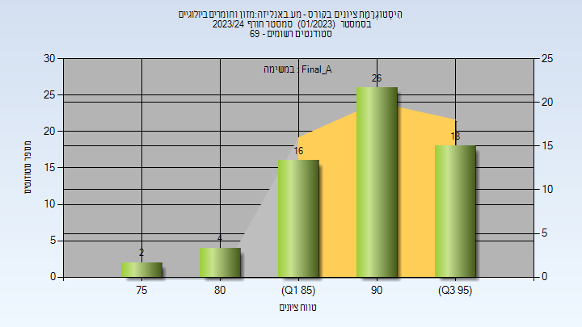
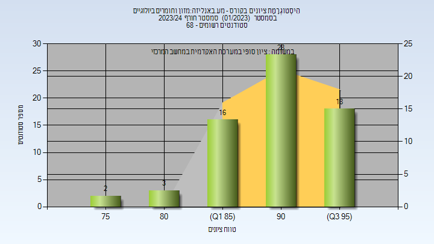
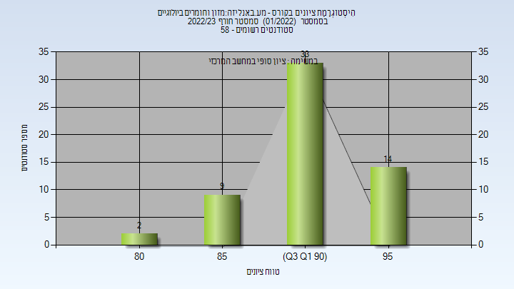
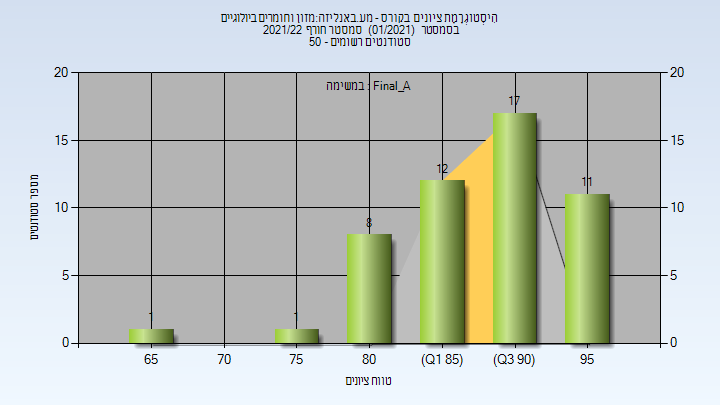
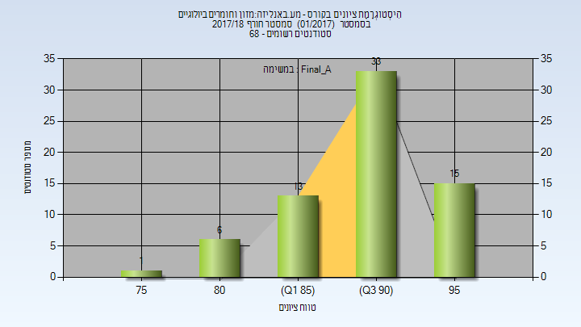
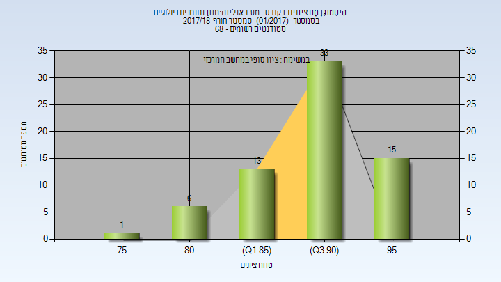

# 064326 - מע.באנליזה:מזון וחומרים ביולוגיים

**הערה**: מאגר ההיסטוגרמות הוקם עבור [CheeseFork](https://cheesefork.cf/), כלי בניית מערכת שעות עבור סטודנטים בטכניון. באתר בו אתם גולשים ניתן לעיין בהיסטוגרמות, אך הדרך היותר נוחה היא לעיין בהיסטוגרמות, ובמידע נוסף כגון חוות דעת של סטודנטים, באתר CheeseFork.

* [חורף 2023-2024](#202301)
  * [סופי מועד א'](#202301-Final_A)
  * [סופי](#202301-Finals)
* [חורף 2022-2023](#202201)
  * [סופי מועד א'](#202201-Final_A)
  * [סופי](#202201-Finals)
* [חורף 2021-2022](#202101)
  * [סופי מועד א'](#202101-Final_A)
  * [סופי](#202101-Finals)
* [חורף 2020-2021](#202001)
  * [סופי מועד א'](#202001-Final_A)
  * [סופי](#202001-Finals)
* [חורף 2019-2020](#201901)
  * [סופי מועד א'](#201901-Final_A)
  * [סופי](#201901-Finals)
* [חורף 2018-2019](#201801)
  * [סופי מועד א'](#201801-Final_A)
  * [סופי](#201801-Finals)
* [חורף 2017-2018](#201701)
  * [סופי מועד א'](#201701-Final_A)
  * [סופי](#201701-Finals)

<h2 id="202301">חורף 2023-2024</h2>

| איש סגל | תפקיד |
| ---- | ---- |
| פרוינדליך עדן | מתרגל - עם הרשאות מרצה אחראי |
| רפאל גילי | מתרגל - עם הרשאות מרצה אחראי |
| בן דוד נועה | מתרגל - עם הרשאות מרצה אחראי |
| לוי שירה | מתרגל - עם הרשאות מרצה אחראי |
| מאירוביץ מתן | מתרגל - עם הרשאות מרצה אחראי |
| רש ענבל | מתרגל - עם הרשאות מרצה אחראי |
| פישמן אילת | מדריך מעבדה - עם הרשאות מרצה אחראי |

<h3 id="202301-Final_A">סופי מועד א'</h3>

| סטודנטים | עברו/נכשלו | אחוז עוברים | ציון מינימלי | ציון מקסימלי | ממוצע | חציון |
| ---- | ---- | ---- | ---- | ---- | ---- | ---- |
| 68 | 68/0 | 100 | 75 | 98 | 91.368 | 93 |

<h3 id="202301-Finals">סופי</h3>

| סטודנטים | עברו/נכשלו | אחוז עוברים | ציון מינימלי | ציון מקסימלי | ממוצע | חציון |
| ---- | ---- | ---- | ---- | ---- | ---- | ---- |
| 68 | 68/0 | 100 | 75 | 98 | 91.507 | 93 |

<h2 id="202201">חורף 2022-2023</h2>

| איש סגל | תפקיד |
| ---- | ---- |
| לוי שירה | מתרגל - עם הרשאות מרצה אחראי |
| בן דוד נועה | מתרגל - עם הרשאות מרצה אחראי |
| רפאל גילי | מתרגל - עם הרשאות מרצה אחראי |
| הרשקוביץ איילת | מתרגל - עם הרשאות מרצה אחראי |
| פרוינדליך עדן | מתרגל - עם הרשאות מרצה אחראי |
| רש ענבל | מתרגל - עם הרשאות מרצה אחראי |
| מאירוביץ מתן | מתרגל - עם הרשאות מרצה אחראי |
| פישמן אילת | מדריך מעבדה - עם הרשאות מרצה אחראי |

<h3 id="202201-Final_A">סופי מועד א'</h3>

| סטודנטים | עברו/נכשלו | אחוז עוברים | ציון מינימלי | ציון מקסימלי | ממוצע | חציון |
| ---- | ---- | ---- | ---- | ---- | ---- | ---- |
| 58 | 58/0 | 100 | 81 | 97 | 91.931 | 92 |

<h3 id="202201-Finals">סופי</h3>

| סטודנטים | עברו/נכשלו | אחוז עוברים | ציון מינימלי | ציון מקסימלי | ממוצע | חציון |
| ---- | ---- | ---- | ---- | ---- | ---- | ---- |
| 58 | 58/0 | 100 | 81 | 97 | 91.931 | 92 |

<h2 id="202101">חורף 2021-2022</h2>

| איש סגל | תפקיד |
| ---- | ---- |
| אשקר ערין | מתרגל |
| רש ענבל | מתרגל - עם הרשאות מרצה אחראי |
| מאירוביץ מתן | מתרגל - עם הרשאות מרצה אחראי |
| הרשקוביץ איילת | מתרגל - עם הרשאות מרצה אחראי |
| פרוינדליך עדן | מתרגל - עם הרשאות מרצה אחראי |
| מלמוד מיטל | מתרגל - עם הרשאות מרצה אחראי |
| רפאל גילי | מתרגל - עם הרשאות מרצה אחראי |
| פישמן אילת | מדריך מעבדה - עם הרשאות מרצה אחראי |

<h3 id="202101-Final_A">סופי מועד א'</h3>

| סטודנטים | עברו/נכשלו | אחוז עוברים | ציון מינימלי | ציון מקסימלי | ממוצע | חציון |
| ---- | ---- | ---- | ---- | ---- | ---- | ---- |
| 50 | 50/0 | 100 | 65 | 98 | 89.3 | 90 |

<h3 id="202101-Finals">סופי</h3>

| סטודנטים | עברו/נכשלו | אחוז עוברים | ציון מינימלי | ציון מקסימלי | ממוצע | חציון |
| ---- | ---- | ---- | ---- | ---- | ---- | ---- |
| 50 | 50/0 | 100 | 65 | 98 | 89.3 | 90 |

<h2 id="202001">חורף 2020-2021</h2>

| איש סגל | תפקיד |
| ---- | ---- |
| פישמן אילת | מרצה - אחראי מקצוע |
| פרידמן אברהם ברוך |  |
| מאירוביץ מתן |  |
| מלמוד מיטל |  |
| בן דוד נועה |  |
| ריינהרדט נופר |  |
| הרשקוביץ איילת |  |

<h3 id="202001-Final_A">סופי מועד א'</h3>

| סטודנטים | עברו/נכשלו | אחוז עוברים | ציון מינימלי | ציון מקסימלי | ממוצע | חציון |
| ---- | ---- | ---- | ---- | ---- | ---- | ---- |
| 31 | 31/0 | 100 | 82 | 97 | 92.032 | 93 |

<h3 id="202001-Finals">סופי</h3>

| סטודנטים | עברו/נכשלו | אחוז עוברים | ציון מינימלי | ציון מקסימלי | ממוצע | חציון |
| ---- | ---- | ---- | ---- | ---- | ---- | ---- |
| 31 | 31/0 | 100 | 82 | 97 | 92.032 | 93 |

<h2 id="201901">חורף 2019-2020</h2>

| איש סגל | תפקיד |
| ---- | ---- |
| פישמן אילת | מרצה - אחראי מקצוע |
| ריינהרדט נופר | מדריך מעבדה |
| בן דוד נועה | מדריך מעבדה |
| מלמוד מיטל | מדריך מעבדה |
| יוגב סיון | מדריך מעבדה |
| הרשקוביץ איילת | מדריך מעבדה |
| פרידמן אברהם ברוך | מדריך מעבדה |
| מאירוביץ מתן | מדריך מעבדה |

<h3 id="201901-Final_A">סופי מועד א'</h3>

| סטודנטים | עברו/נכשלו | אחוז עוברים | ציון מינימלי | ציון מקסימלי | ממוצע | חציון |
| ---- | ---- | ---- | ---- | ---- | ---- | ---- |
| 48 | 48/0 | 100 | 75 | 97 | 90.625 | 92 |

<h3 id="201901-Finals">סופי</h3>

| סטודנטים | עברו/נכשלו | אחוז עוברים | ציון מינימלי | ציון מקסימלי | ממוצע | חציון |
| ---- | ---- | ---- | ---- | ---- | ---- | ---- |
| 48 | 48/0 | 100 | 75 | 97 | 90.625 | 92 |

<h2 id="201801">חורף 2018-2019</h2>

| איש סגל | תפקיד |
| ---- | ---- |
| פישמן אילת | מרצה - אחראי מקצוע |
| נפומניאשי אינה | מדריך מעבדה |
| עליאן מוחמד | מדריך מעבדה |
| בן דוד נועה | מדריך מעבדה |
| הרשקוביץ איילת | מדריך מעבדה |
| דרעי בתאל | מדריך מעבדה |
| ריינהרדט נופר | מדריך מעבדה |
| מלמוד מיטל | מדריך מעבדה |

<h3 id="201801-Final_A">סופי מועד א'</h3>

| סטודנטים | עברו/נכשלו | אחוז עוברים | ציון מינימלי | ציון מקסימלי | ממוצע | חציון |
| ---- | ---- | ---- | ---- | ---- | ---- | ---- |
| 63 | 63/0 | 100 | 83 | 97 | 92.825 | 94 |

<h3 id="201801-Finals">סופי</h3>

| סטודנטים | עברו/נכשלו | אחוז עוברים | ציון מינימלי | ציון מקסימלי | ממוצע | חציון |
| ---- | ---- | ---- | ---- | ---- | ---- | ---- |
| 63 | 63/0 | 100 | 83 | 97 | 92.825 | 94 |

<h2 id="201701">חורף 2017-2018</h2>

| איש סגל | תפקיד |
| ---- | ---- |
| פישמן אילת | מרצה - אחראי מקצוע |
| מלמוד מיטל | מתרגל |
| מאיר אוהד |  |
| עליאן מוחמד |  |
| קצב הדס |  |
| דרעי בתאל |  |
| כהן רוני |  |
| הרשקוביץ איילת |  |

<h3 id="201701-Final_A">סופי מועד א'</h3>

| סטודנטים | עברו/נכשלו | אחוז עוברים | ציון מינימלי | ציון מקסימלי | ממוצע | חציון |
| ---- | ---- | ---- | ---- | ---- | ---- | ---- |
| 68 | 68/0 | 100 | 76 | 98 | 90.809 | 91 |

<h3 id="201701-Finals">סופי</h3>

| סטודנטים | עברו/נכשלו | אחוז עוברים | ציון מינימלי | ציון מקסימלי | ממוצע | חציון |
| ---- | ---- | ---- | ---- | ---- | ---- | ---- |
| 68 | 68/0 | 100 | 76 | 98 | 90.809 | 91 |

