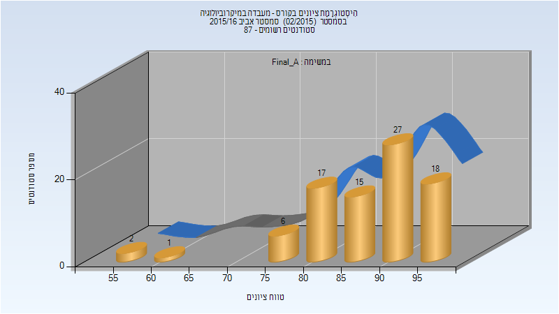
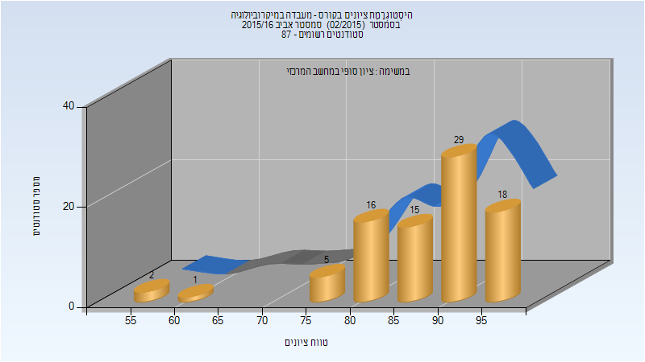
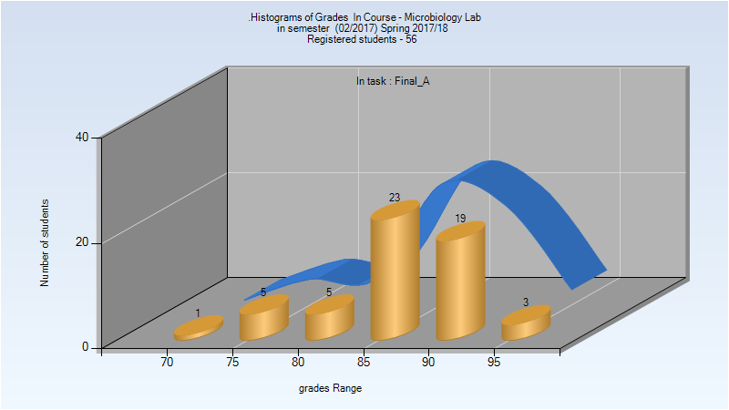
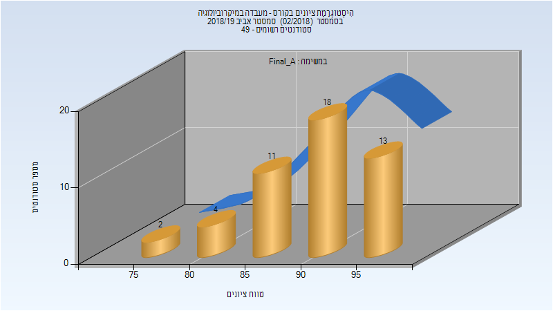
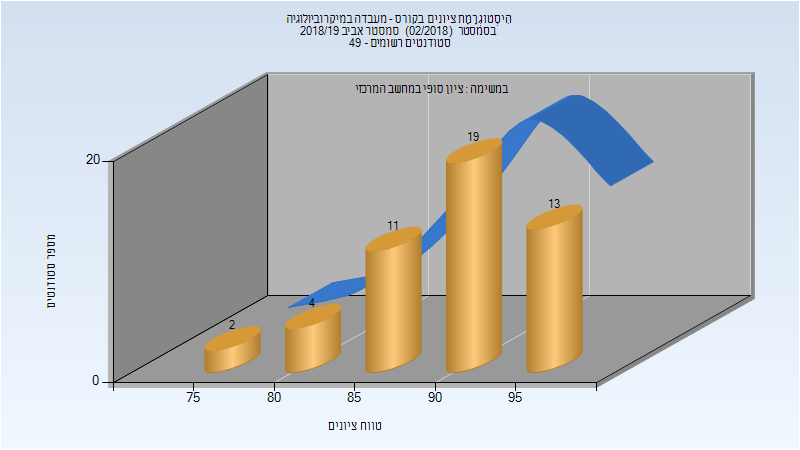
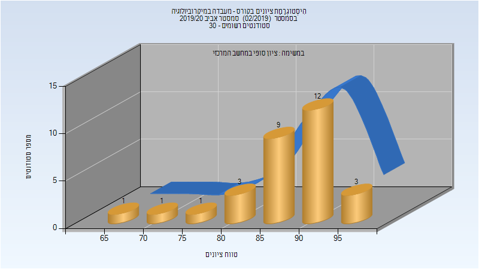

# 064413 - מעבדה במיקרוביולוגיה

## אביב 2016

| איש סגל | תפקיד |
| ---- | ---- |
| ירון סימה | מרצה - אחראי מקצוע |
| קוליק לובה | מתרגל |
| סינואני פרתי אילנה | מתרגל |
| קלמנסקי רגינה | מתרגל |
| האס רוני | מתרגל |
| חימוביץ יעל | מתרגל |
| כצמן מרינה | מתרגל |

### סופי מועד א'

| סטודנטים | עברו/נכשלו | אחוז עוברים | ציון מינימלי | ציון מקסימלי | ממוצע | חציון |
| ---- | ---- | ---- | ---- | ---- | ---- | ---- |
| 86 | 86/0 | 100 | 55 | 98 | 87.663 | 90 |

### סופי

| סטודנטים | עברו/נכשלו | אחוז עוברים | ציון מינימלי | ציון מקסימלי | ממוצע | חציון |
| ---- | ---- | ---- | ---- | ---- | ---- | ---- |
| 86 | 86/0 | 100 | 55 | 98 | 87.919 | 90 |

## אביב 2018

| איש סגל | תפקיד |
| ---- | ---- |
| ירון סימה | מרצה - אחראי מקצוע |
| האס רוני | מרצה |
| קרח רכטמן הילה דינה | מרצה |
| סינואני פרתי אילנה |  |
| ג'מאל ג'ואנה |  |
| אבוחצירה-כהן ירדן |  |
| נפומניאשי אינה |  |
| קסטן ענבר |  |
| כירוג ליבי |  |

### סופי מועד א'

| סטודנטים | עברו/נכשלו | אחוז עוברים | ציון מינימלי | ציון מקסימלי | ממוצע | חציון |
| ---- | ---- | ---- | ---- | ---- | ---- | ---- |
| 56 | 56/0 | 100 | 73 | 96 | 87.714 | 88.5 |

### סופי

| סטודנטים | עברו/נכשלו | אחוז עוברים | ציון מינימלי | ציון מקסימלי | ממוצע | חציון |
| ---- | ---- | ---- | ---- | ---- | ---- | ---- |
| 56 | 56/0 | 100 | 73 | 96 | 87.714 | 88.5 |

## אביב 2019

| איש סגל | תפקיד |
| ---- | ---- |
| ירון סימה | מרצה - אחראי מקצוע |
| נסייר ראוף | מדריך מעבדה |
| קסטן ענבר | מדריך מעבדה |
| ריינהרדט נופר | מדריך מעבדה |
| שקולניקוב חני | מדריך מעבדה |
| אבוחצירה-כהן ירדן | מדריך מעבדה |
| הרשקוביץ איילת | מדריך מעבדה |

### סופי מועד א'

| סטודנטים | עברו/נכשלו | אחוז עוברים | ציון מינימלי | ציון מקסימלי | ממוצע | חציון |
| ---- | ---- | ---- | ---- | ---- | ---- | ---- |
| 48 | 48/0 | 100 | 77 | 97 | 90.542 | 91 |

### סופי

| סטודנטים | עברו/נכשלו | אחוז עוברים | ציון מינימלי | ציון מקסימלי | ממוצע | חציון |
| ---- | ---- | ---- | ---- | ---- | ---- | ---- |
| 49 | 49/0 | 100 | 77 | 97 | 90.592 | 91 |

## אביב 2020

| איש סגל | תפקיד |
| ---- | ---- |
| ירון סימה |  |
| קסטן ענבר | מדריך מעבדה |
| פרייליך שי | מדריך מעבדה |
| ריינהרדט נופר | מדריך מעבדה |
| אבוחצירה-כהן ירדן | מדריך מעבדה |
| הרשקוביץ איילת | מדריך מעבדה |

### סופי מועד א'

| סטודנטים | עברו/נכשלו | אחוז עוברים | ציון מינימלי | ציון מקסימלי | ממוצע | חציון |
| ---- | ---- | ---- | ---- | ---- | ---- | ---- |
| 30 | 30/0 | 100 | 67 | 96 | 87.867 | 89.5 |

### סופי

| סטודנטים | עברו/נכשלו | אחוז עוברים | ציון מינימלי | ציון מקסימלי | ממוצע | חציון |
| ---- | ---- | ---- | ---- | ---- | ---- | ---- |
| 30 | 30/0 | 100 | 67 | 96 | 87.867 | 89.5 |

## אביב 2021

| איש סגל | תפקיד |
| ---- | ---- |
| ירון סימה | מדריך מעבדה - עם הרשאות מרצה אחראי |
| נסייר ראוף | מדריך מעבדה |
| יהודה נופר | מדריך מעבדה |
| הרשקוביץ איילת | מדריך מעבדה |
| אבוחצירה-כהן ירדן | מדריך מעבדה |
| רש ענבל | מדריך מעבדה |

