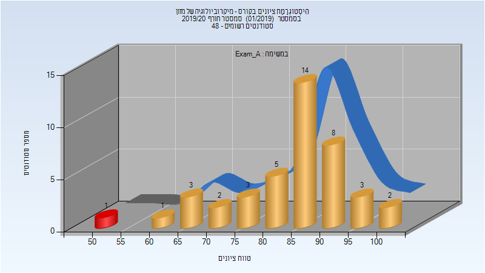
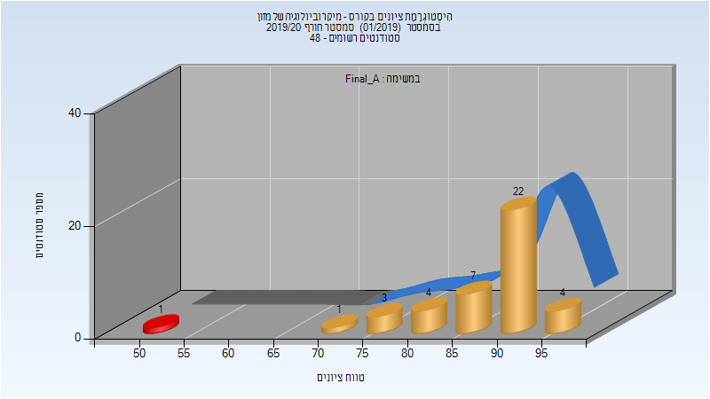
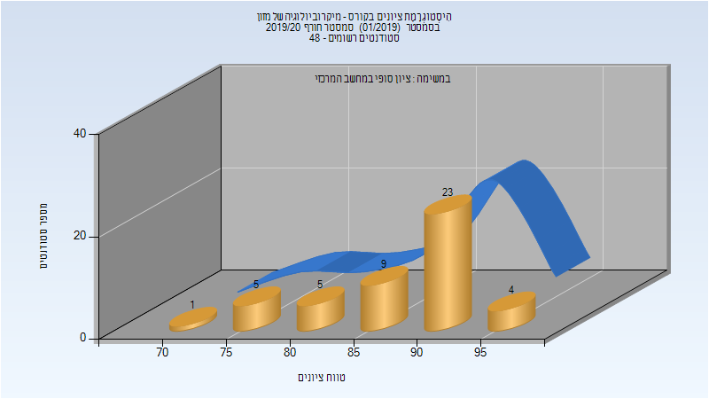

# 064420 - מיקרוביולוגיה של מזון

## חורף 2019-2020

| איש סגל | תפקיד |
| ---- | ---- |
| קשי יחזקאל | מרצה - אחראי מקצוע |
| קסטן ענבר | מדריך מעבדה |
| חמיאס שני | מדריך מעבדה |
| פרייליך שי | מדריך מעבדה |
| לוי רחל | מדריך מעבדה |
| טרזי הילה | מדריך מעבדה |
| ערן עדן | מדריך מעבדה |

### מבחן מועד א'

| סטודנטים | עברו/נכשלו | אחוז עוברים | ציון מינימלי | ציון מקסימלי | ממוצע | חציון |
| ---- | ---- | ---- | ---- | ---- | ---- | ---- |
| 42 | 41/1 | 98 | 52 | 100 | 84.405 | 87 |

### סופי מועד א'

| סטודנטים | עברו/נכשלו | אחוז עוברים | ציון מינימלי | ציון מקסימלי | ממוצע | חציון |
| ---- | ---- | ---- | ---- | ---- | ---- | ---- |
| 42 | 41/1 | 98 | 52 | 97 | 87.952 | 90 |

### סופי

| סטודנטים | עברו/נכשלו | אחוז עוברים | ציון מינימלי | ציון מקסימלי | ממוצע | חציון |
| ---- | ---- | ---- | ---- | ---- | ---- | ---- |
| 47 | 47/0 | 100 | 72 | 97 | 88.043 | 90 |

## חורף 2020-2021

| איש סגל | תפקיד |
| ---- | ---- |
| קשי יחזקאל | מרצה - אחראי מקצוע |
| קסטן ענבר |  |
| חמיאס שני |  |
| פרייליך שי |  |
| לוי רחל |  |
| טרזי הילה |  |
| ערן עדן |  |

