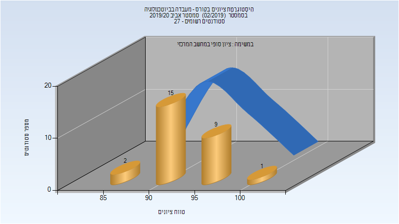

# 064508 - מעבדה בביוטכנולוגיה

## אביב 2020

| איש סגל | תפקיד |
| ---- | ---- |
| שוהם יובל | מרצה - אחראי מקצוע |
| חמלניק אולג | מדריך מעבדה |
| כהן שרי | מדריך מעבדה |
| מרחב רעות | מדריך מעבדה |
| בן דוד נועה | מדריך מעבדה |
| ואקנין ענבל | מדריך מעבדה |

### סופי מועד א'

| סטודנטים | עברו/נכשלו | אחוז עוברים | ציון מינימלי | ציון מקסימלי | ממוצע | חציון |
| ---- | ---- | ---- | ---- | ---- | ---- | ---- |
| 27 | 27/0 | 100 | 86 | 100 | 93.259 | 92 |

### סופי

| סטודנטים | עברו/נכשלו | אחוז עוברים | ציון מינימלי | ציון מקסימלי | ממוצע | חציון |
| ---- | ---- | ---- | ---- | ---- | ---- | ---- |
| 27 | 27/0 | 100 | 86 | 100 | 93.259 | 92 |

## אביב 2021

| איש סגל | תפקיד |
| ---- | ---- |
| שולמי סמדר | מרצה - אחראי מקצוע |
| פרלה עדן | מדריך מעבדה |
| בן דוד נועה | מדריך מעבדה |
| לייטרר קרולינה | מדריך מעבדה |
| חמלניק אולג | מדריך מעבדה |
| פיגנבוים-אור רותם | מדריך מעבדה |

