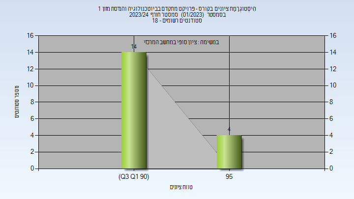

# 066013 - פרויקט מתקדם בביוטכנולוגיה והנדסת מזון 1

**הערה**: מאגר ההיסטוגרמות הוקם עבור [CheeseFork](https://cheesefork.cf/), כלי בניית מערכת שעות עבור סטודנטים בטכניון. באתר בו אתם גולשים ניתן לעיין בהיסטוגרמות, אך הדרך היותר נוחה היא לעיין בהיסטוגרמות, ובמידע נוסף כגון חוות דעת של סטודנטים, באתר CheeseFork.

* [חורף 2019-2020](#201901)
* [חורף 2022-2023](#202201)
* [חורף 2023-2024](#202301)
  * [סופי](#202301-Finals)

<h2 id="201901">חורף 2019-2020</h2>

<h2 id="202201">חורף 2022-2023</h2>

| איש סגל | תפקיד |
| ---- | ---- |
| ליבני יואב | מנחה פרויקטים  - עם הרשאות מרצה אחראי |
| פישמן אילת |  |

<h2 id="202301">חורף 2023-2024</h2>

<h3 id="202301-Finals">סופי</h3>

| סטודנטים | עברו/נכשלו | אחוז עוברים | ציון מינימלי | ציון מקסימלי | ממוצע | חציון |
| ---- | ---- | ---- | ---- | ---- | ---- | ---- |
| 18 | 18/0 | 100 | 92 | 97 | 93.667 | 93 |

