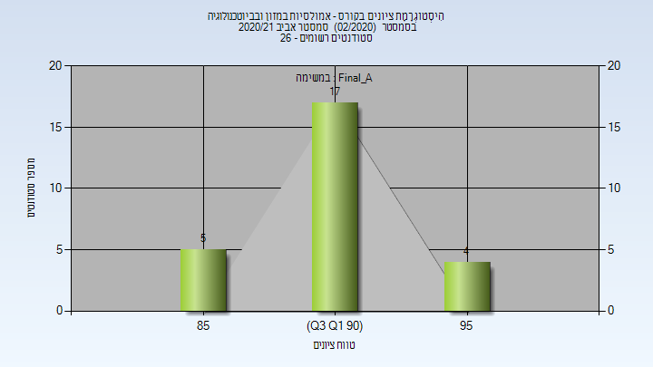

# 066329 - אמולסיות במזון ובביוטכנולוגיה

## אביב 2020

| איש סגל | תפקיד |
| ---- | ---- |
| לזמס אורי | מרצה - אחראי מקצוע |
| אשקר ערין |  |

### סופי מועד א'

| סטודנטים | עברו/נכשלו | אחוז עוברים | ציון מינימלי | ציון מקסימלי | ממוצע | חציון |
| ---- | ---- | ---- | ---- | ---- | ---- | ---- |
| 17 | 17/0 | 100 | 75 | 95 | 87.941 | 88 |

### סופי

| סטודנטים | עברו/נכשלו | אחוז עוברים | ציון מינימלי | ציון מקסימלי | ממוצע | חציון |
| ---- | ---- | ---- | ---- | ---- | ---- | ---- |
| 17 | 17/0 | 100 | 75 | 95 | 87.941 | 88 |

## אביב 2021

| איש סגל | תפקיד |
| ---- | ---- |
| לזמס אורי | מרצה - אחראי מקצוע |
| אשקר ערין | מדריך מעבדה |

### סופי מועד א'

| סטודנטים | עברו/נכשלו | אחוז עוברים | ציון מינימלי | ציון מקסימלי | ממוצע | חציון |
| ---- | ---- | ---- | ---- | ---- | ---- | ---- |
| 26 | 26/0 | 100 | 86 | 95 | 91.423 | 91 |

### סופי

| סטודנטים | עברו/נכשלו | אחוז עוברים | ציון מינימלי | ציון מקסימלי | ממוצע | חציון |
| ---- | ---- | ---- | ---- | ---- | ---- | ---- |
| 26 | 26/0 | 100 | 86 | 95 | 91.423 | 91 |

