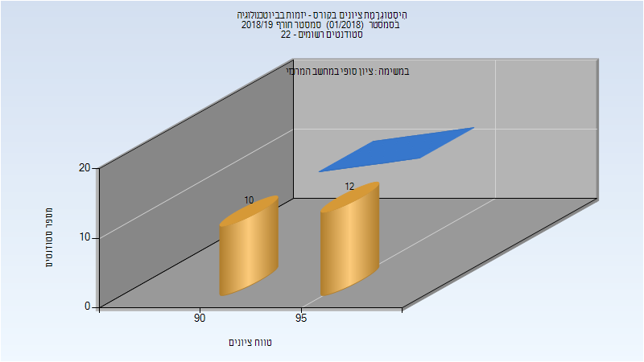

# 066525 - יזמות בביוטכנולוגיה

## חורף 2018-2019

| איש סגל | תפקיד |
| ---- | ---- |
| וולך מיכאל | מרצה - אחראי מקצוע |

### סופי

| סטודנטים | עברו/נכשלו | אחוז עוברים | ציון מינימלי | ציון מקסימלי | ממוצע | חציון |
| ---- | ---- | ---- | ---- | ---- | ---- | ---- |
| 22 | 22/0 | 100 | 91 | 97 | 93.727 | 95 |

