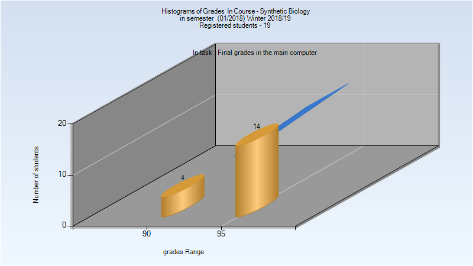
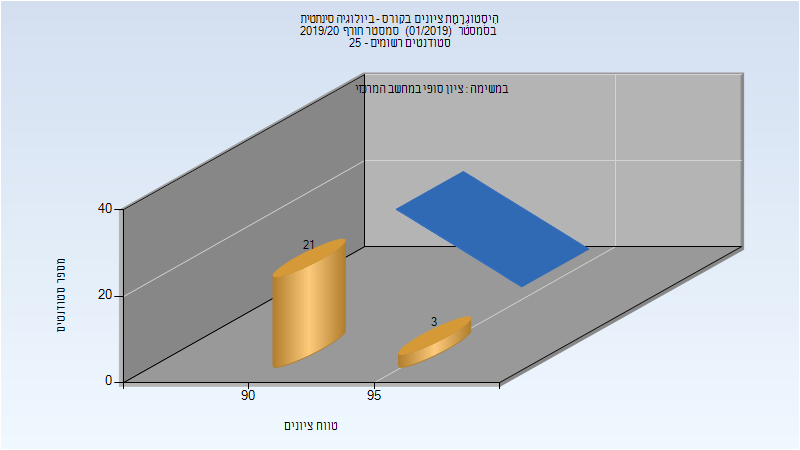

# 066526 - ביולוגיה סינתטית

## חורף 2018-2019

| איש סגל | תפקיד |
| ---- | ---- |
| עמית רועי | מרצה - אחראי מקצוע |
| כהן רוני | מתרגל |
| דוידוב צילה | מתרגל |
| כץ נועה | מתרגל |
| אדן נועה | מתרגל |

### סופי מועד א'

| סטודנטים | עברו/נכשלו | אחוז עוברים | ציון מינימלי | ציון מקסימלי | ממוצע | חציון |
| ---- | ---- | ---- | ---- | ---- | ---- | ---- |
| 18 | 18/0 | 100 | 91 | 97 | 95.278 | 96 |

### סופי

| סטודנטים | עברו/נכשלו | אחוז עוברים | ציון מינימלי | ציון מקסימלי | ממוצע | חציון |
| ---- | ---- | ---- | ---- | ---- | ---- | ---- |
| 18 | 18/0 | 100 | 91 | 97 | 95.278 | 96 |

## חורף 2019-2020

| איש סגל | תפקיד |
| ---- | ---- |
| עמית רועי | מרצה - אחראי מקצוע |
| ואקנין ענבל | מתרגל |
| וילינגר אור | מדריך מעבדה |
| אדן נועה | מדריך מעבדה |
| אברהמי פצ'וק לירון | מדריך מעבדה |
| דוידוב צילה | מדריך מעבדה |

### סופי מועד א'

| סטודנטים | עברו/נכשלו | אחוז עוברים | ציון מינימלי | ציון מקסימלי | ממוצע | חציון |
| ---- | ---- | ---- | ---- | ---- | ---- | ---- |
| 24 | 24/0 | 100 | 90 | 95 | 92.583 | 92.5 |

### סופי

| סטודנטים | עברו/נכשלו | אחוז עוברים | ציון מינימלי | ציון מקסימלי | ממוצע | חציון |
| ---- | ---- | ---- | ---- | ---- | ---- | ---- |
| 24 | 24/0 | 100 | 90 | 95 | 92.583 | 92.5 |

