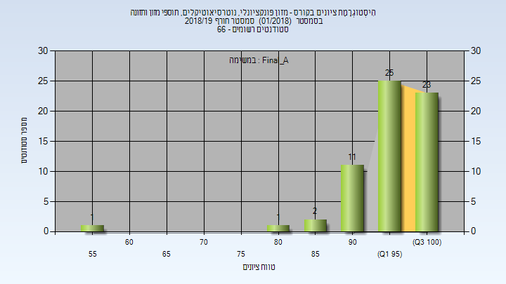
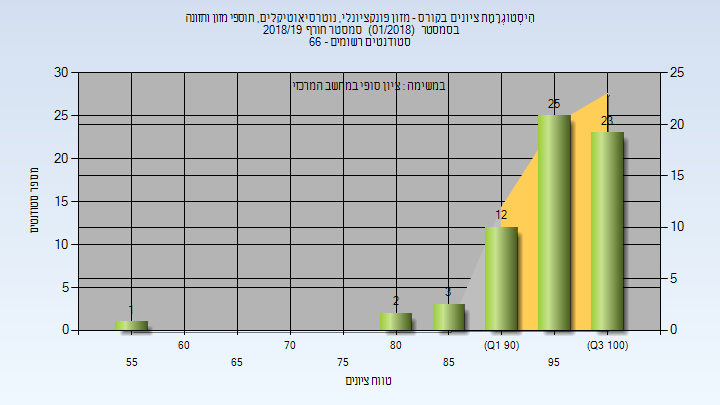

# 066613 - מזון פונקציונלי ונוטרסיאוטיקלים

## חורף 2018-2019

| איש סגל | תפקיד |
| ---- | ---- |
| טל בנימין | מרצה - אחראי מקצוע |

### סופי מועד א'

| סטודנטים | עברו/נכשלו | אחוז עוברים | ציון מינימלי | ציון מקסימלי | ממוצע | חציון |
| ---- | ---- | ---- | ---- | ---- | ---- | ---- |
| 63 | 63/0 | 100 | 59 | 100 | 95.905 | 96 |

### סופי

| סטודנטים | עברו/נכשלו | אחוז עוברים | ציון מינימלי | ציון מקסימלי | ממוצע | חציון |
| ---- | ---- | ---- | ---- | ---- | ---- | ---- |
| 66 | 66/0 | 100 | 59 | 100 | 95.439 | 96 |

