# 084154 - שיטות ניסוי בהנדסה אוירונוטית

## קיץ 2016

| איש סגל | תפקיד |
| ---- | ---- |
| צוקורל בני | מרצה - אחראי מקצוע |

### סופי מועד א'

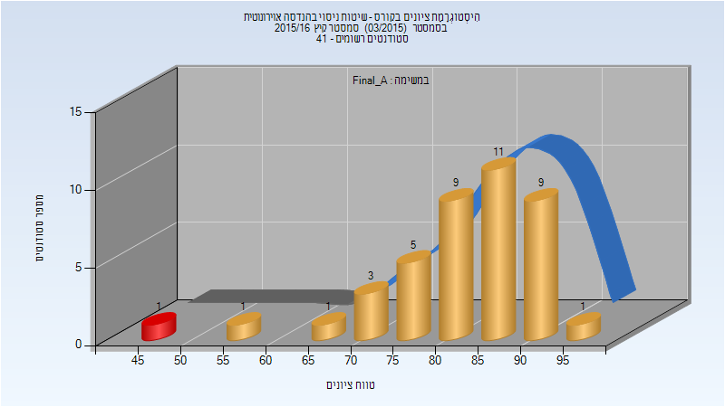

| סטודנטים | עברו/נכשלו | אחוז עוברים | ציון מינימלי | ציון מקסימלי | ממוצע | חציון |
| ---- | ---- | ---- | ---- | ---- | ---- | ---- |
| 41 | 40/1 | 98 | 48 | 95 | 82.902 | 85 |

### סופי

| סטודנטים | עברו/נכשלו | אחוז עוברים | ציון מינימלי | ציון מקסימלי | ממוצע | חציון |
| ---- | ---- | ---- | ---- | ---- | ---- | ---- |
| 41 | 40/1 | 98 | 48 | 95 | 82.902 | 85 |

## קיץ 2017

| איש סגל | תפקיד |
| ---- | ---- |
| אברמוביץ חיים | מרצה - אחראי מקצוע |
| שטיינר מתן |  |

### סופי מועד א'

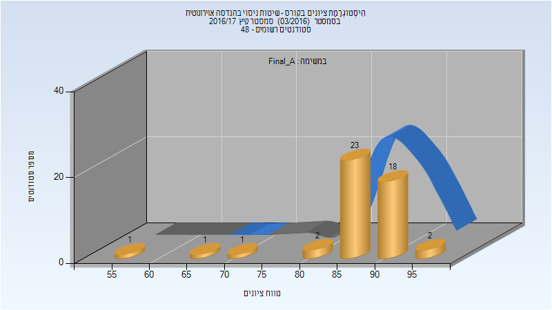

| סטודנטים | עברו/נכשלו | אחוז עוברים | ציון מינימלי | ציון מקסימלי | ממוצע | חציון |
| ---- | ---- | ---- | ---- | ---- | ---- | ---- |
| 48 | 48/0 | 100 | 55 | 95 | 87.479 | 89 |

### סופי

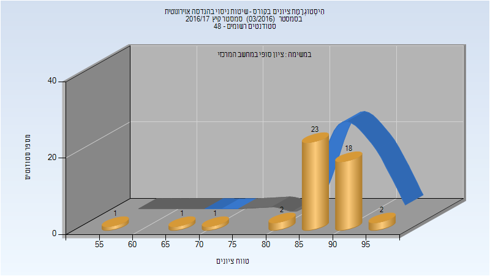

| סטודנטים | עברו/נכשלו | אחוז עוברים | ציון מינימלי | ציון מקסימלי | ממוצע | חציון |
| ---- | ---- | ---- | ---- | ---- | ---- | ---- |
| 48 | 48/0 | 100 | 55 | 95 | 87.479 | 89 |

## אביב 2018

| איש סגל | תפקיד |
| ---- | ---- |
| צוקורל בני | מרצה - אחראי מקצוע |

### סופי מועד א'

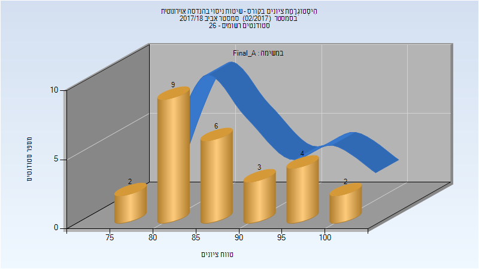

| סטודנטים | עברו/נכשלו | אחוז עוברים | ציון מינימלי | ציון מקסימלי | ממוצע | חציון |
| ---- | ---- | ---- | ---- | ---- | ---- | ---- |
| 26 | 26/0 | 100 | 77 | 100 | 87.615 | 85.5 |

### סופי

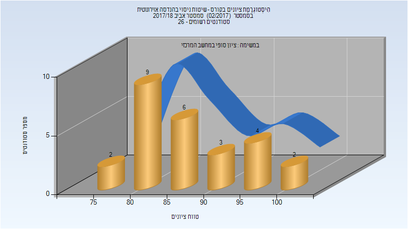

| סטודנטים | עברו/נכשלו | אחוז עוברים | ציון מינימלי | ציון מקסימלי | ממוצע | חציון |
| ---- | ---- | ---- | ---- | ---- | ---- | ---- |
| 26 | 26/0 | 100 | 77 | 100 | 87.615 | 85.5 |

## קיץ 2018

| איש סגל | תפקיד |
| ---- | ---- |
| צוקורל בני | מרצה - אחראי מקצוע |
| שטיינר מתן | מרצה |

### סופי מועד א'

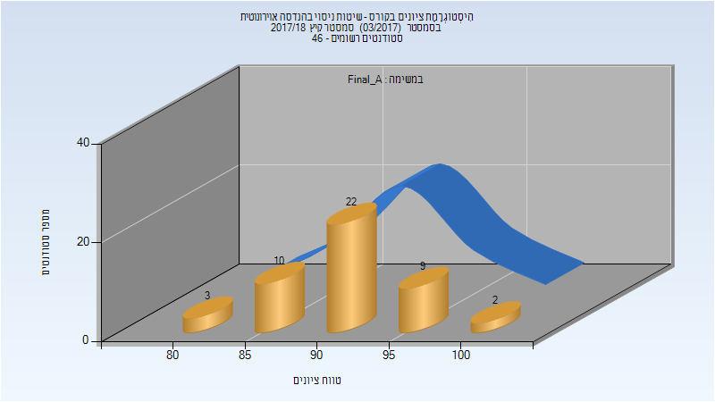

| סטודנטים | עברו/נכשלו | אחוז עוברים | ציון מינימלי | ציון מקסימלי | ממוצע | חציון |
| ---- | ---- | ---- | ---- | ---- | ---- | ---- |
| 46 | 46/0 | 100 | 82 | 100 | 91.413 | 91 |

### סופי

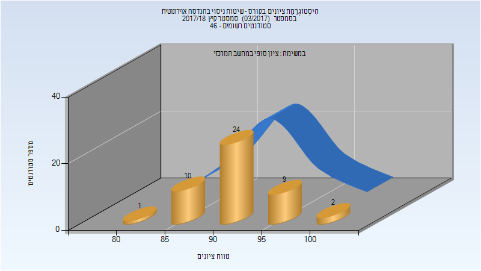

| סטודנטים | עברו/נכשלו | אחוז עוברים | ציון מינימלי | ציון מקסימלי | ממוצע | חציון |
| ---- | ---- | ---- | ---- | ---- | ---- | ---- |
| 46 | 46/0 | 100 | 83 | 100 | 91.87 | 91.5 |

## חורף 2018-2019

| איש סגל | תפקיד |
| ---- | ---- |
| צוקורל בני | מרצה - אחראי מקצוע |

### סופי מועד א'

| סטודנטים | עברו/נכשלו | אחוז עוברים | ציון מינימלי | ציון מקסימלי | ממוצע | חציון |
| ---- | ---- | ---- | ---- | ---- | ---- | ---- |
| 12 | 12/0 | 100 | 59 | 100 | 91 | 93.5 |

### סופי

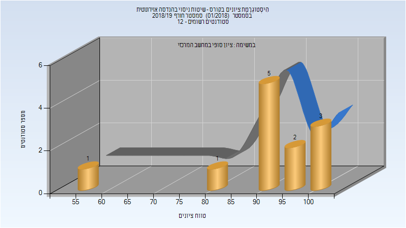

| סטודנטים | עברו/נכשלו | אחוז עוברים | ציון מינימלי | ציון מקסימלי | ממוצע | חציון |
| ---- | ---- | ---- | ---- | ---- | ---- | ---- |
| 12 | 12/0 | 100 | 59 | 100 | 91 | 93.5 |

## קיץ 2019

| איש סגל | תפקיד |
| ---- | ---- |
| צוקורל בני | מרצה - אחראי מקצוע |
| שטיינר מתן | מרצה |
| זמיר אינה |  |
| אייזן נחום אל |  |
| קליין גריגורי |  |
| אשל רן |  |

### סופי מועד א'

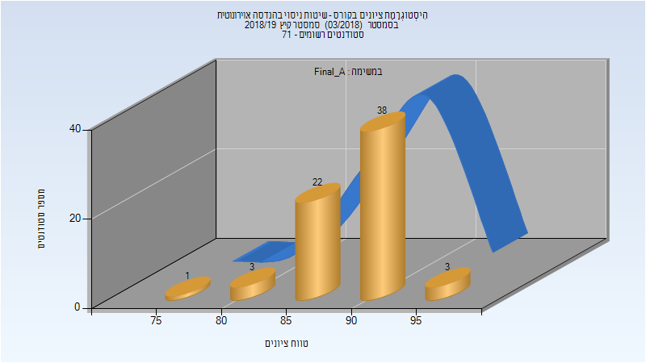

| סטודנטים | עברו/נכשלו | אחוז עוברים | ציון מינימלי | ציון מקסימלי | ממוצע | חציון |
| ---- | ---- | ---- | ---- | ---- | ---- | ---- |
| 67 | 67/0 | 100 | 75.21 | 96.12 | 90.257 | 90.86 |

### סופי

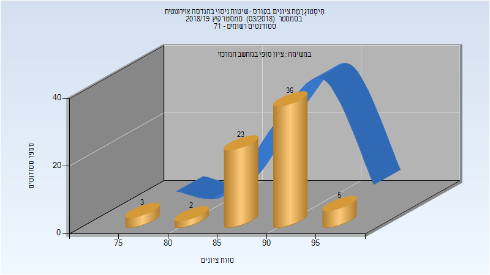

| סטודנטים | עברו/נכשלו | אחוז עוברים | ציון מינימלי | ציון מקסימלי | ממוצע | חציון |
| ---- | ---- | ---- | ---- | ---- | ---- | ---- |
| 69 | 69/0 | 100 | 75 | 96 | 89.855 | 91 |

## חורף 2019-2020

| איש סגל | תפקיד |
| ---- | ---- |
| כהן יעקב | מרצה - אחראי מקצוע |
| אייזן נחום אל |  |
| שטיינר מתן |  |
| זמיר אינה |  |
| אשל רן |  |
| קליין גריגורי |  |

### סופי מועד א'

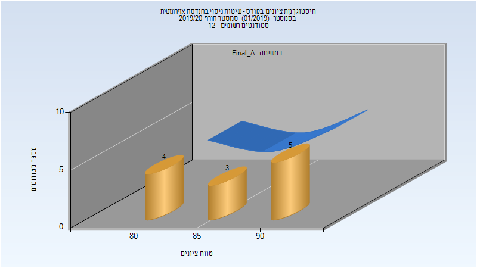

| סטודנטים | עברו/נכשלו | אחוז עוברים | ציון מינימלי | ציון מקסימלי | ממוצע | חציון |
| ---- | ---- | ---- | ---- | ---- | ---- | ---- |
| 12 | 12/0 | 100 | 81 | 93 | 87.833 | 89 |

### סופי

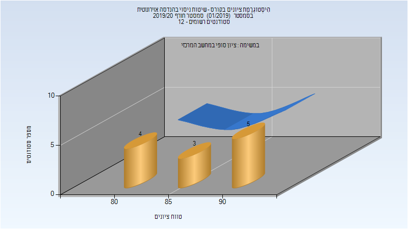

| סטודנטים | עברו/נכשלו | אחוז עוברים | ציון מינימלי | ציון מקסימלי | ממוצע | חציון |
| ---- | ---- | ---- | ---- | ---- | ---- | ---- |
| 12 | 12/0 | 100 | 81 | 93 | 87.833 | 89 |

## קיץ 2020

| איש סגל | תפקיד |
| ---- | ---- |
| צוקורל בני | מרצה - אחראי מקצוע |

### סופי מועד א'

| סטודנטים | עברו/נכשלו | אחוז עוברים | ציון מינימלי | ציון מקסימלי | ממוצע | חציון |
| ---- | ---- | ---- | ---- | ---- | ---- | ---- |
| 40 | 40/0 | 100 | 77 | 97 | 90 | 90 |

### סופי

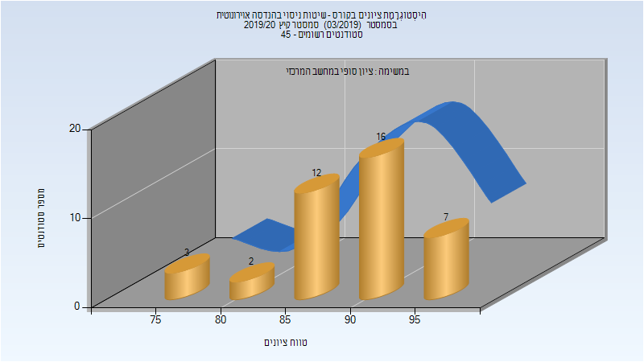

| סטודנטים | עברו/נכשלו | אחוז עוברים | ציון מינימלי | ציון מקסימלי | ממוצע | חציון |
| ---- | ---- | ---- | ---- | ---- | ---- | ---- |
| 44 | 44/0 | 100 | 67 | 97 | 89.432 | 90 |

## חורף 2020-2021

| איש סגל | תפקיד |
| ---- | ---- |
| צוקורל בני | מרצה - אחראי מקצוע |
| אשל רן |  |
| שטיינר מתן |  |
| קליין גריגורי |  |
| אייזן נחום אל |  |
| זמיר אינה |  |

### סופי מועד א'

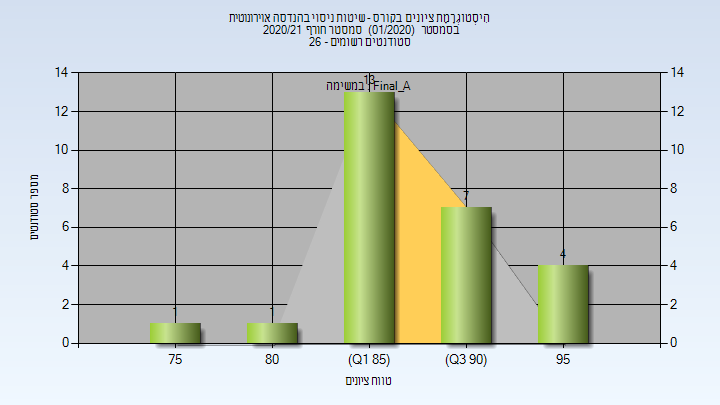

| סטודנטים | עברו/נכשלו | אחוז עוברים | ציון מינימלי | ציון מקסימלי | ממוצע | חציון |
| ---- | ---- | ---- | ---- | ---- | ---- | ---- |
| 26 | 26/0 | 100 | 76 | 96 | 89.231 | 89 |

### סופי

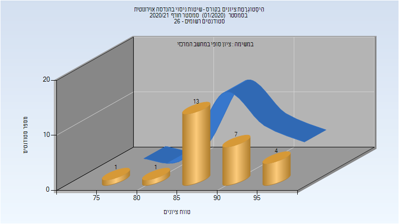

| סטודנטים | עברו/נכשלו | אחוז עוברים | ציון מינימלי | ציון מקסימלי | ממוצע | חציון |
| ---- | ---- | ---- | ---- | ---- | ---- | ---- |
| 26 | 26/0 | 100 | 76 | 96 | 89.231 | 89 |

