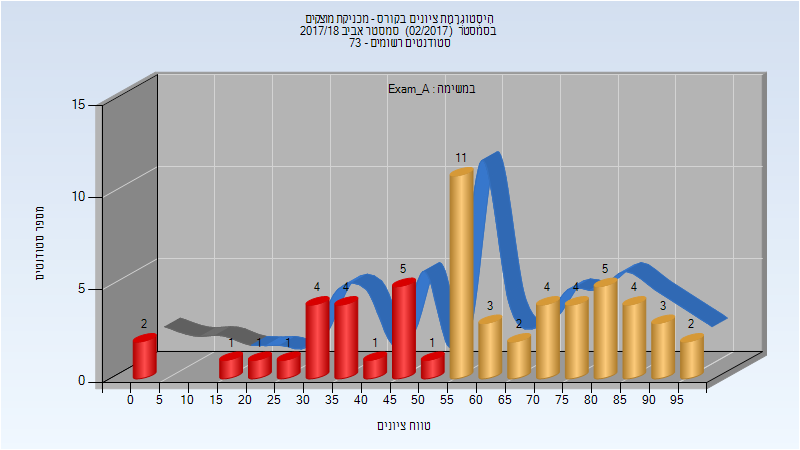
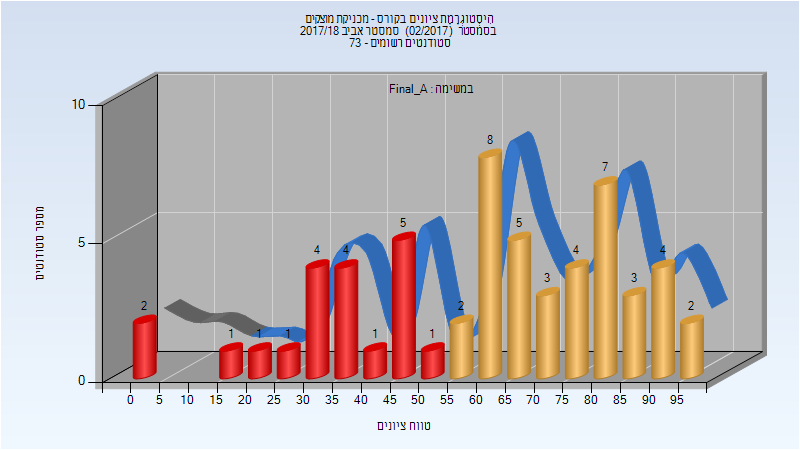
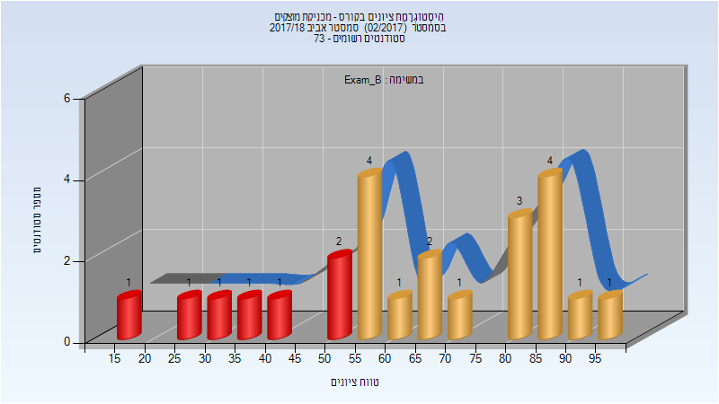
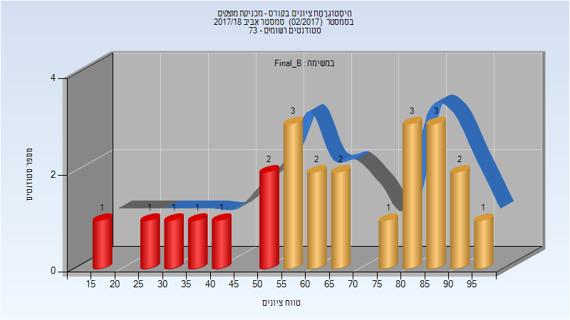
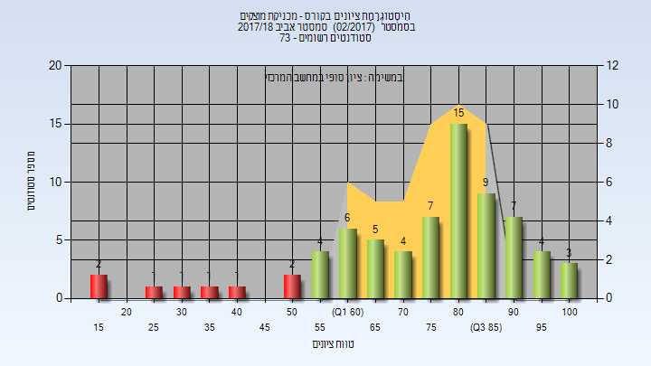
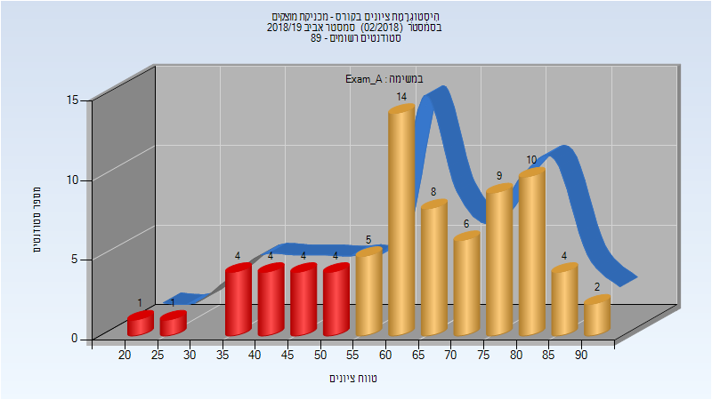
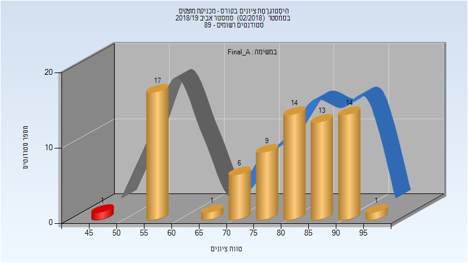
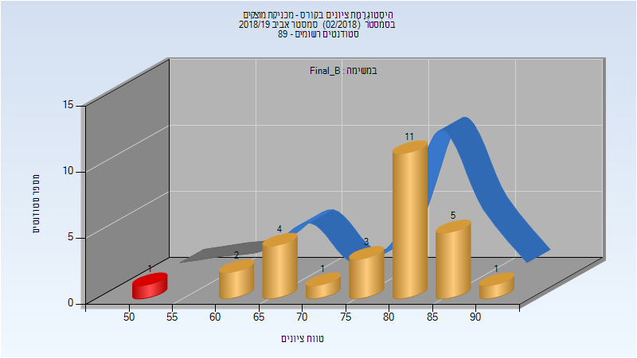
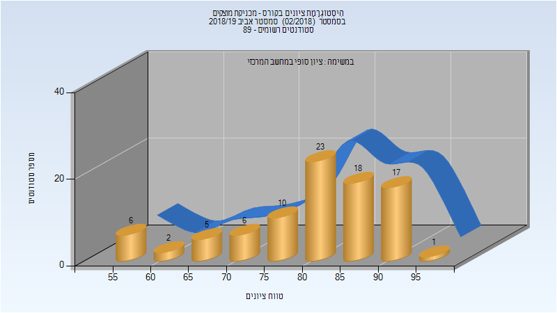
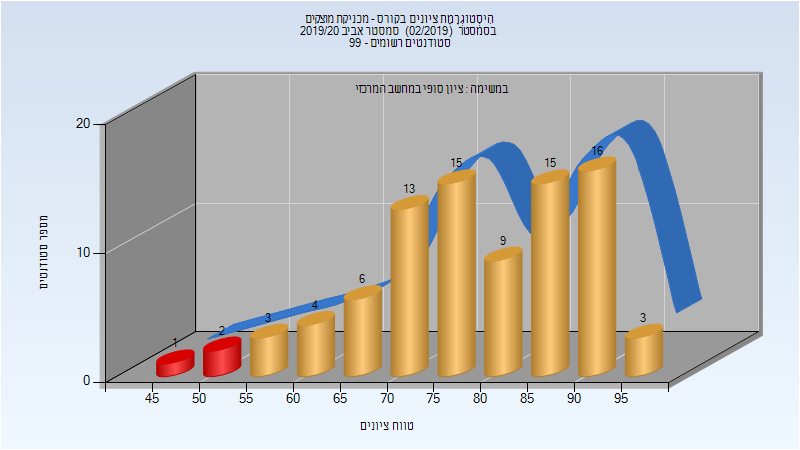

# 084506 - מכניקת מוצקים

## אביב 2018

| איש סגל | תפקיד |
| ---- | ---- |
| קרפ ברוך | מרצה - אחראי מקצוע |
| רוניס אנטון | מתרגל |
| שטיינר מתן | מרצה |

### מבחן מועד א'

| סטודנטים | עברו/נכשלו | אחוז עוברים | ציון מינימלי | ציון מקסימלי | ממוצע | חציון |
| ---- | ---- | ---- | ---- | ---- | ---- | ---- |
| 58 | 38/20 | 66 | 0 | 98 | 59.259 | 58 |

### סופי מועד א'

| סטודנטים | עברו/נכשלו | אחוז עוברים | ציון מינימלי | ציון מקסימלי | ממוצע | חציון |
| ---- | ---- | ---- | ---- | ---- | ---- | ---- |
| 58 | 38/20 | 66 | 0 | 98 | 60.966 | 62.5 |

### מבחן מועד ב'

| סטודנטים | עברו/נכשלו | אחוז עוברים | ציון מינימלי | ציון מקסימלי | ממוצע | חציון |
| ---- | ---- | ---- | ---- | ---- | ---- | ---- |
| 24 | 17/7 | 71 | 18 | 95 | 63.667 | 63 |

### סופי מועד ב'

| סטודנטים | עברו/נכשלו | אחוז עוברים | ציון מינימלי | ציון מקסימלי | ממוצע | חציון |
| ---- | ---- | ---- | ---- | ---- | ---- | ---- |
| 24 | 17/7 | 71 | 18 | 95 | 64.833 | 66 |

### סופי

| סטודנטים | עברו/נכשלו | אחוז עוברים | ציון מינימלי | ציון מקסימלי | ממוצע | חציון |
| ---- | ---- | ---- | ---- | ---- | ---- | ---- |
| 72 | 64/8 | 89 | 18 | 100 | 74.847 | 80 |

## אביב 2019

| איש סגל | תפקיד |
| ---- | ---- |
| אברמוביץ חיים | מרצה - אחראי מקצוע |
| שטיינר מתן | מתרגל - עם הרשאות מרצה אחראי |
| קליין גריגורי | מתרגל - עם הרשאות מרצה אחראי |

### מבחן מועד א'

| סטודנטים | עברו/נכשלו | אחוז עוברים | ציון מינימלי | ציון מקסימלי | ממוצע | חציון |
| ---- | ---- | ---- | ---- | ---- | ---- | ---- |
| 76 | 58/18 | 76 | 23 | 92 | 64.868 | 66 |

### סופי מועד א'

| סטודנטים | עברו/נכשלו | אחוז עוברים | ציון מינימלי | ציון מקסימלי | ממוצע | חציון |
| ---- | ---- | ---- | ---- | ---- | ---- | ---- |
| 76 | 75/1 | 99 | 49 | 95 | 76.434 | 80 |

### סופי מועד ב'

| סטודנטים | עברו/נכשלו | אחוז עוברים | ציון מינימלי | ציון מקסימלי | ממוצע | חציון |
| ---- | ---- | ---- | ---- | ---- | ---- | ---- |
| 28 | 27/1 | 96 | 52 | 90 | 77.679 | 81.5 |

### סופי

| סטודנטים | עברו/נכשלו | אחוז עוברים | ציון מינימלי | ציון מקסימלי | ממוצע | חציון |
| ---- | ---- | ---- | ---- | ---- | ---- | ---- |
| 88 | 88/0 | 100 | 55 | 95 | 80.364 | 83 |

## אביב 2020

| איש סגל | תפקיד |
| ---- | ---- |
| אברמוביץ חיים | מרצה - אחראי מקצוע |
| שטיינר מתן | מתרגל - עם הרשאות מרצה אחראי |
| קליין גריגורי | מתרגל - עם הרשאות מרצה אחראי |

### סופי מועד א'

| סטודנטים | עברו/נכשלו | אחוז עוברים | ציון מינימלי | ציון מקסימלי | ממוצע | חציון |
| ---- | ---- | ---- | ---- | ---- | ---- | ---- |
| 87 | 84/3 | 97 | 47 | 99 | 78.77 | 79 |

### סופי

| סטודנטים | עברו/נכשלו | אחוז עוברים | ציון מינימלי | ציון מקסימלי | ממוצע | חציון |
| ---- | ---- | ---- | ---- | ---- | ---- | ---- |
| 95 | 94/1 | 99 | 50 | 99 | 80.653 | 82 |

## אביב 2021

| איש סגל | תפקיד |
| ---- | ---- |
| אברמוביץ חיים | מרצה - אחראי מקצוע |
| קליין גריגורי | מתרגל - עם הרשאות מרצה אחראי |
| בן אשר תומר | מתרגל - עם הרשאות מרצה אחראי |

