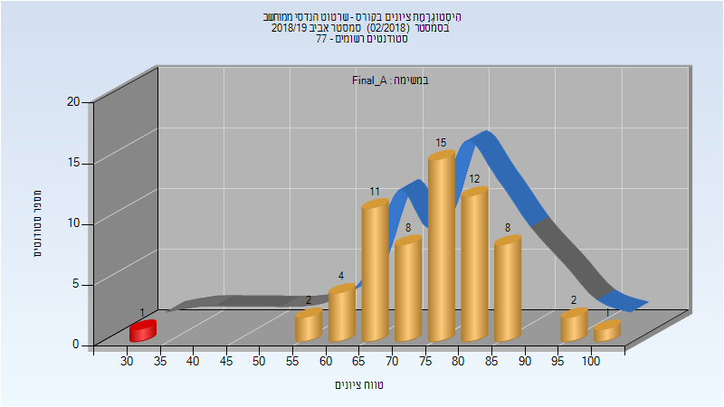
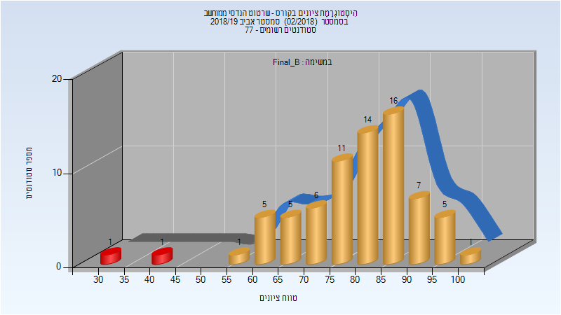
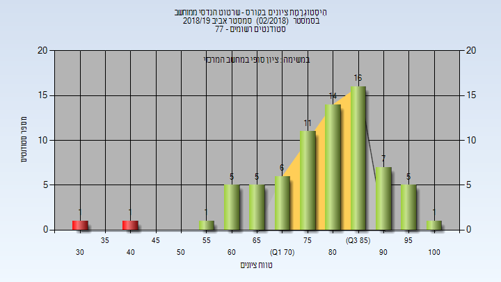

# 084630 - שרטוט הנדסי ממוחשב

## אביב 2019

| איש סגל | תפקיד |
| ---- | ---- |
| זאק ולאדימיר | מרצה - אחראי מקצוע |
| הרשקו דפנה | מרצה |

### סופי מועד א'

| סטודנטים | עברו/נכשלו | אחוז עוברים | ציון מינימלי | ציון מקסימלי | ממוצע | חציון |
| ---- | ---- | ---- | ---- | ---- | ---- | ---- |
| 64 | 63/1 | 98 | 32 | 100 | 75.656 | 77 |

### סופי מועד ב'

| סטודנטים | עברו/נכשלו | אחוז עוברים | ציון מינימלי | ציון מקסימלי | ממוצע | חציון |
| ---- | ---- | ---- | ---- | ---- | ---- | ---- |
| 73 | 71/2 | 97 | 34 | 100 | 79.603 | 81 |

### סופי

| סטודנטים | עברו/נכשלו | אחוז עוברים | ציון מינימלי | ציון מקסימלי | ממוצע | חציון |
| ---- | ---- | ---- | ---- | ---- | ---- | ---- |
| 73 | 71/2 | 97 | 34 | 100 | 79.644 | 81 |

## אביב 2020

| איש סגל | תפקיד |
| ---- | ---- |
| זאק ולאדימיר | מרצה - אחראי מקצוע |
| הרשקו דפנה | מרצה |
| האס יותם | מתרגל - עם הרשאות מרצה אחראי |
| שיינמן אמנון | מתרגל - עם הרשאות מרצה אחראי |

### סופי מועד א'

| סטודנטים | עברו/נכשלו | אחוז עוברים | ציון מינימלי | ציון מקסימלי | ממוצע | חציון |
| ---- | ---- | ---- | ---- | ---- | ---- | ---- |
| 87 | 87/0 | 100 | 55 | 100 | 91.425 | 94 |

