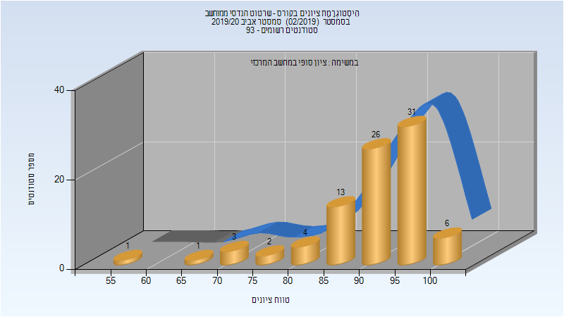
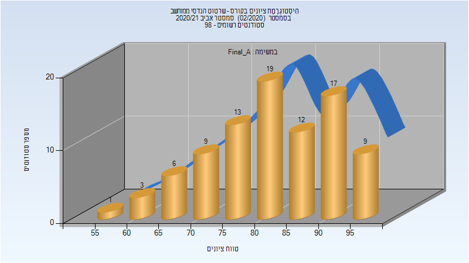
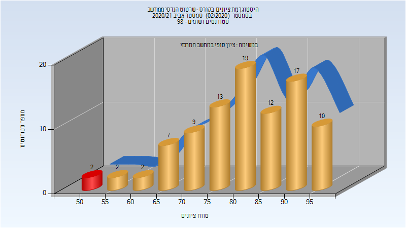
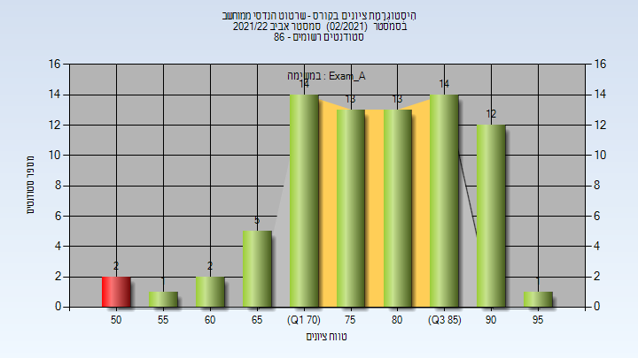
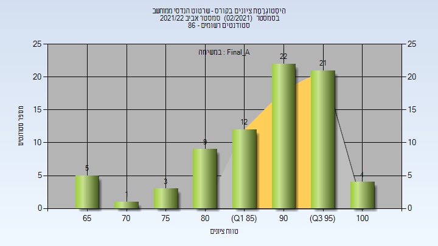

# 084630 - שרטוט הנדסי ממוחשב

## אביב 2019

| איש סגל | תפקיד |
| ---- | ---- |
| זאק ולאדימיר | מרצה - אחראי מקצוע |
| הרשקו דפנה | מרצה |

### סופי מועד א'

| סטודנטים | עברו/נכשלו | אחוז עוברים | ציון מינימלי | ציון מקסימלי | ממוצע | חציון |
| ---- | ---- | ---- | ---- | ---- | ---- | ---- |
| 64 | 63/1 | 98 | 32 | 100 | 75.656 | 77 |

### סופי מועד ב'

| סטודנטים | עברו/נכשלו | אחוז עוברים | ציון מינימלי | ציון מקסימלי | ממוצע | חציון |
| ---- | ---- | ---- | ---- | ---- | ---- | ---- |
| 73 | 71/2 | 97 | 34 | 100 | 79.603 | 81 |

### סופי

| סטודנטים | עברו/נכשלו | אחוז עוברים | ציון מינימלי | ציון מקסימלי | ממוצע | חציון |
| ---- | ---- | ---- | ---- | ---- | ---- | ---- |
| 73 | 71/2 | 97 | 34 | 100 | 79.644 | 81 |

## אביב 2020

| איש סגל | תפקיד |
| ---- | ---- |
| זאק ולאדימיר | מרצה - אחראי מקצוע |
| הרשקו דפנה | מרצה |
| האס יותם | מתרגל - עם הרשאות מרצה אחראי |
| שיינמן אמנון | מתרגל - עם הרשאות מרצה אחראי |

### סופי מועד א'

| סטודנטים | עברו/נכשלו | אחוז עוברים | ציון מינימלי | ציון מקסימלי | ממוצע | חציון |
| ---- | ---- | ---- | ---- | ---- | ---- | ---- |
| 87 | 87/0 | 100 | 55 | 100 | 91.425 | 94 |

### סופי

| סטודנטים | עברו/נכשלו | אחוז עוברים | ציון מינימלי | ציון מקסימלי | ממוצע | חציון |
| ---- | ---- | ---- | ---- | ---- | ---- | ---- |
| 87 | 87/0 | 100 | 55 | 100 | 91.425 | 94 |

## אביב 2021

| איש סגל | תפקיד |
| ---- | ---- |
| זאק ולאדימיר | מרצה - אחראי מקצוע |
| הרשקו דפנה | מרצה |
| אברהם אבי | מתרגל - עם הרשאות מרצה אחראי |
| מיטנוביצקי מיכאל | מתרגל - עם הרשאות מרצה אחראי |
| שיינמן אמנון | מתרגל - עם הרשאות מרצה אחראי |

### סופי מועד א'

| סטודנטים | עברו/נכשלו | אחוז עוברים | ציון מינימלי | ציון מקסימלי | ממוצע | חציון |
| ---- | ---- | ---- | ---- | ---- | ---- | ---- |
| 89 | 89/0 | 100 | 58 | 99 | 82.64 | 83 |

### סופי

| סטודנטים | עברו/נכשלו | אחוז עוברים | ציון מינימלי | ציון מקסימלי | ממוצע | חציון |
| ---- | ---- | ---- | ---- | ---- | ---- | ---- |
| 93 | 91/2 | 98 | 52 | 99 | 81.946 | 83 |

## אביב 2022

| איש סגל | תפקיד |
| ---- | ---- |
| רום טל | מרצה - אחראי מקצוע |
| הרשקו דפנה | מרצה |
| זגלסקי אלכסנדר | מתרגל - עם הרשאות מרצה אחראי |
| גולדינר יבגני | מתרגל - עם הרשאות מרצה אחראי |
| בליקין גלי | מתרגל - עם הרשאות מרצה אחראי |

### מבחן מועד א'

| סטודנטים | עברו/נכשלו | אחוז עוברים | ציון מינימלי | ציון מקסימלי | ממוצע | חציון |
| ---- | ---- | ---- | ---- | ---- | ---- | ---- |
| 77 | 75/2 | 97 | 52 | 96 | 79.312 | 80 |

### סופי מועד א'

| סטודנטים | עברו/נכשלו | אחוז עוברים | ציון מינימלי | ציון מקסימלי | ממוצע | חציון |
| ---- | ---- | ---- | ---- | ---- | ---- | ---- |
| 77 | 77/0 | 100 | 65 | 100 | 89.481 | 91 |

### סופי

| סטודנטים | עברו/נכשלו | אחוז עוברים | ציון מינימלי | ציון מקסימלי | ממוצע | חציון |
| ---- | ---- | ---- | ---- | ---- | ---- | ---- |
| 77 | 77/0 | 100 | 65 | 100 | 89.481 | 91 |

