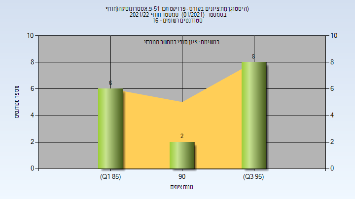

# 084651 - פרויקט תכן 51-פ.אסטרונוטיקה(חורף)

## חורף 2019-2020

| איש סגל | תפקיד |
| ---- | ---- |
| הרשקוביץ יעקב | מרצה - אחראי מקצוע |
| הרשקו דפנה | מרצה |

## חורף 2021-2022

| איש סגל | תפקיד |
| ---- | ---- |
| הרשקוביץ יעקב | מרצה |
| אדמסקי ניקו | מרצה |
| הרשקו דפנה | מרצה |

### סופי מועד א'

| סטודנטים | עברו/נכשלו | אחוז עוברים | ציון מינימלי | ציון מקסימלי | ממוצע | חציון |
| ---- | ---- | ---- | ---- | ---- | ---- | ---- |
| 16 | 16/0 | 100 | 86 | 99 | 93.625 | 96 |

### סופי

| סטודנטים | עברו/נכשלו | אחוז עוברים | ציון מינימלי | ציון מקסימלי | ממוצע | חציון |
| ---- | ---- | ---- | ---- | ---- | ---- | ---- |
| 16 | 16/0 | 100 | 86 | 99 | 93.625 | 96 |

