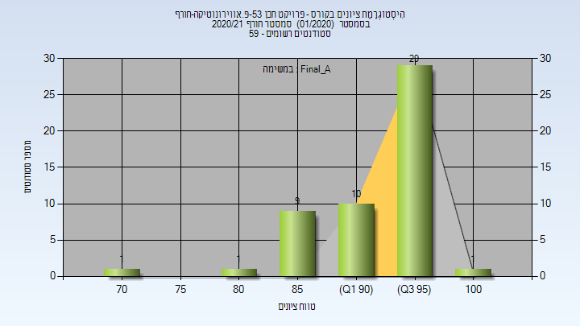
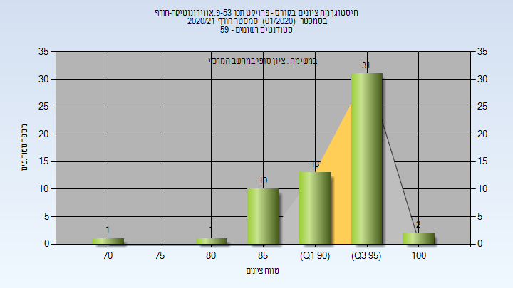

# 084653 - פרויקט תכן 53-פ.אווירונוטיקה-חורף

## חורף 2020-2021

| איש סגל | תפקיד |
| ---- | ---- |
| אדרעי-אזולאי לוסי | מרצה - אחראי מקצוע |
| הרשקו דפנה | מרצה |
| שפונד זלמן | מרצה |
| חודוס גרגורי | מרצה |
| קדושין יצחק | מרצה |
| דיסקין דוד | מרצה |
| זנגו עמי | מרצה |
| איטוביץ יאן | מרצה |
| נווה עודד | מרצה |

### סופי מועד א'

| סטודנטים | עברו/נכשלו | אחוז עוברים | ציון מינימלי | ציון מקסימלי | ממוצע | חציון |
| ---- | ---- | ---- | ---- | ---- | ---- | ---- |
| 51 | 51/0 | 100 | 72 | 100 | 93.078 | 95 |

### סופי

| סטודנטים | עברו/נכשלו | אחוז עוברים | ציון מינימלי | ציון מקסימלי | ממוצע | חציון |
| ---- | ---- | ---- | ---- | ---- | ---- | ---- |
| 53 | 53/0 | 100 | 72 | 100 | 92.962 | 95 |

