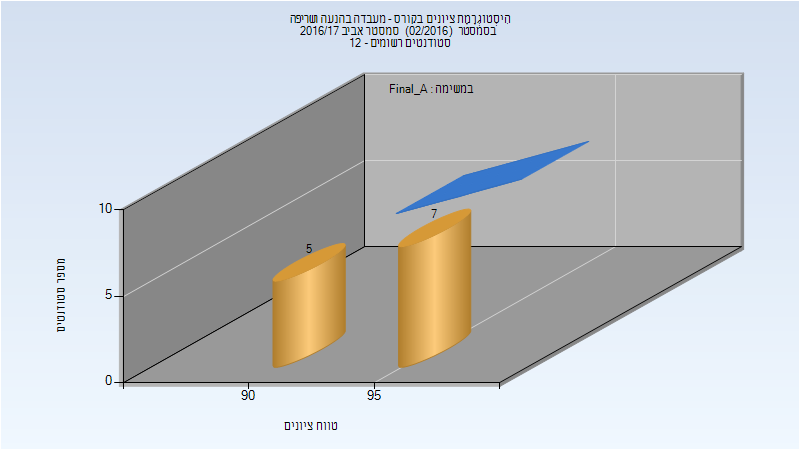

# 085405 - מעבדה בהנעה ושריפה

## אביב 2017

| איש סגל | תפקיד |
| ---- | ---- |
| גני אלון | מרצה - אחראי מקצוע |
| זמיר אינה |  |

### סופי מועד א'

| סטודנטים | עברו/נכשלו | אחוז עוברים | ציון מינימלי | ציון מקסימלי | ממוצע | חציון |
| ---- | ---- | ---- | ---- | ---- | ---- | ---- |
| 12 | 12/0 | 100 | 92 | 98 | 95.333 | 96 |

### סופי

| סטודנטים | עברו/נכשלו | אחוז עוברים | ציון מינימלי | ציון מקסימלי | ממוצע | חציון |
| ---- | ---- | ---- | ---- | ---- | ---- | ---- |
| 12 | 12/0 | 100 | 92 | 98 | 95.333 | 96 |

