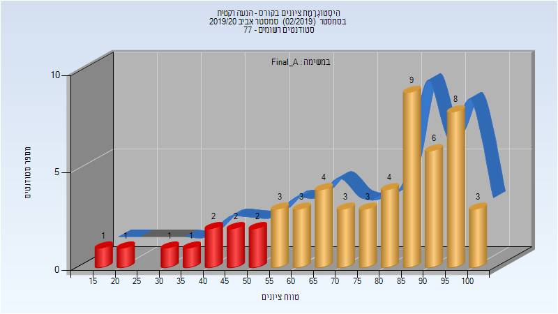
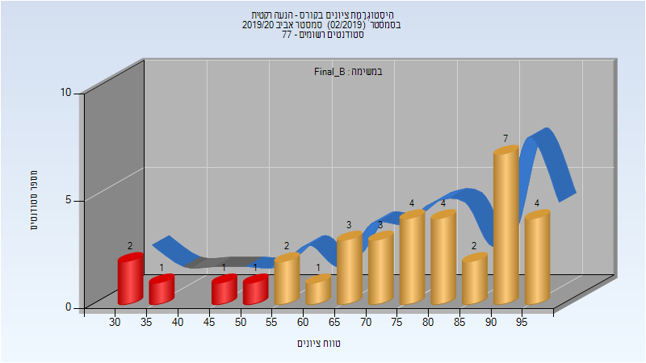

# 085406 - הנעה רקטית

## אביב 2020

| איש סגל | תפקיד |
| ---- | ---- |
| מייקלס דן | מרצה - אחראי מקצוע |
| שוגייב סטניסלב | מתרגל - עם הרשאות מרצה אחראי |

### סופי מועד א'

| סטודנטים | עברו/נכשלו | אחוז עוברים | ציון מינימלי | ציון מקסימלי | ממוצע | חציון |
| ---- | ---- | ---- | ---- | ---- | ---- | ---- |
| 56 | 46/10 | 82 | 16 | 100 | 75.071 | 83.5 |

### סופי מועד ב'

| סטודנטים | עברו/נכשלו | אחוז עוברים | ציון מינימלי | ציון מקסימלי | ממוצע | חציון |
| ---- | ---- | ---- | ---- | ---- | ---- | ---- |
| 35 | 30/5 | 86 | 32 | 99 | 75.686 | 78 |

### סופי

| סטודנטים | עברו/נכשלו | אחוז עוברים | ציון מינימלי | ציון מקסימלי | ממוצע | חציון |
| ---- | ---- | ---- | ---- | ---- | ---- | ---- |
| 76 | 71/5 | 93 | 16 | 100 | 80.789 | 85 |

## אביב 2021

| איש סגל | תפקיד |
| ---- | ---- |
| מייקלס דן | מרצה - אחראי מקצוע |
| שוגייב סטניסלב | מתרגל - עם הרשאות מרצה אחראי |

