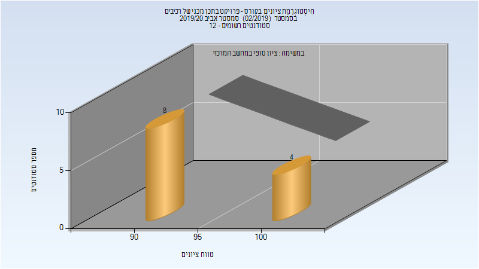
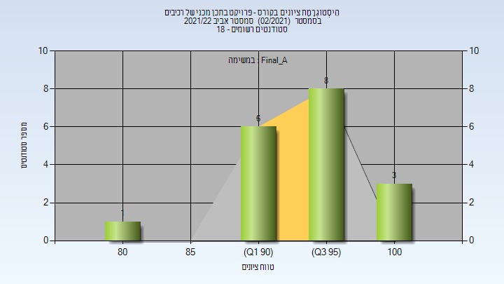
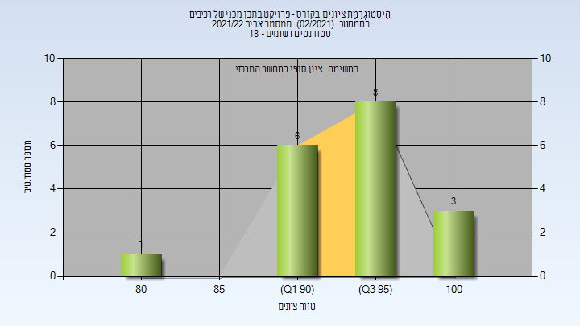

# 085634 - פרויקט בתכן מכני של רכיבים

## אביב 2020

| איש סגל | תפקיד |
| ---- | ---- |
| ארצי דרור | מתרגל - עם הרשאות מרצה אחראי |
| הרשקו דפנה | מתרגל - עם הרשאות מרצה אחראי |

### סופי מועד א'

| סטודנטים | עברו/נכשלו | אחוז עוברים | ציון מינימלי | ציון מקסימלי | ממוצע | חציון |
| ---- | ---- | ---- | ---- | ---- | ---- | ---- |
| 12 | 12/0 | 100 | 92 | 100 | 94.667 | 92 |

### סופי

| סטודנטים | עברו/נכשלו | אחוז עוברים | ציון מינימלי | ציון מקסימלי | ממוצע | חציון |
| ---- | ---- | ---- | ---- | ---- | ---- | ---- |
| 12 | 12/0 | 100 | 92 | 100 | 94.667 | 92 |

## אביב 2022

| איש סגל | תפקיד |
| ---- | ---- |
| ארצי דרור | מתרגל - עם הרשאות מרצה אחראי |
| הרשקו דפנה | מתרגל - עם הרשאות מרצה אחראי |

### סופי מועד א'

| סטודנטים | עברו/נכשלו | אחוז עוברים | ציון מינימלי | ציון מקסימלי | ממוצע | חציון |
| ---- | ---- | ---- | ---- | ---- | ---- | ---- |
| 18 | 18/0 | 100 | 80 | 100 | 94 | 95 |

### סופי

| סטודנטים | עברו/נכשלו | אחוז עוברים | ציון מינימלי | ציון מקסימלי | ממוצע | חציון |
| ---- | ---- | ---- | ---- | ---- | ---- | ---- |
| 18 | 18/0 | 100 | 80 | 100 | 94 | 95 |

