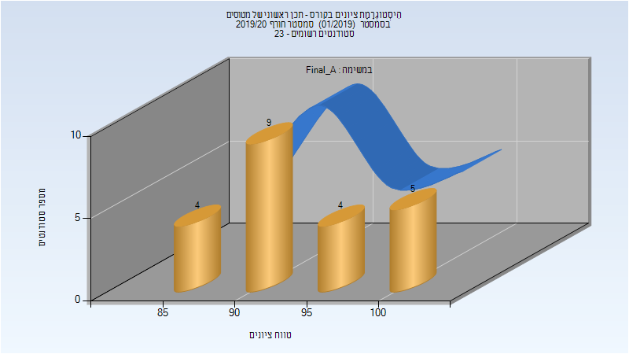
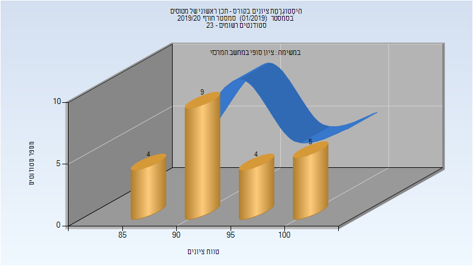
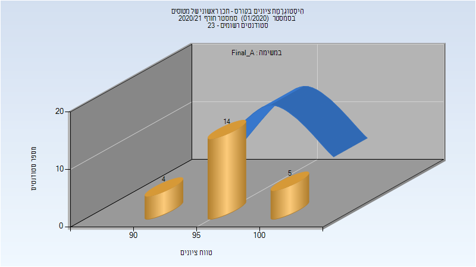

# 085695 - תכן ראשוני של מטוסים

## חורף 2019-2020

| איש סגל | תפקיד |
| ---- | ---- |
| ארצי דרור | מרצה - אחראי מקצוע |
| הרשקו דפנה | מרצה |

### סופי מועד א'

| סטודנטים | עברו/נכשלו | אחוז עוברים | ציון מינימלי | ציון מקסימלי | ממוצע | חציון |
| ---- | ---- | ---- | ---- | ---- | ---- | ---- |
| 22 | 22/0 | 100 | 87 | 100 | 93.091 | 92 |

### סופי

| סטודנטים | עברו/נכשלו | אחוז עוברים | ציון מינימלי | ציון מקסימלי | ממוצע | חציון |
| ---- | ---- | ---- | ---- | ---- | ---- | ---- |
| 22 | 22/0 | 100 | 87 | 100 | 93.091 | 92 |

## חורף 2020-2021

| איש סגל | תפקיד |
| ---- | ---- |
| ארצי דרור | מרצה - אחראי מקצוע |
| הרשקו דפנה | מרצה |

### סופי מועד א'

| סטודנטים | עברו/נכשלו | אחוז עוברים | ציון מינימלי | ציון מקסימלי | ממוצע | חציון |
| ---- | ---- | ---- | ---- | ---- | ---- | ---- |
| 23 | 23/0 | 100 | 94 | 100 | 96.957 | 97 |

### סופי

| סטודנטים | עברו/נכשלו | אחוז עוברים | ציון מינימלי | ציון מקסימלי | ממוצע | חציון |
| ---- | ---- | ---- | ---- | ---- | ---- | ---- |
| 23 | 23/0 | 100 | 94 | 100 | 96.957 | 97 |

