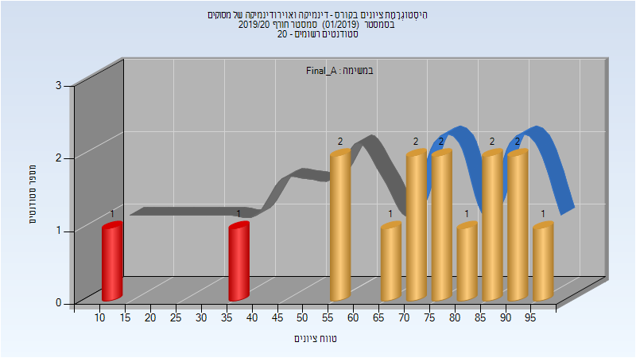
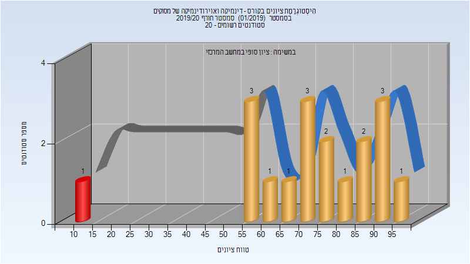

# 086219 - דינמיקה ואוירודינמיקה  של מסוקים

## חורף 2019-2020

| איש סגל | תפקיד |
| ---- | ---- |
| רנד עמרי | מרצה - אחראי מקצוע |

### סופי מועד א'

| סטודנטים | עברו/נכשלו | אחוז עוברים | ציון מינימלי | ציון מקסימלי | ממוצע | חציון |
| ---- | ---- | ---- | ---- | ---- | ---- | ---- |
| 15 | 13/2 | 87 | 10 | 98 | 70.267 | 74 |

### סופי

| סטודנטים | עברו/נכשלו | אחוז עוברים | ציון מינימלי | ציון מקסימלי | ממוצע | חציון |
| ---- | ---- | ---- | ---- | ---- | ---- | ---- |
| 18 | 17/1 | 94 | 10 | 98 | 71.944 | 74.5 |

