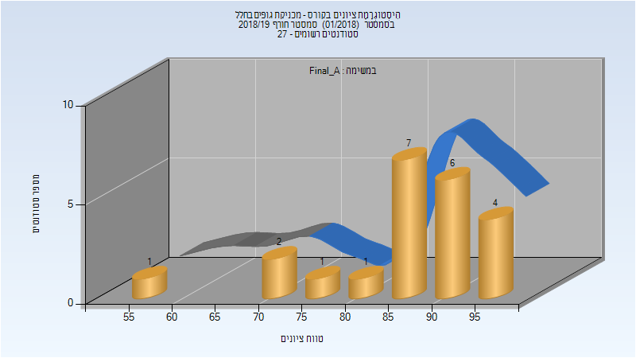
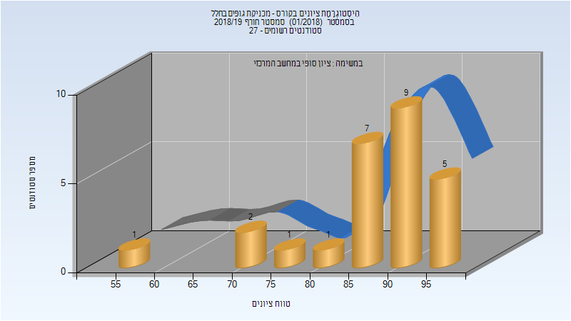

# 086287 - מכניקת גופים בחלל

## חורף 2018-2019

| איש סגל | תפקיד |
| ---- | ---- |
| משנה דוד | מרצה - אחראי מקצוע |
| מאייט נדב | מרצה |
| הרשקו דפנה | מרצה |

### סופי מועד א'

| סטודנטים | עברו/נכשלו | אחוז עוברים | ציון מינימלי | ציון מקסימלי | ממוצע | חציון |
| ---- | ---- | ---- | ---- | ---- | ---- | ---- |
| 22 | 22/0 | 100 | 59 | 99 | 86.682 | 87.5 |

### סופי

| סטודנטים | עברו/נכשלו | אחוז עוברים | ציון מינימלי | ציון מקסימלי | ממוצע | חציון |
| ---- | ---- | ---- | ---- | ---- | ---- | ---- |
| 26 | 26/0 | 100 | 59 | 99 | 87.577 | 90 |

