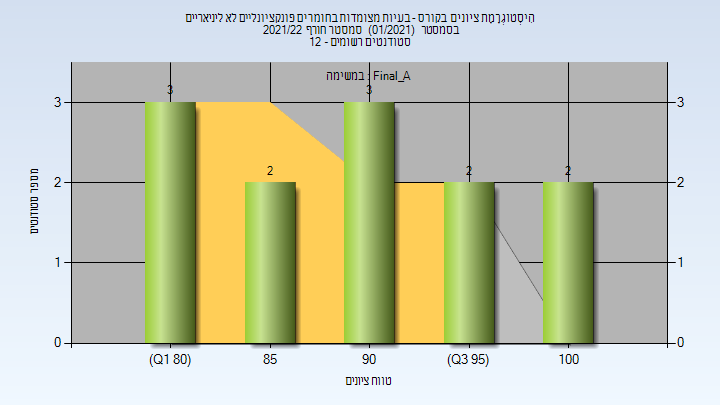

# 086520 - בעיות מצומדות בחומרים פונקציונלי

## חורף 2021-2022

| איש סגל | תפקיד |
| ---- | ---- |
| גליץ' פבל | מרצה - אחראי מקצוע |

### סופי מועד א'

| סטודנטים | עברו/נכשלו | אחוז עוברים | ציון מינימלי | ציון מקסימלי | ממוצע | חציון |
| ---- | ---- | ---- | ---- | ---- | ---- | ---- |
| 12 | 12/0 | 100 | 81 | 100 | 90.333 | 90 |

